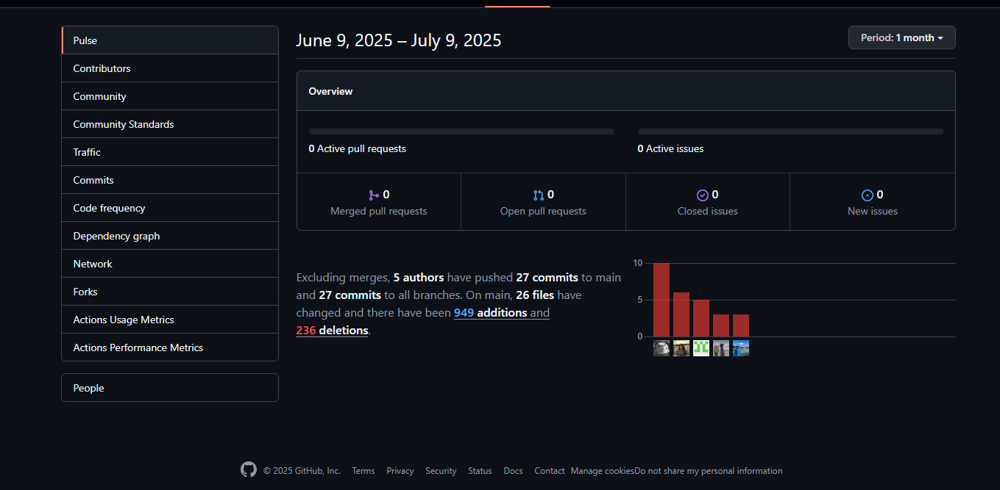
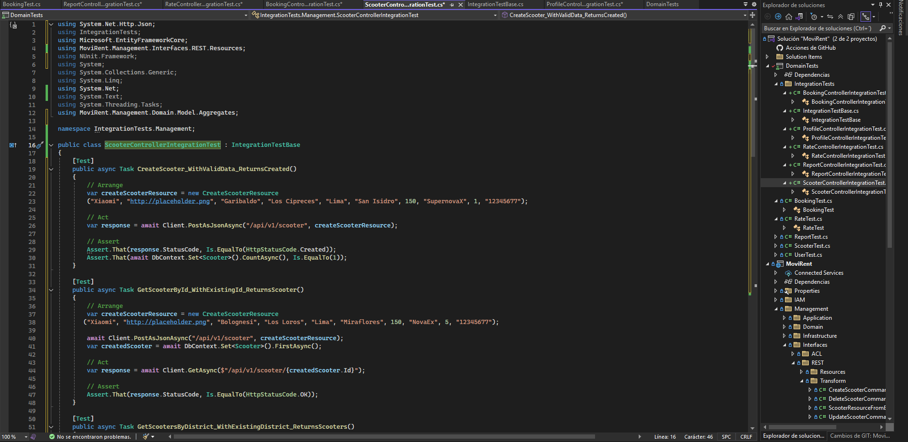
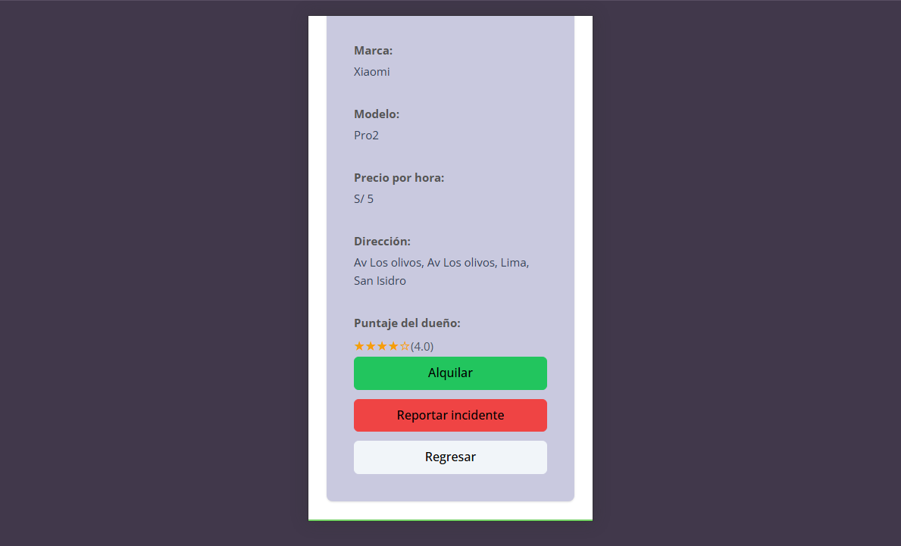

  
  **Universidad Peruana de Ciencias Aplicadas**
  
  Ingeniería de Software
  
  **CURSO:** 1ASI0732
  
  **NRC:** 4453
  
  **Profesor:** Julio Manuel Noriega Melendez
  
  **Informe de Trabajo Final**
  
  **Nombre del startup:** CiberMach
  
  **Nombre del producto:** MoviRent
  
  **Integrantes:**
  
  <table border="1px" align="center">
    <thead>
        <tr>
            <th>Nombre</th>
            <th>Código</th>
        </tr>
    </thead>
    <tbody>
        <tr>
            <td>Gustavo Huilca Chipana </td>
            <td>u202213983</td>
        </tr>
        <tr>
            <td> Mathias Alejandro Jave Diaz </td>
            <td>U202212721</td>
        </tr>
        <tr>
            <td>Mathias Adriano Hidalgo Lopez</td>
            <td>u202213222</td>
        </tr>
        <tr>
            <td>Alexandra Belen Ramos Argüelles </td>
            <td>U202215164</td>
        </tr>
        <tr>
            <td>Sebastian Valente Lobato Pozo </td>
            <td>U202215312</td>
        </tr>
        <tr>
            <td>Integrante</td>
            <td>codigo</td>
        </tr>
    </tbody>
</table>

  
  
  ## **Abril, 2025**

## Registro de versiones del informe

| Versión | Fecha       | Autor                           | Descripción de modificación |
|---------|-------------|---------------------------------|-----------------------------|
| 0.1     | 29/03/2025  | Mathias Adriano Hidalgo Lopez   | TB1                         |
| 0.1     | 29/03/2025  | Gustavo Huilca Chipana          | TB1                         |
| 0.1     | 29/03/2025  | Alexandra Belen Ramos Argüelles | TB1                         |
| 0.1     | 29/03/2025  | Mathias Alejandro Jave Diaz     | TB1                         |
| 0.1     | 29/03/2025  | Sebastian Valente Lobato Pozo   | TB1                         |
| 1.0     | 29/03/2025  | Mathias Adriano Hidalgo Lopez   | TP                          |
| 1.0     | 29/03/2025  | Gustavo Huilca Chipana          | TP                          |
| 1.0     | 29/03/2025  | Alexandra Belen Ramos Argüelles | TP                          |
| 1.0     | 29/03/2025  | Mathias Alejandro Jave Diaz     | TP                          |
| 1.0     | 29/03/2025  | Sebastian Valente Lobato Pozo   | TP                          |
| 2.0     | 18/06/2025  | Mathias Adriano Hidalgo Lopez   | TB2                         |
| 2.0     | 18/06/2025  | Gustavo Huilca Chipana          | TB2                         |
| 2.0     | 18/06/2025  | Alexandra Belen Ramos Argüelles | TB2                         |
| 2.0     | 18/06/2025  | Mathias Alejandro Jave Diaz     | TB2                         |
| 2.0     | 18/06/2025  | Sebastian Valente Lobato Pozo   | TB2                         |
| 2.0     | 18/06/2025  | Mathias Adriano Hidalgo Lopez   | TF                          |
| 2.0     | 18/06/2025  | Gustavo Huilca Chipana          | TF                          |
| 2.0     | 18/06/2025  | Alexandra Belen Ramos Argüelles | TF                          |
| 2.0     | 18/06/2025  | Mathias Alejandro Jave Diaz     | TF                          |
| 2.0     | 18/06/2025  | Sebastian Valente Lobato Pozo   | TF                          |

## Project Report Collaboration Insights

**TF**

## Student Outcome

### ABET – EAC - Student Outcome 4

Criterio: La capacidad de reconocer responsabilidades éticas y
profesionales en situaciones de ingeniería y hacer juicios informados, que deben
considerar el impacto de las soluciones de ingeniería en contextos globales, económicos,
ambientales y sociales

<table align="center" border="1">
    <thead>
        <tr>
            <th>Criterio específico</th>
            <th style="width: 45%;">Acciones realizadas</th>
            <th>Conclusiones</th>
        </tr>
    </thead>
    <tbody>
        <tr>
            <td>Reconoce responsabilidad
ética y profesional en
situaciones de ingeniería de
software
</td>
            <td>
                
Mathias Alejandro Jave Diaz:
 
                TB1: Durante esta entrega, Identifiqué algunos riesgos éticos y de privacidad en el proyecto de software, sobre todo relacionados con la protección de datos personales de los usuarios. Trabajé en conjunto con el equipo para establecer medidas de seguridad y privacidad, asegurando que la información de los usuarios estuviera protegida. Esta experiencia me permitió mejorar mis habilidades en la identificación y gestión de riesgos éticos en proyectos de software.
              TP1:Al desarrollar los Unit Tests para las entidades clave, me aseguré de incluir casos de prueba que validen no solo la funcionalidad, sino también la seguridad y privacidad de los datos, evitando riesgos como inyecciones SQL o exposición indebida de información. Documenté cada decisión técnica para garantizar transparencia y replicabilidad.
              TB2: me encargué de diseñar las tarjetas de experimento  y formular las hipótesis. Para ello, consideré cómo nuestras suposiciones podían traducirse en soluciones que realmente respondan a las necesidades de usuarios diversos. Me aseguré de que nuestras propuestas promovieran la inclusión, el acceso equitativo y el uso responsable de los recursos digitales.
              TB2:Estuve a cargo de la elaboración de las Experiment Cards y la formulación de Hipótesis. Mi trabajo se enfocó en plantear hipótesis objetivas que reflejaran escenarios reales y no supuestos sesgados. Me aseguré de que las experiment cards estuvieran bien estructuradas, facilitando la trazabilidad de los objetivos del experimento y sus posibles impactos en los usuarios. Durante este proceso, mantuve un enfoque ético, evitando generar expectativas no verificables y promoviendo un análisis crítico de cada planteamiento. Esta experiencia fortaleció mi capacidad para tomar decisiones responsables en entornos de ingeniería de software.
                
Mathias Adriano Hidalgo Lopez:
 
                TB1: En esta entrega, Analicé si las decisiones técnicas del proyecto respetan principios éticos establecidos por organizaciones como la ACM o IEEE, de esta manera, me aseguré de que el desarrollo del software cumpla con estándares éticos y profesionales. Trabajé en conjunto con el equipo para identificar y mitigar riesgos éticos relacionados con la privacidad y la seguridad de los datos de los usuarios.
              TP1: Al rediseñar la landing page, implementé pruebas A/B equilibradas para evitar sesgos algorítmicos, asegurando que las mejoras beneficiaran por igual a usuarios de diferentes regiones o perfiles demográficos.
              TB2:Mi participación estuvo centrada en la priorización de preguntas (Question Backlog) y en la definición de las condiciones de los experimentos (Conditions). Organicé las preguntas de forma estratégica y ética, dando prioridad a aquellas que respondían a necesidades reales de los usuarios. Asimismo, definí condiciones claras, replicables y justas para los distintos escenarios de prueba. Me aseguré de que los experimentos no introdujeran discriminación ni errores de validación, y trabajé con responsabilidad para garantizar que los resultados obtenidos fueran representativos y éticamente manejados.
                
Sebastian Valente Lobato Pozo:

                TB1: En esta entrega, me pude reconocer posibles conflictos de interés durante la revisión del proyecto y pude comunicar alternativas para resolverlos. De esta manera, me aseguré de que en equipo podamos tomar decisiones con transparencia y responsabilidad en el desarrollo del software.
              TP1: Al diseñar los System Tests, trabajé con el equipo para simular escenarios realistas, incluyendo fallos éticos potenciales (como manejo de datos sensibles). Integré checks automatizados en el pipeline de despliegue para asegurar el cumplimiento de normativas como GDPR y licencias de código abierto.
              TB2:Como encargado de las Experiment-Ready Questions y de la selección de métodos experimentales, me aseguré de formular preguntas claras, útiles y orientadas a mejorar la experiencia del usuario. Consideré con responsabilidad que los métodos escogidos fueran inclusivos y respetaran la diversidad de perfiles de usuarios. Además, cuidé que la ejecución de los experimentos evitara cualquier tipo de sesgo o manipulación que pudiera afectar la validez de los resultados. Al aplicar criterios de equidad y transparencia en la definición metodológica, ejercí mi rol con conciencia ética y profesionalismo.
                
Gustavo Huilca Chipana:

                TB1: En esta entrga, me ancargué de evaluar si el diseño del software considera la accesibilidad y la inclusión de todos los usuarios, y propuse mejoras para garantizar que la aplicación sea accesible para personas con discapacidades. Esto me permitió mejorar mis habilidades en la identificación y gestión de riesgos éticos en proyectos de software, así como en la promoción de la inclusión y la diversidad en el desarrollo de software.
              TP1: Al aplicar Behavior-Driven Development (BDD), facilité talleres con stakeholders para definir criterios de aceptación claros y éticos, asegurando que las funcionalidades desarrolladas cumplieran con las necesidades reales de los usuarios sin exclusiones.
              TB2:Tuve a mi cargo la elaboración de los insumos iniciales (Raw Material), los cálculos de escala (Scale Calculations) y la definición de los indicadores clave de rendimiento (KPIs y métricas). En mi trabajo, consideré fundamental sustentar cada supuesto con evidencia confiable, evitando afirmaciones infundadas. Durante los cálculos y proyecciones, mantuve un criterio realista y evité exageraciones que pudieran inducir a conclusiones erróneas. Al seleccionar los KPIs, prioricé aquellos que reflejaran el impacto real en los usuarios y que fueran éticamente apropiados para la medición de desempeño. Esta responsabilidad me permitió fortalecer mi compromiso con el desarrollo ético de software basado en datos verificados y objetivos.
          

 Alexandra Belen Ramos Argüelles:

                TB1: Me encargué de la revisión y la justificación del uso de herramientas y bibliotecas de terceros considerando aspectos éticos como licencias y propiedad intelectual durante esta entrega, de forma que pudiera asegurarme de que el proyecto cumpla con los estándares éticos y legales establecidos.
              TP1: Al desarrollar los Integration Tests, verifiqué que las interacciones entre módulos cumplieran con estándares éticos, como el manejo adecuado de errores y la consistencia en el tratamiento de datos críticos. Documenté cada flujo para facilitar auditorías futuras. 
              TB2:Como responsable del As-Is Summary, las Measures y el Web and Mobile Tracking Plan, asumí con seriedad la responsabilidad de analizar el estado actual del sistema y proponer mejoras éticas y viables. Me aseguré de identificar los puntos críticos que afectaban la experiencia del usuario, como los tiempos de espera por validación manual. Al definir las métricas de evaluación, prioricé aquellas que permitieran tomar decisiones basadas en datos objetivos y sin sesgos. Asimismo, al desarrollar el plan de seguimiento web y móvil, cuidé que los eventos recolectados respetaran la privacidad de los usuarios, utilizando herramientas que promueven la transparencia y el uso responsable de la información. En todo momento, procuré actuar con compromiso profesional y responsabilidad ética.

</td>
            <td>
                En esta entrega, cada miembro del equipo trabajó para identificar y mitigar riesgos éticos relacionados con la privacidad y la seguridad de los datos de los usuarios. Se establecieron medidas de seguridad y privacidad, asegurando que la información de los usuarios estuviera protegida. Además, se promovió la inclusión y la diversidad en el desarrollo del software, considerando la accesibilidad y la inclusión de todos los usuarios.
</td>
        </tr>
        <tr>
            <td>Emite juicios informados
considerando el impacto de las
soluciones de ingeniería de
software en contextos globales,
económicos, ambientales y
sociales
</td>
            <td>
                
Mathias Alejandro Jave Diaz:

                TB1: Durante esta entrega, evalué cómo el software puede impactar a usuarios de diferentes culturas y regiones, considerando su adaptabilidad y alcance global en el desarrollo del software.
              TP1: Al implementar mejoras en la app móvil y landing page, evalué cuidadosamente el impacto en la experiencia del usuario, priorizando accesibilidad (como compatibilidad con lectores de pantalla) y optimizando el rendimiento para reducir el consumo de batería y datos, contribuyendo a un uso más sostenible de la tecnología.
               TB2: Me encargué de diseñar las tarjetas de experimento  y formular las hipótesis. Para ello, consideré cómo nuestras suposiciones podían traducirse en soluciones que realmente respondan a las necesidades de usuarios diversos. Me aseguré de que nuestras propuestas promovieran la inclusión, el acceso equitativo y el uso responsable de los recursos digitales.

Mathias Adriano Hidalgo Lopez:
 
                TB1: Durante esta entrega, analicé el impacto ambiental del software en el contexto de la movilidad urbana y propuse soluciones para mitigar su huella de carbono.
              TP1: Al configurar los despliegues por etapas (dev, staging, prod), establecí políticas de retención de datos temporales para entornos no productivos, minimizando riesgos de exposición de información sensible y reduciendo el almacenamiento innecesario.
                 TB2:trabajé en el Question Backlog y en definir las condiciones de prueba. En este proceso, analicé diferentes escenarios de despliegue y validación, considerando restricciones económicas y operativas que podrían darse en distintos contextos. Esto me permitió tomar decisiones informadas, priorizando no solo lo funcional, sino también lo sostenible y viable a largo plazo.

Gustavo Huilca Chipana:

                TB1: En esta entrega, evalué el impacto social del software en la movilidad urbana y propuse soluciones para mejorar la calidad de vida de los usuarios. Me aseguré de que el desarrollo del software cumpla con estándares éticos y profesionales, considerando su impacto en la sociedad.
              TP1: Al optimizar el Build & Test Suite, prioricé la detección temprana de vulnerabilidades (como las del OWASP Top 10) y reduje el tiempo de ejecución de pruebas, lo que disminuyó el consumo energético asociado al proceso de CI/CD.
              TB2: En esta entrega, trabajé en conjunto con el equipo para identificar y mitigar riesgos éticos relacionados con la privacidad y la seguridad de los datos de los usuarios. Me aseguré de que el desarrollo del software cumpla con estándares éticos y profesionales, considerando su impacto en la sociedad.

Sebastian Valente Lobato Pozo:

                TB1: Durante esta entrega, trabajé activamente para fomentar un entorno de trabajo colaborativo e inclusivo, alentando la participación y aportes de todos los miembros del equipo. Junto con mis compañeros, ayudamos a establecer metas claras y a planificar las tareas necesarias para cumplir con los objetivos del proyecto.
              TP1: Al configurar el pipeline de producción, analicé el costo ambiental de los recursos en la nube y propuse estrategias para minimizar la huella de carbono, como programar despliegues en horarios de baja demanda energética o usar instancias más eficientes.
              TB2: Desarrollé los supuestos (Assumptions), realicé los cálculos de escala y seleccioné los KPIs y métricas. Me enfoqué en cómo nuestras decisiones técnicas podían afectar el consumo de recursos, la seguridad de los datos y el impacto ambiental del sistema. Propuse métricas que nos ayuden a medir no solo el éxito técnico, sino también la responsabilidad social de nuestras soluciones.

 Alexandra Belen Ramos Argüelles:

                TB1: En esta entrega pude hacer recomendaciones informadas que equilibren la viabilidad técnica del proyecto con su responsabilidad social, económica y ambiental.
              TP1: Al seleccionar herramientas para el equipo, comparé opciones de código abierto y propietarias, considerando no solo su eficiencia técnica, sino también su impacto en la comunidad de desarrollo (ej: licencias permisivas) y su alineación con nuestros valores de transparencia.
              TB2:Analicé el estado actual del sistema (As-Is Summary), definí medidas de evaluación y elaboré un plan de seguimiento para web y mobile. Durante este proceso, consideré cómo nuestros indicadores y herramientas de análisis podían respetar la privacidad de los usuarios, minimizar el impacto ambiental del rastreo de datos y al mismo tiempo ofrecer información útil para mejorar la experiencia.

</td>
            <td>
                En esta entrega, cada miembro del equipo trabajó para evaluar el impacto social, económico y ambiental del software en la movilidad urbana. Se promovió un entorno de trabajo colaborativo e inclusivo, alentando la participación y aportes de todos los miembros del equipo. Se establecieron metas claras y se planificaron las tareas necesarias para cumplir con los objetivos del proyecto. Además, se hicieron recomendaciones informadas que equilibran la viabilidad técnica del proyecto con su responsabilidad social, económica y ambiental.
            </td>
        </tr>
    </tbody>
</table>

## Project Report Online

Project Report-Final en Github: [URL Project Report en GitHub](https://github.com/UPC-AppWeb-CiberMach/Final-Report)

Visita nuestra landing page: [www.movirent.com](https://upc-appweb-cibermach.github.io/movirent-landing-page/)

## Tabla de contenidos

### [Capítulo I: Introducción](#capítulo-i-introducción)
- [1.1. Startup Profile](#11-startup-profile)
    - [1.1.1. Descripción de la Startup](#111-descripción-de-la-startup)
    - [1.1.2. Perfiles de integrantes del equipo](#112-perfiles-de-integrantes-del-equipo)
- [1.2. Solution Profile](#12-solution-profile)
    - [1.2.1 Antecedentes y problemática](#121-antecedentes-y-problemática)
    - [1.2.2 Lean UX Process](#122-lean-ux-process)
        - [1.2.2.1. Lean UX Problem Statements](#1221-lean-ux-problem-statements)
        - [1.2.2.2. Lean UX Assumptions](#1222-lean-ux-assumptions)
        - [1.2.2.3. Lean UX Hypothesis Statements](#1223-lean-ux-hypothesis-statements)
        - [1.2.2.4. Lean UX Canvas](#1224-lean-ux-canvas)
- [1.3. Segmentos objetivo](#13-segmentos-objetivo)

### [Capítulo II: Requirements Elicitation & Analysis](#capítulo-ii-requirements-elicitation--analysis)
- [2.1. Competidores](#21-competidores)
    - [2.1.1. Análisis competitivo](#211-análisis-competitivo)
    - [2.1.2. Estrategias y tácticas frente a competidores](#212-estrategias-y-tácticas-frente-a-competidores)
- [2.2. Entrevistas](#22-entrevistas)
    - [2.2.1. Diseño de entrevistas](#221-diseño-de-entrevistas)
    - [2.2.2. Registro de entrevistas](#222-registro-de-entrevistas)
    - [2.2.3. Análisis de entrevistas](#223-análisis-de-entrevistas)
- [2.3. Needfinding](#23-needfinding)
    - [2.3.1. User Personas](#231-user-personas)
    - [2.3.2. User Task Matrix](#232-user-task-matrix)
    - [2.3.3. User Journey Mapping](#233-user-journey-mapping)
    - [2.3.4. Empathy Mapping](#234-empathy-mapping)
    - [2.3.5. As-is Scenario Mapping](#235-as-is-scenario-mapping)
- [2.4. Ubiquitous Language](#24-ubiquitous-language)

### [Capítulo III: Requirements Specification](#capítulo-iii-requirements-specification)
- [3.1. To-Be Scenario Mapping](#31-to-be-scenario-mapping)
- [3.2. User Stories](#32-user-stories)
- [3.3. Impact Mapping](#33-impact-mapping)
- [3.4. Product Backlog](#34-product-backlog)

### [Capítulo IV: Product Design](#capítulo-iv-product-design)
- [4.1. Style Guidelines](#41-style-guidelines)
    - [4.1.1. General Style Guidelines](#411-general-style-guidelines)
    - [4.1.2. Web Style Guidelines](#412-web-style-guidelines)
- [4.2. Information Architecture](#42-information-architecture)
    - [4.2.1. Organization Systems](#421-organization-systems)
    - [4.2.2. Labeling Systems](#422-labeling-systems)
    - [4.2.3. SEO Tags and Meta Tags](#423-seo-tags-and-meta-tags)
    - [4.2.4. Searching Systems](#424-searching-systems)
    - [4.2.5. Navigation Systems](#425-navigation-systems)
- [4.3. Landing Page UI Design](#43-landing-page-ui-design)
    - [4.3.1. Landing Page Wireframe](#431-landing-page-wireframe)
    - [4.3.2. Landing Page Mock-up](#432-landing-page-mock-up)
- [4.4. Web Applications UX/UI Design](#44-web-applications-uxui-design)
    - [4.4.1. Web Applications Wireframes](#441-web-applications-wireframes)
    - [4.4.2. Web Applications Wireflow Diagrams](#442-web-applications-wireflow-diagrams)
    - [4.4.3. Web Applications Mock-ups](#443-web-applications-mock-ups)
    - [4.4.4. Web Applications User Flow Diagrams](#444-web-applications-user-flow-diagrams)
- [4.5. Web Applications Prototyping](#45-web-applications-prototyping)
- [4.6. Domain-Driven Software Architecture](#46-domain-driven-software-architecture)
    - [4.6.1. Software Architecture Context Diagram](#461-software-architecture-context-diagram)
    - [4.6.2. Software Architecture Container Diagrams](#462-software-architecture-container-diagrams)
    - [4.6.3. Software Architecture Components Diagrams](#463-software-architecture-components-diagrams)
- [4.7. Software Object-Oriented Design](#47-software-object-oriented-design)
    - [4.7.1. Class Diagrams](#471-class-diagrams)
    - [4.7.2. Class Dictionary](#472-class-dictionary)
- [4.8. Database Design](#48-database-design)
    - [4.8.1. Database Diagram](#481-database-diagram)

### [Capítulo V: Product Implementation, Validation & Deployment](#capítulo-v-product-implementation-validation--deployment)
- [Capítulo I: Introducción](#capítulo-i-introducción-1)
  - [1.1. Startup Profile](#11-startup-profile)
    - [1.1.1. Descripción de la Startup](#111-descripción-de-la-startup)
    - [1.1.2. Perfiles de integrantes del equipo](#112-perfiles-de-integrantes-del-equipo)
  - [1.2. Solution Profile](#12-solution-profile)
    - [1.2.1. Antecedentes y problemática](#121-antecedentes-y-problemática)
    - [1.2.2. Lean UX Process](#122-lean-ux-process)
      - [1.2.2.1. Lean UX Problem statements](#1221-lean-ux-problem-statements)
      - [1.2.2.2. Lean UX Assumptions](#1222-lean-ux-assumptions)
      - [1.2.2.3. Lean UX Hypothesis Statements](#1223-lean-ux-hypothesis-statements)
      - [1.2.2.4. Lean UX Canvas](#1224-lean-ux-canvas)
  - [1.3. Segmentos Objetivo](#13-segmentos-objetivo)
- [Capítulo II: Requirements Elicitation \& Analysis](#capítulo-ii-requirements-elicitation--analysis-1)
  - [2.1. Competidores](#21-competidores)
    - [2.1.1. Análisis competitivo](#211-análisis-competitivo)
    - [2.1.2. Estrategias y tácticas frente a competidores](#212-estrategias-y-tácticas-frente-a-competidores)
      - [Estrategias competitivas para MoviRent:](#estrategias-competitivas-para-movirent)
      - [Tácticas específicas para MoviRent:](#tácticas-específicas-para-movirent)
  - [2.2. Entrevistas](#22-entrevistas)
    - [2.2.1. Diseño de entrevistas](#221-diseño-de-entrevistas)
      - [Entrevistas segmento 01: Owner](#entrevistas-segmento-01-owner)
      - [Entrevistas segmento 2: Client](#entrevistas-segmento-2-client)
    - [2.2.2 Registro de entrevistas.](#222-registro-de-entrevistas)
    - [Entrevistas segmento 1: Owners](#entrevistas-segmento-1-owners)
      - [Entrevista 1:](#entrevista-1)
      - [Entrevista 2:](#entrevista-2)
      - [Entrevista 3:](#entrevista-3)
    - [Entrevistas segmento 2: Clientes](#entrevistas-segmento-2-clientes)
      - [Entrevista 1:](#entrevista-1-1)
    - [Entrevista 2:](#entrevista-2-1)
    - [Entrevista 3:](#entrevista-3-1)
    - [Entrevista 4:](#entrevista-4)
    - [2.2.3 Análisis de entrevistas.](#223-análisis-de-entrevistas)
  - [2.3. Needfinding](#23-needfinding)
    - [2.3.1. User Personas](#231-user-personas)
    - [2.3.2. User Task Matrix](#232-user-task-matrix)
    - [Owner:](#owner)
    - [Client:](#client)
    - [Principales diferencias y coincidencias entre los User Personas:](#principales-diferencias-y-coincidencias-entre-los-user-personas)
    - [2.3.3. User Journey Mapping](#233-user-journey-mapping)
    - [2.3.4. Empathy Mapping](#234-empathy-mapping)
    - [2.3.5. As-is Scenario Mapping](#235-as-is-scenario-mapping)
  - [2.4. Ubiquitous Language.](#24-ubiquitous-language)
- [Capítulo III: Requirements Specification](#capítulo-iii-requirements-specification-1)
  - [3.1. To-Be Scenario Mapping](#31-to-be-scenario-mapping)
  - [3.2. User Stories](#32-user-stories)
  - [3.3. Impact Mapping](#33-impact-mapping)
  - [3.4. Product Backlog](#34-product-backlog)
- [Capítulo IV: Product Design](#capítulo-iv-product-design-1)
  - [4.1. Style Guidelines](#41-style-guidelines)
    - [4.1.1. General Style Guidelines](#411-general-style-guidelines)
    - [Brand Name](#brand-name)
      - [Colores](#colores)
      - [Tipografía](#tipografía)
      - [Espaciado](#espaciado)
      - [Tono de comunicación y lenguaje aplicado](#tono-de-comunicación-y-lenguaje-aplicado)
    - [4.1.2. Web Style Guidelines](#412-web-style-guidelines)
  - [4.2. Information Architecture](#42-information-architecture)
    - [4.2.1. Organization Systems](#421-organization-systems)
    - [4.2.2. Labeling Systems](#422-labeling-systems)
  - [Botones en la Parte Superior Derecha del Home Page](#botones-en-la-parte-superior-derecha-del-home-page)
    - [4.2.3. SEO Tags and Meta Tags](#423-seo-tags-and-meta-tags)
      - [**Landing Page**](#landing-page)
      - [**Aplicación Web**](#aplicación-web)
    - [4.2.4. Searching Systems](#424-searching-systems)
    - [4.2.5. Navigation Systems](#425-navigation-systems)
  - [4.3. Landing Page UI Design](#43-landing-page-ui-design)
    - [4.3.1. Landing Page Wireframe](#431-landing-page-wireframe)
    - [4.3.2. Landing Page Mock-up](#432-landing-page-mock-up)
  - [4.4. Web Applications UX/UI Design](#44-web-applications-uxui-design)
    - [4.4.1. Web Applications Wireframes](#441-web-applications-wireframes)
    - [4.4.2. Web Applications Wireflow Diagrams](#442-web-applications-wireflow-diagrams)
    - [4.4.3. Web Applications Mock-ups](#443-web-applications-mock-ups)
    - [4.4.4. Web Applications User Flow Diagrams](#444-web-applications-user-flow-diagrams)
  - [4.5. Web Applications Prototyping](#45-web-applications-prototyping)
  - [4.6. Domain-Driven Software Architecture](#46-domain-driven-software-architecture)
    - [4.6.1. Software Architecture Context Diagram](#461-software-architecture-context-diagram)
    - [4.6.2. Software Architecture Container Diagrams](#462-software-architecture-container-diagrams)
    - [4.6.3. Software Architecture Components Diagrams](#463-software-architecture-components-diagrams)
  - [4.7. Software Object-Oriented Design](#47-software-object-oriented-design)
    - [4.7.1. Class Diagrams](#471-class-diagrams)
    - [4.7.2. Class Dictionary](#472-class-dictionary)
  - [4.8. Database Design](#48-database-design)
    - [4.8.1. Database Diagram](#481-database-diagram)
- [Capítulo V: Product Implementation, Validation \& Deployment](#capítulo-v-product-implementation-validation--deployment-1)
  - [5.1. Software Configuration Management](#51-software-configuration-management)
    - [5.1.1. Software Development Environment Configuration](#511-software-development-environment-configuration)
    - [5.1.2. Source Code Management](#512-source-code-management)
    - [5.1.3. Source Code Style Guide \& Conventions](#513-source-code-style-guide--conventions)
    - [5.1.4. Software Deployment Configuration](#514-software-deployment-configuration)
  - [5.2. Product Implementation \& Deployment](#52-product-implementation--deployment)
    - [5.2.1. Sprint Backlogs](#521-sprint-backlogs)
    - [Sprint 1](#sprint-1)
      - [5.2.1.1. Sprint Planning 1](#5211-sprint-planning-1)
      - [Sprint Backlog 1](#sprint-backlog-1)
    - [5.2.2. Implemented Landing Page Evidence](#522-implemented-landing-page-evidence)
    - [5.2.3. Implemented Frontend-Web Application Evidence](#523-implemented-frontend-web-application-evidence)
      - [5.2.4. Implemented Native-Mobile Application Evidence](#524-implemented-native-mobile-application-evidence)
      - [5.2.5. Implemented RESTful API and/or Serverless Backend Evidence](#525-implemented-restful-api-andor-serverless-backend-evidence)
    - [5.2.6. RESTful API documentation](#526-restful-api-documentation)
    - [5.2.7. Team Collaboration Insights](#527-team-collaboration-insights)
    - [5.2.2. Sprint 2](#522-sprint-2)
      - [5.2.2.1. Sprint Planning 2](#5221-sprint-planning-2)
      - [5.2.2.2. Sprint Backlog 2](#5222-sprint-backlog-2)
      - [5.2.2.3. Development Evidence for Sprint Review](#5223-development-evidence-for-sprint-review)
      - [5.2.2.4. Testing Suite Evidence for Sprint Review](#5224-testing-suite-evidence-for-sprint-review)
      - [5.2.2.5. Execution Evidence for Sprint Review](#5225-execution-evidence-for-sprint-review)
      - [5.2.2.6. Services Documentation Evidence for Sprint Review](#5226-services-documentation-evidence-for-sprint-review)
      - [5.2.2.7. Software Deployment Evidence for Sprint Review](#5227-software-deployment-evidence-for-sprint-review)
      - [5.2.2.8. Team Collaboration Insights during Sprint.](#5228-team-collaboration-insights-during-sprint)
    - [5.2.3. Sprint 3](#523-sprint-3)
      - [5.2.3.1. Sprint Planning 3](#5231-sprint-planning-3)
      - [5.2.3.2. Sprint Backlog 3](#5232-sprint-backlog-3)
      - [5.2.3.3. Development Evidence for Sprint Review](#5233-development-evidence-for-sprint-review)
      - [5.2.3.4. Testing Suite Evidence for Sprint Review](#5234-testing-suite-evidence-for-sprint-review)
      - [5.2.3.5. Execution Evidence for Sprint Review](#5235-execution-evidence-for-sprint-review)
      - [5.2.3.6. Services Documentation Evidence for Sprint Review](#5236-services-documentation-evidence-for-sprint-review)
      - [5.2.3.7. Software Deployment Evidence for Sprint Review](#5237-software-deployment-evidence-for-sprint-review)
      - [5.2.3.8. Team Collaboration Insights during Sprint.](#5238-team-collaboration-insights-during-sprint)
    - [5.2.4. Sprint 4](#524-sprint-4)
      - [5.2.4.1. Sprint Planning 4](#5241-sprint-planning-4)
      - [5.2.4.2. Sprint Backlog 4](#5242-sprint-backlog-4)
      - [5.2.4.3. Development Evidence for Sprint Review](#5243-development-evidence-for-sprint-review)
      - [5.2.4.4. Testing Suite Evidence for Sprint Review](#5244-testing-suite-evidence-for-sprint-review)
      - [5.2.4.5. Execution Evidence for Sprint Review](#5245-execution-evidence-for-sprint-review)
      - [5.2.4.6. Services Documentation Evidence for Sprint Review](#5246-services-documentation-evidence-for-sprint-review)
      - [5.2.4.7. Software Deployment Evidence for Sprint Review](#5247-software-deployment-evidence-for-sprint-review)
      - [5.2.4.8. Team Collaboration Insights during Sprint.](#5248-team-collaboration-insights-during-sprint)
    - [5.2.5 Acuerdo de Servicio - SaaS](#525-acuerdo-de-servicio---saas)
    - [5.3.3. Evaluaciones según heurísticas](#533-evaluaciones-según-heurísticas)
    - [5.4. Video about the product](#54-video-about-the-product)
  - [Capítulo VI: Product Verification \& Validation](#capítulo-vi-product-verification--validation)
    - [6.1.1. Core Entities Unit Tests](#611-core-entities-unit-tests)
      - 
    - [6.1.2. Core Integration Tests](#612-core-integration-tests)
    - [6.1.3. Core Behavior-Driven Development](#613-core-behavior-driven-development)
    - [6.1.4. Core System Tests](#614-core-system-tests)
    - [6.3. Validation Interviews](#63-validation-interviews)
    - [6.3.1 Diseño de Entrevistas](#631-diseño-de-entrevistas)
    - [6.3.2. Registro de entrevistas](#632-registro-de-entrevistas)
    - [Entrevistas segmento 1: Owner](#entrevistas-segmento-1-owner)
      - [Entrevista 1:](#entrevista-1-2)
      - [Entrevista 2:](#entrevista-2-2)
      - [Entrevista 3:](#entrevista-3-2)
    - [Entrevistas segmento 2: Clientes](#entrevistas-segmento-2-clientes-1)
      - [Entrevista 1:](#entrevista-1-3)
    - [Entrevista 2:](#entrevista-2-3)
    - [Entrevista 3:](#entrevista-3-3)
    - [Entrevista 4:](#entrevista-4-1)
    - [6.4. Auditoría de Experiencias de Usuario](#64-auditoría-de-experiencias-de-usuario)
    - [6.4.1. Auditoría realizada](#641-auditoría-realizada)
      - [6.4.1.1. Información del grupo auditado](#6411-información-del-grupo-auditado)
      - [6.4.1.2. Cronograma de auditoría realizada](#6412-cronograma-de-auditoría-realizada)
      - [6.4.1.3. Contenido de auditoría realizada](#6413-contenido-de-auditoría-realizada)
    - [6.4.2. Auditoría recibida](#642-auditoría-recibida)
      - [6.4.2.1. Información del grupo auditado](#6421-información-del-grupo-auditado)
      - [6.4.2.2. Cronograma de auditoría realizada](#6422-cronograma-de-auditoría-realizada)
      - [6.4.2.3. Contenido de auditoría realizada](#6423-contenido-de-auditoría-realizada)
  - [Capítulo VII: Devops Practices](#capítulo-vii-devops-practices)
    - [7.1. Continuous Integration](#71-continuous-integration)
    - [7.1.1. Tools and Practices](#711-tools-and-practices)
    - [7.1.2. Build \& Test Suite Pipeline Components](#712-build--test-suite-pipeline-components)
    - [7.2. Continuous Delivery](#72-continuous-delivery)
    - [7.2.1. Tools and Practices](#721-tools-and-practices)
    - [7.2.2. Stages Deployments Pipeline Components](#722-stages-deployments-pipeline-components)
    - [7.3. Continuous deployment](#73-continuous-deployment)
    - [7.3.1. Tools and Practices](#731-tools-and-practices)
    - [7.3.2. Production Deployment Pipeline Components](#732-production-deployment-pipeline-components)
  - [Capítulo VIII: Experiment-Driven-Development](#capítulo-viii-experiment-driven-development)
    - [8.1 Experiment Planning](#81-experiment-planning)
    - [8.1.1. As-Is Summary.](#811-as-is-summary)
    - [8.1.2. Raw Material: Assumptions, Knowledge Gaps, Ideas, Claims.](#812-raw-material-assumptions-knowledge-gaps-ideas-claims)
    - [8.1.3. Experiment-Ready Questions.](#813-experiment-ready-questions)
    - [8.1.4. Question Backlog.](#814-question-backlog)
    - [8.1.5. Experiment Cards.](#815-experiment-cards)
    - [8.2. Experiment Design](#82-experiment-design)
    - [8.2.1. Hypotheses.](#821-hypotheses)
    - [8.2.2. Measures.](#822-measures)
    - [8.2.3. Conditions.](#823-conditions)
    - [8.2.4. Scale Calculations and Decisions.](#824-scale-calculations-and-decisions)
    - [8.2.5. Methods Selection.](#825-methods-selection)
    - [8.2.6. Data Analytics: Goals, KPIs and Metrics Selection.](#826-data-analytics-goals-kpis-and-metrics-selection)
    - [8.2.7. Web and Mobile Tracking Plan](#827-web-and-mobile-tracking-plan)
    - [Implementación Inicial](#implementación-inicial)
    - [Seguimiento Continuo](#seguimiento-continuo)
  - [8.3 Experimentation](#83-experimentation)
    - [8.3.1. To-Be User Stories](#831-to-be-user-stories)
    - [8.3.2. To-Be Product Backlog](#832-to-be-product-backlog)
    - [8.3.3. Pipeline-supported, Experiment-Driven To-Be Software Platform Lifecycle](#833-pipeline-supported-experiment-driven-to-be-software-platform-lifecycle)
      - [8.3.3.1. To-Be Sprint Backlogs](#8331-to-be-sprint-backlogs)
      - [8.3.3.2. Implemented To-Be Landing Page Evidence](#8332-implemented-to-be-landing-page-evidence)
      - [8.3.3.3. Implemented To-Be Frontend-Web Application Evidence](#8333-implemented-to-be-frontend-web-application-evidence)
      - [8.3.3.4. Implemented To-Be Native-Mobile Application Evidence](#8334-implemented-to-be-native-mobile-application-evidence)
      - [8.3.3.6. Team Collaboration Insights](#8336-team-collaboration-insights)
    - [8.3.4. To-Be Validation Interviews](#834-to-be-validation-interviews)
      - [8.3.4.1. Diseño de Entrevistas.](#8341-diseño-de-entrevistas)
      - [8.3.4.2. Registro de Entrevistas.](#8342-registro-de-entrevistas)
  - [8.4. Experiment Aftermath \& Analysis](#84-experiment-aftermath--analysis)
    - [8.4.1. Analysis and Interpretation of Results](#841-analysis-and-interpretation-of-results)
    - [8.4.2. Re-scored and Re-prioritized Question Backlog](#842-re-scored-and-re-prioritized-question-backlog)
  - [8.5. Continuous Learning](#85-continuous-learning)
    - [8.5.1. Shareback Session Artifacts: Learning Workflow](#851-shareback-session-artifacts-learning-workflow)
  - [8.6. To-Be Software Platform Pre-launch](#86-to-be-software-platform-pre-launch)
    - [8.6.1. About-the-Product Intro Video](#861-about-the-product-intro-video)
- [Conclusiones](#conclusiones)
      - [Conclusiones preliminares](#conclusiones-preliminares)
- [About The Team](#about-the-team)
- [Recomendaciones](#recomendaciones)
- [Bibliografía](#bibliografía)
- [Anexos](#anexos)

# Capítulo I: Introducción

## 1.1. Startup Profile

### 1.1.1. Descripción de la Startup

Somos CiberMach, una startup conformada por 6 estudiantes de la Universidad Peruana de Ciencias Aplicadas (UPC), que trabaja en el desarrollo del producto MoviRent, dedicado a facilitar el alquiler de scooters eléctricos. Nuestro enfoque se centra en brindar soluciones tanto para usuarios que buscan alquilar scooters para fines de transporte como para personas que tienen un scooter y buscan generar ganancias alquilándolo. Nuestro objetivo es facilitar el acceso a scooters eléctricos de forma segura y conveniente para nuestros usuarios. Nuestro sitio web ofrece una experiencia excepcional, garantizando la disponibilidad y seguridad de sus scooters.

<table border="1px" align="center">
    <tbody>
        <tr>
            <td>Misión</td>
            <td>Visión</td>
            <td>Valores</td>
        </tr>
        <tr>
            <td>Transformar la movilidad urbana y recreativa con un acceso conveniente, económico y seguro a scooters eléctricos.</td>
            <td>Ser líderes en el mercado de desarrollo de aplicaciones orientadas al cuidado del medio ambiente.</td>
            <td>
                <ul>
                    <li>Innovación: La innovación constante para ofrecer soluciones creativas.</li>
                    <li>Calidad: Buscamos la excelencia en nuestro producto.</li>
                </ul>
            </td>
        </tr>
    </tbody>
</table>

### 1.1.2. Perfiles de integrantes del equipo

<table align="center" border="1px">
    <thead>
        <tr>
            <th>Integrante</th>
            <th>Foto</th>
            <th>Descripción del Perfil</th>
        </tr>
    </thead>
    <tbody>
        <tr>
            <td>Gustavo Huilca Chipana</td>
            <td></td>
            <td>Cuento con conocimientos en UI/UX design, trabajo colaborativo de desarrollos ágiles a través de SCRUM, desarrollo de aplicaciones web y móvil haciendo uso de los frameworks Vue, Angular, Astro, ASP.NET Core y Spring Boot; así como habilidades blandas que me permiten a mí y a mis compañeros trabajar de forma organizada y eficiente, priorizando la comunicación y la participación permanente.</td>
        </tr>
        <tr>
            <td>Mathias Alejandro Jave Diaz</td>
            <td>  </td>
            <td>Cuento con experiencia en el desarrollo web y móvil, trabajando con frameworks como ASP.NET Core, NestJS y Spring Boot en el backend, así como React, Vue y Angular en el frontend, y Flutter para aplicaciones móviles. Además, tengo conocimientos en Arquitectura de Software y en la implementación de marcos de trabajo ágiles, especialmente Scrum. Me destaco por mi capacidad de autoorganización y aprendizaje autónomo.</td>
        </tr>
        <tr>
            <td>Mathias Adriano Hidalgo Lopez</td>
            <td> </td>
            <td>Cuento con conocimientos en UI/UX desing, trabajo colaborativos y en desarrollo de aplicaciones web. Manejo varios lenguajes de programación como Vue, Angular, ASP.NET, C#; así mismo poseo habilidades blandas que me permiten a tener mejor rendimiento en los proyectos con mi equipo de trabajo de forma organizada.</td> 
        </tr>
        <tr>
            <td>Alexandra Belen Ramos Argüelles</td>
            <td> </td>
            <td>Cuento con experiencia en el desarrollo de aplicaciones móviles (Flutter) y web (Angular y Spring Boot, Vue, ASP-.NET y C#). Manejo herramientas como MySQL, MongoDB y Docker, además de conceptos clave en redes, estructuras de datos, algoritmos y metodologías como BDD. He trabajado en proyectos aplicando buenas prácticas de diseño UI/UX, colaboración en equipo y planificación ágil. Me destaco por mi organización, responsabilidad y habilidades comunicativas, que potencian el trabajo grupal y el logro de objetivos.</td>
        </tr>
        <tr>
            <td>Sebastian Valente Lobato Pozo</td>
            <td></td>
            <td>Tengo conocimientos en frameworks como React, Flutter, Python, C++, manejo bases de datos relacionales y no relacionales. Las habilidades que me representan son la amabilidad, comunicación asertiva, empatía y adaptabilidad al cambio.</td>
        </tr>
    </tbody>
</table>

## 1.2. Solution Profile

### 1.2.1. Antecedentes y problemática

Nuestra capital Lima, es una de las ciudades con mayor tráfico del mundo, lo que genera grandes costos económicos para las millones de personas que transitan diariamente por la ciudad de Lima y Callao. El sistema de transporte se encuentra notablemente retrasado. En el 2023, nuestra ciudad de Lima pasó del quinto al segundo lugar en el ranking de ciudades con mayor tráfico a nivel mundial. Según TomTom Traffic, trasladarse 10 kilómetros (distancia entre Plaza San Martín y el Óvalo Naranjal al norte o al Larcomar al sur) demora 24 a 30 minutos en promedio.

- **What (Qué)**  
  El problema identificado radica en el tráfico de Lima, que es uno de los más congestionados del mundo, generando costos económicos significativos y afectando la calidad de vida de millones de personas.

- **When (Cuándo)**  
  ¿Cuándo estamos viendo el problema?  
  El problema del tráfico se experimenta diariamente, especialmente durante las horas pico de la mañana y la tarde, afectando los desplazamientos laborales y personales.

- **Where (Dónde)**  
  ¿Dónde estamos viendo los problemas?  
  El tráfico congestionado se encuentra generalmente en las avenidas principales, intersecciones críticas y puntos de entrada y salida de la ciudad.

- **Who (Quiénes)**  
  ¿A quién le sucede?  
  El problema afecta a todos los residentes y usuarios de Lima, que dependen del transporte terrestre para sus actividades diarias, incluidos trabajadores, estudiantes y visitantes.

- **Why (Por qué)**  
  ¿Por qué sucede el problema?  
  La congestión vehicular se debe a una combinación de factores, como el crecimiento poblacional desmedido, la falta de infraestructura vial adecuada, el aumento del parque automotor, la falta de sistemas de transporte público eficientes y, sobre todo, el desconocimiento de transportes alternativos.

- **How (Cómo)**  
  ¿Cómo se diferencia el problema del estado normal?  
  Como una congestión constante en las vías principales, causando retrasos significativos en los tiempos de viaje y aumentando el estrés y la frustración de los usuarios. La congestión tiende a empeorar durante las horas pico y en días laborables.

- **How much (Cuánto)**  
  ¿Cuánto dinero está implicando?  
  La congestión vehicular causa un impacto diario a millones de personas, provocando retraso en sus actividades diarias, pérdida de productividad y el aumento en el coste de transporte que asciende a más de 500 soles anuales por manejar en horas pico o la alza de pasajes en el transporte público que ha aumentado en casi 100 soles mensuales desde 2010.

### 1.2.2. Lean UX Process

#### 1.2.2.1. Lean UX Problem statements  

El transporte público en Perú es malo y deficiente ¿Cómo podemos ayudar a que las personas opten por transportarse en vehículos como scooters eléctricos?

Los servicios existentes no dan la posibilidad de obtener un ingreso de dinero adicional por alquilar tu scooter.  ¿Cómo se podría ayudar a los dueños de un scooter a generar ingresos?

Notamos que los adultos desconfían de lo que ven en internet ¿Existe alguna forma de transmitirles confianza al usar nuestra aplicación?

En ocasiones pueden haber inconvenientes como robos o daños ¿Cómo podríamos evitar que personas irresponsables afecten a nuestros clientes?

#### 1.2.2.2. Lean UX Assumptions

**Features**  

- Herramientas de Colaboración: Funcionalidades que faciliten el alquiler de un scooter eléctrico.  
- Sistema de Monetización Transparente: Opciones claras y justas para que los arrendadores puedan ganar ingresos.  
- Listado de scooters disponibles: Un amplio catálogo de scooters disponibles para ser alquilados.  
- Perfil de Usuario: Perfiles personalizables para que los usuarios se identifiquen.  
- Soporte para Dispositivos Múltiples: Accesibilidad desde cualquier dispositivo.  

**Bussiness Outcomes**  

Utilizando la tecnica de Metrics Mountain se obtuvo lo siguiente.

1. Adquisición:
Porcentaje de nuevos usuarios registrados como arrendatarios que se suscriben a un plan mensual.
Porcentaje de propietarios que publican al menos un vehículo en la plataforma

2. Activación:  
Porcentaje de usuarios que completan el proceso de reserva de un vehículo en los primeros 7 dias de registro.
Porcentaje de vehículos registrados que reciben al menos una solicitud de alquiler.

3. Retención:  
Porcentaje de usuarios que realizan al menos 3 solicitudes de alquiler por semana.
Porcentaje de propietarios que mantienen al menos un vehículo activo en la plataforma durante tres meses consecutivos.

4. Ingresos:
Ingresos mensuales por suscripciones de arrendatarios.
Ingresos mensuales por comisiones de alquiler.

5. Impacto Social Positivo:
Contribuir a la sociedad fomentando el uso de un transporte eco-amigable.

Usando estas métricas se evaluaron los siguientes outcomes:  

- Aumento en el número total reservas por parte de nuevos usuarios.
- Mejora en la utilización de vehículos, reduciendo los períodos de inactividad y aumentando la rentabilidad por vehículo.
- Lograr un crecimiento significativo en los ingresos mensuales por suscripciones de arrendatarios y comisiones de alquiler.  
- Reducir al menos en un 30% el tiempo de viaje diario de los usuarios.  

**Users**  
Los usuarios de la plataforma serán principalmente arrendadores de scooters eléctricos que buscan generar un ingreso económico extra, así como arrendatarios que buscan alquilar un scooter eléctrico por horas o dias para transportarse de manera más rápida y económica.  

**User outcomes**  

**Cliente:**  

¿Qué está intentando lograr el usuario?  
Reducir el tiempo y el estrés asociados con los desplazamientos diarios en Lima, así como ahorrar dinero en transporte para destinarlo a otros gastos.  

¿Cómo quiere sentirse el usuario durante y después de este proceso?  
Desea sentirse aliviado y menos estresado durante sus viajes diarios, así como satisfecho por haber encontrado una solución económica y confiable para sus necesidades de transporte.  

¿Cómo acerca nuestro producto o servicio al usuario a una meta o sueño de vida?  
Nuestro servicio de transporte le permite al usuario ahorrar tiempo y dinero, contribuyendo a una mayor eficiencia en su vida diaria y liberando recursos para otros aspectos de su vida.  

¿Por qué buscaría su usuario su producto?  
El usuario busca nuestro producto porque valora la economía, y está interesado en soluciones que reduzcan el tiempo y el estrés al movilizarse.  

¿Qué cambio de comportamiento podemos observar que indique que han logrado su objetivo?  
Utiliza regularmente nuestro servicio de alquiler de scooters eléctricos para sus desplazamientos diarios, experimentando una disminución en el tiempo de viaje y una mayor sensación de calma y comodidad durante sus trayectos.   

 

**Owner:**  

¿Qué está intentando lograr el usuario?  
Busca generar ingresos adicionales mediante el alquiler de sus scooters eléctricos para maximizar su inversión.  

¿Cómo quiere sentirse el usuario durante y después de este proceso?  
Desea sentirse seguro y confiado en la gestión del proceso de alquiler, así como satisfecho con el incremento de sus ingresos mensuales como resultado de esta actividad.  

¿Cómo acerca nuestro producto o servicio al usuario a una meta o sueño de vida?  
Nuestra plataforma de alquiler le permite al usuario maximizar el valor de sus activos, brindándole una oportunidad rentable para generar ingresos adicionales y alcanzar sus objetivos financieros.  

¿Por qué buscaría su usuario su producto?  
Busca nuestra plataforma de alquiler porque valora la seguridad, confiabilidad y soporte que proporcionamos, así como nuestra capacidad para proteger la integridad de sus activos y garantizar una experiencia positiva para sus arrendatarios.  
¿Qué cambio de comportamiento podemos observar que indique que han logrado su objetivo?  
Experimenta un aumento en sus ingresos mensuales como resultado del alquiler de sus scooters, y se siente seguro y confiado en la gestión del proceso de alquiler a través de nuestra plataforma.  

**User assumptions**  

¿Quién es el usuario?  
El usuario puede ser cualquier persona interesada en alquilar un scooter eléctrico o una persona que busque dar en alquiler un scooter.  

¿Dónde encaja nuestro producto en sus trabajos o vidas?  
Nuestro producto se integra en la vida de los usuarios como una plataforma digital que facilita el alquiler de scooters eléctricos. Para los arrendadores es una plataforma para dar en alquiler sus scooters y generar ingresos extra. Para los los arrendatarios es una plataforma donde podrán tener una amplia lista de scooters en alquiler para poder elegir el que mejor se adecue a sus necesidades y presupuesto.

¿Qué problema resuelve nuestro producto?  
Nuestro producto aborda varios problemas:

Pérdida de tiempo en el tráfico: Proporciona una plataforma donde las personas pueden alquilar scooters eléctricos y poder transportarse de manera rápida y económica.  
Búsqueda de ingresos extra: Aborda la dificultad que tienen las personas hoy en día para tener ingresos extras.

¿Cuándo y cómo es usado nuestro producto?  
Los arrendatarios usarán la plataforma cuando quieran poner en alquiler un scooter eléctrico.  
Los arrendadores la utilizarán para alquilar un scooter cuando lo necesiten.  

¿Qué características son importantes?
- Registro de scooter: Funcionalidades para poner en alquiler un scooter,
- Búsqueda y Filtros: Funcionalidades para buscar scooters que se adecuen a las preferencias del usuario.

¿Cómo debería verse y comportarse nuestro producto?
- Diseño Limpio y Atractivo: Interfaz intuitiva con un enfoque en las fotos e información precisa.
- Facilidad de Uso: Navegación sencilla y procesos claros para cargar contenido.
- Transparencia en Compensación: Información clara sobre cómo se alquila un scooter.  

**Business Assumptions**  

1. Creemos que nuestros clientes necesitan una plataforma que les permita alquilar y dar en alquiler scooters eléctricos de manera rápida y sencilla. Los arrendadores buscan personas que alquilen sus scooters mientras que los arrendatarios buscan alquilar el scooter ideal para sus necesidades.

2. Estas necesidades se pueden resolver con una aplicación web que de alquiler de scooters eléctricos y permita a las personas dueñas de uno o más scooters obtengan un ingreso extra.  

3. El valor #1 que mi cliente quiere de mi servicio
   - Para los arrendadores: Una plataforma donde puedan encontrar diversias opciones de scooters eléctricos para alquilar.
   - Para los arrendatarios: Una plataforma que les permita dar en alquiler su scooter y ganar dinero extra.  

4. Voy a adquirir la mayoría de mis clientes la promoción activa en redes sociales, asociaciones con comunidades del cuidado del medio ambiente y la creación de contenido atractivo para atraer a nuestro público objetivo. 

5. Haré dinero a través de modelos de suscripción semanal, mensual o anual.  

6. Mi competencia principal en el mercado serán plataformas existentes como emove, grin4u y otras aplicaciones que den en alquiler transportes altermnativos incluidos scooters eléctricos. 

7. Los venceremos debido a la simplicidad de uso gracias a la interfaz intuitiva y procesos sencillos, facilitando la colaboración y la publicación y dando la oportunidad a los dueños de scooters de generar un ingreso extra.

8. El mayor riesgo es que no logremos una base de usuarios activa o no cumplamos con las expectativas de calidad y colaboración.  

9. Resolveremos esto a través de fomentar una comunidad activa, garantizar la remuneración a los arrendadores y estar en constante mejora de calidad de la aplicación.  

#### 1.2.2.3. Lean UX Hypothesis Statements

Utilizando los bussines outcomes, user outcomes y solutions se formularon las siguientes hipótesis:  

**Cliente:**  
**Creemos que** al simplificar el proceso de registro en nuestra plataforma, aumentaremos la cantidad de nuevos usuarios. **Sabremos que** hemos tenido éxito **cuando** observemos un aumento significativo en el número de cuentas creadas en los primeros 7 días después del lanzamiento.  

**Creemos que** al facilitar la información de cada scooter disponible, aumentaremos la cantidad de usuarios que alquilen un scooter. **Sabremos que** hemos tenido éxito **cuando** observemos un aumento significativo en el número de personas que pongan en alquiler sus scooters.  

**Owner:**  
**Creemos que** al simplificar el proceso de poner en alquiler un scooter en nuestra plataforma, aumentaremos la cantidad de arrendadores. **Sabremos que** hemos tenido éxito **cuando** observemos un aumento significativo en el número de scooters disponibles para alquilar en los primeros 7 días después del lanzamiento.  

#### 1.2.2.4. Lean UX Canvas

## 1.3. Segmentos Objetivo

Según Huamanraime y Echevarría (2022) Se ha observado a adultos y adultos mayores hacer uso de los e-scooters, 
principalmente en distritos con un alto índice de desarrollo humano, como Miraflores o San Isidro, por lo que 
nuestros segmentos objetivo del proyecto propuesto son dos, a continuación los presentamos:  

**Segmento 1** Segmento arrendatario (Owner): Aquellas personas interesadas formar parte de MoviTech, donde ellos 
podrán rentar su scooter disponible y conseguir un ingreso extra, tendrán la opción de registrar sus caracteristicas 
y validar si el equipo cumple con las condiciones para nuestro servicio.  
Aspectos demográficos:

Sexo: Ambos sexos.
Edades: de 18 a 65 años.
Nivel socioeconómico: Clase media, media-alta y alta.

Aspectos geográficos:
Nacionalidad: Peruana y extranjera residente en Perú.
Zona geográfica en la que viven: Zonas urbanas.

Aspecto psicográfico: Buscan generar ingresos extra con la compra de 
un scooter eléctrico que no usan recurrentemente.

**Segmento 2** Segmento arrendador (User): Personas que desean optar 
un scooter eléctrico para fines de transporte sea hacia sus labores, 
universidades, fines deportivos u otros pero que no cuentan con el dinero 
necesario en el momento para comprar uno. Donde podrán optar por alquilar 
un scooter por horas a un precio muy accesible.

Sexo: Ambos sexos.
Edades: de 18 a 65 años.
Nivel socioeconómico: Clase media, media-alta y alta.

Aspectos geográficos:
Nacionalidad: Peruana y extranjera residente en Perú.
Zona geográfica en la que viven: Zonas urbanas.

Aspecto psicográfico: Buscan alquilar scooters eléctricos para momentos específicos y no ven viable comprar uno propio.

# Capítulo II: Requirements Elicitation & Analysis

## 2.1. Competidores

### 2.1.1. Análisis competitivo

<table border="1px" align="center">
  <tr>
    <th colspan="6" valign="top">Competitive Analysis Landscape</th>
  </tr>
  <tr>
    <td colspan="2" valign="top">¿Por qué llevar a cabo este análisis?</td>
    <td colspan="4" valign="top">El objetivo de este análisis es identificar las características de los competidores y encontrar maneras de diferenciarnos.</td>
  </tr>
  <tr>
    <td colspan="2" rowspan="2" valign="top">Startup y Competidores</td>
    <td valign="top">MoviRent</td>
    <td valign="top">City Bike</td>
    <td valign="top">Grin</td>
    <td valign="top">Emove</td>
  </tr>
  <tr>
    <td valign="top"></td>
    <td valign="top"></td>
    <td valign="top"></td>
    <td valign="top"></td>
  </tr>
  <tr>
    <td rowspan="2" valign="top">Perfil</td>
    <td valign="top">Overview</td>
    <td valign="top">Servicio de alquiler de scooters para la ciudad de Lima metropolitana.</td>
    <td valign="top">Servicio de alquiler de bicicletas en Miraflores, Lima.</td>
    <td valign="top">Servicio de alquiler de scooters para Lima metropolitana.</td>
    <td valign="top">Servicio de alquiler de vehículos, servicios de reparaciones, venta de equipos y accesorios.</td>
  </tr>
  <tr>
    <td valign="top">Ventaja competitiva ¿Qué valor ofrece a los clientes?</td>
    <td valign="top">Una plataforma que permite poner en alquiler scooters, ganar dinero con ello. Asimismo, se puede rentar mediante suscripcion</td>
    <td valign="top">La forma de alquiler es mediante registros por plataforma web o móvil, la suscripción está disponible desde pase diario, mensual y anual.</td>
    <td valign="top">Permite a los usuarios alquilar mediante suscripción sus scooters. Además, ofrece mantenimiento gratuito.</td>
    <td valign="top">Permite a los usuarios el alquiler de vehículos, la compra y venta de accesorios nuevos como de segunda mano, a través de su sitio web.</td>
  </tr>   
  <tr>
    <td rowspan="2" valign="top">Perfil de Marketing</td>
    <td valign="top">Mercado objetivo</td>
    <td valign="top">Personas de entre 18 y 65 años que requieren movilizarse por la ciudad de Lima y personas de entre 18 y 65 para el alquiler.</td>
    <td valign="top">Personas mayores a 18 años, para habitantes de Lima, visitantes y turistas.</td>
    <td valign="top">Personas mayores de 15 años que se deben movilizar por Lima Metropolitana diariamente.</td>
    <td valign="top">Personas mayores de 18 años que busquen promover los vehículos de micromovilidad.</td>
  </tr>
  <tr>
    <td valign="top">Estrategias de marketing</td>
    <td valign="top">Publicidad por redes sociales y vallas publicitarias en calles de mayor afluencia.</td>
    <td valign="top">Publicidad en redes sociales.</td>
    <td valign="top">Publicidad en redes sociales y afiches.</td>
    <td valign="top">Publicidad en redes sociales.</td>
  </tr>
  <tr>
    <td rowspan="3" valign="top">Perfil de Producto</td>
    <td valign="top">Productos & Servicios</td>
    <td valign="top">Alquilerde scooters.</td>
    <td valign="top">Alquiler de bicicletas.</td>
    <td valign="top">Alquiler de scooters y mantenimiento.</td>
    <td valign="top">Alquiler de vehículos y servicio de reparaciones.</td>
  </tr>
  <tr>
    <td valign="top">Precios & Costos</td>
    <td valign="top">
      Planes de suscripción: 
      - Plan mensual: s/. 39 
      - Plan trimestral: s/. 99 
      - Plan anual: s/. 199 
    </td>
    <td valign="top">
      Planes de suscripción:  
      - Diario: s/4.33    
      - Mensual: s/19.50  
      - Anual: s/151.73 
    </td>
    <td valign="top">
      Planes de suscripción: 
      - Mensual: S/. 139 
      - Bimestral: S/. 239 
      - Trimestral: S/. 329 
    </td>
    <td valign="top">
      Costo de alquiler: 
      - 2 horas: s/. 60 
      - 4 horas: s/. 80 
      - 1 día: s/. 120 
    </td>
  </tr>
  <tr>
    <td valign="top">Canales de distribución (Web y/o Móvil)</td>
    <td valign="top">Principalmente a través de su sitio web oficial.</td>
    <td valign="top">Principalmente a través de su sitio web, con posibilidad de acceso móvil.</td>
    <td valign="top">Principalmente a través de su sitio web oficial.</td>
    <td valign="top">Principalmente a través de su sitio web oficial.</td>
  </tr>
  <tr>
    <td rowspan="4" valign="top">Análisis SWOT</td>
    <td valign="top">Fortalezas</td>
    <td valign="top">
      Modelo de negocio innovador que combina alquiler por suscripción y oportunidad para propietarios de generar ingresos adicionales.
    </td>
    <td valign="top">
      Posibilidad para personas que optan por un transporte eficiente y sano.
    </td>
    <td valign="top">
      Base de clientes establecida, está presente en lugares con mayor afluencia de tráfico.
    </td>
    <td valign="top">
      - Variedad de servicios 
      - Movilidad sostenible 
      - Flexibilidad de precios 
    </td>
  </tr>
  <tr>
    <td valign="top">Debilidades</td>
    <td valign="top">
      Dependencia de la disponibilidad de los vehículos por parte de los propietarios. 
      No contamos con un sistema de rastreo sofisticado.
    </td>
    <td valign="top">
      No cuenta con servicio de mantenimiento.
    </td>
    <td valign="top">
      No cuenta con aplicación móvil, costos elevados. Poca publicidad.
    </td>
    <td valign="top">
      - Dependencia tecnológica 
      - Competencia 
      - Costos de mantenimiento 
      - Dependencia climática 
    </td>
  </tr>
  <tr>
    <td valign="top">Oportunidades</td>
    <td valign="top">
      Es innovador y no afecta al medio ambiente. Asimismo, tiene un impacto positivo en la economía y salud de los usuarios.
    </td>
    <td valign="top">
      La ciudad de Miraflores cuenta con vías exclusivas para bicicletas y posibilidad para expandir a más distritos Limeños.
    </td>
    <td valign="top">
      Expandir su base de usuarios ya sea con mayor publicidad o más alcance a zonas de cobertura del servicio.
    </td>
    <td valign="top">
      - Expansión de mercado 
      - Alianzas estratégicas 
      - Diversificación de servicios 
      - Tendencia de movilidad urbana 
    </td>
  </tr>
  <tr>
    <td valign="top">Amenazas</td>
    <td valign="top">
      Creciente aumento de competidores en el mercado de alquiler de scooters.
    </td>
    <td valign="top">
      Las invasiones de motorizados a ciclovías y los robos de equipos (bicicletas) en lugares con poca seguridad.
    </td>
    <td valign="top">
      Cambios en la regulación del transporte.
    </td>
    <td valign="top">
      Cambios en la regulación, críticas negativas y avances tecnológicos representan amenazas potenciales para la operación y la reputación de Samma en el mercado.
    </td>
  </tr>
</table>

### 2.1.2. Estrategias y tácticas frente a competidores

Teniendo en cuenta el analisis SWOT se propone las siguientes estrategias competitivas:

#### Estrategias competitivas para MoviRent:

1. Liderazgo en costos:

Podemos buscar optimizar los procesos que permitan reducir los gastos de infraestructura y ofrecer los servicios a precios mas competitivos que los competidores.

2. Diferenciación:

MoviRent puede enfocarse en desarrollar caracteristicas y funcionalidades unicas que destaquen en su plataforma como lider en innovacion.

3. Enfoque en segmentos especificos del mercado:

MoviRent puede enfocarse en segmentos especificos del mercado donde pueda ofrecer un valor diferenciado y adaptado.
Aprovecha la oportunidad de expandir nuestro servicio a otras áreas metropolitanas y turísticas, más allá de la ubicación actual de nuestros competidores. Esto nos permitirá alcanzar a una base de usuarios más amplia y capturar nuevos mercados.

#### Tácticas específicas para MoviRent:

1. Estrategia de precios

Ajustar estrategicamente los precios de suscripción para competir de manera efectiva en el mercado

2. Inversion en marketing diferenciado

Desarrollar mensajes y campañas de marketing que resalten las fortalezas unicas y la propuesta de valor de MoviRent.

## 2.2. Entrevistas

### 2.2.1. Diseño de entrevistas

#### Entrevistas segmento 01: Owner
1. ¿Cual es tu nombre completo?
2. ¿Cuántos años tienes? ¿En que distrito resides actualmente?
3. ¿En que sector se desempeña laboralmente? ¿Que funciones realizas?
4. ¿Para trabajar que dispositivo se le hace mas comodo? ¿Que marca es?
5. ¿Que navegador web prefiere utilizar en su dia a dia y por qué?
6. ¿Que medios informativos usa con mayor frecuencia? ¿Y de entretenimiento?
7. ¿Hace cuantos años te dedicas a rentas sus vehiculos?
8. ¿Que estrategia de marketing haces a las personas nuevas para que te alquilen tu vehiculo?
9. ¿Como manejas las tarifas para tus vehiculos?
10. ¿Cómo te gustaría que sean las tarifas de alquiler?
11. ¿Manejas algún limite o reglas para las personas que te alquilan?
12. ¿Como te contactas con tus clientes o personas quienes te alquilan?
13. ¿Que haces cuando tu vehiculo se malogra?
14. ¿Tienes un límite de tiempo o distancia para el alquiler?
15. ¿Usualmente, que equipos electrónicos usas con mayor frecuencia?
16. Según nuestro proyecto mensionado, ¿Que te parece la idea?
17. ¿Usarías nuestra aplicación web?
18. ¿Qué te parecería poder visualizar la identidad del cliente?
19. ¿Qué te parecería poder visualizar el historial de rentas del cliente?
20. ¿Qué medidas de seguridad deben tener en cuenta los usuarios al usar los vehículos?
21. ¿Cuentas con algún tipo de seguro?
22. ¿Te gustaría que ofrezcamos algún tipo de seguro?
23. ¿Dónde te gustaría entregar tus vehículos?
24. ¿Cuáles son tus expectativas en cuanto a la cantidad de reservas a través de la aplicación?
25. ¿Con qué frecuencia te gustaría alquilar tus vehículos?
26. ¿Hay alguna mejora o característica adicional que te gustaría ver en la aplicación en el futuro?

#### Entrevistas segmento 2: Client
1. ¿Cual es tu nombre? ¿Cuántos años tienes? ¿Dónde vives actualmente? ¿A qué te dedicas?
2. ¿Qué dispositivos de escritorio usas mayormente? ¿Y de móvil? ¿Por que? ¿Que marca es?
3. ¿Que navegador web prefiere utilizar en su dia a dia y por qué?
4. ¿Que medios informativos usa con mayor frecuencia? ¿Y de entretenimiento?
5. ¿Qué medios de transporte utilizas con mayor frecuencia?
6. ¿Cuánto tiempo dedicas a desplazarte en el transporte diariamente?¿Qué tipo de transporte es?
7. ¿Cuáles son los mayores desafíos que enfrentas con tu transporte actual?
8. ¿Cuánto dinero aproximadamente gasta al mes en transporte convencional?¿Qué tan satisfecho estás con el servicio que este te ofrece?
9. ¿Qué te parecería contar con un servicio de vehículos alternativos como el scooters?
10. ¿Qué aspectos consideras más importantes al elegir un servicio de alquiler de vehículos?
11. ¿Estarías dispuesto(a) a pagar una suscripción mensual por este servicio?
12. ¿Crees que este servicio podría ayudarte a reducir tus costos mensuales de transporte y el tiempo perdido en el tráfico?
13. ¿Con qué frecuencia crees que utilizarías este servicio de alquiler de vehículos?
14. ¿Qué tan importante es para ti la disponibilidad de vehículos en distintos puntos de la ciudad?
15. ¿Hay alguna mejora o característica adicional que te gustaría ver en la aplicación en el futuro?

 

### 2.2.2 Registro de entrevistas.

En esta sección se presentan las entrevistas realizadas a los segmentos objetivo.

### Entrevistas segmento 1: Owners
#### Entrevista 1:

Datos del entrevistador:
* Nombres: Quique Vladimir
* Apellidos: Jara Benites

Datos del entrevistado:
* Nombres: David
* Apellidos: Beltran Burgos
* Edad: 23
* Distrito de residencia: San Borja
* Enlace a la entrevista: [Ver Video](https://n9.cl/zcl36)
* Duración de la entrevista: 5:51

**Informe del resumen de la entrevista:**
David Beltrán un joven de 23 años, residente de San Borja. Actualmente trabaja en el sector financiero, sus funciones las cumple en el departamento de cobranzas del BCP. Sus sitemas operativos de preferencia son IOS en moviles y windows en ordenadores. El navegador que usa con mayor frecuencia es chrome. Tiene preferencia por la marca Apple y lenovo. Su canal informativo favorito es Twitter y de entretenimiento instagram. Beltrán posee un scooter eléctrico como vehiculo personal y no tiene experiencia previa en el alquiler de vehiculos.
Considera que las tarifas de alquiler deberían depender del tiempo de uso de cada equipo y prefiere los pagos a través de transferencias bancarias o aplicativos móviles como YAPE o Plin. Sugiere que el límite de tiempo o distancia para el alquiler debería restringirse solo a Lima. En caso de daños durante el uso del vehículo, espera una compensación por parte de la empresa. Valora la posibilidad de visualizar la identidad y el historial de rentas de los clientes. Recomienda medidas de seguridad como el uso de casco y respetar las normas de tránsito. Prefiere entregar los vehículos en módulos con supervisión. Inicialmente, espera pocas reservas, pero prevé un aumento con el tiempo. La entrevista concluyó con la posibilidad de requerir feedback en el futuro y agradecimientos mutuos.

#### Entrevista 2:

Datos del entrevistador:
* Nombres: Néstor H.
* Apellidos: Velarde Gonzales

Datos del entrevistado:
* Nombres: Sebastian
* Apellidos: Flores Mendez.
* Edad: 25
* Distrito de residencia: Villa Maria del Triunfo.
* Enlace a la entrevista: [Ver Video](https://n9.cl/x08frd)
* Duración de la entrevista: 5:55

**Informe del resumen de la entrevista:**

Sebastián Flores, un joven de 25 años, residente de Villa María del Triunfo. Actualmente trabaja en una empresa de logística, desempeñando funciones de sistemas y soporte técnico. Él usa dispositivos como Android y Windows, y prefiere el navegador Chrome. Su marca preferida es Samsung y Lenovo. Los fines de semana le gusta salir de paseo a los parques con su familia en scooter, a veces de caminata por el distrito; siempre ha poseído desde muchos años más de un scooter eléctrico en su casa. De hecho, él a veces alquila su scooter a sus amigos o conocidos, pero nunca ha tenido la experiencia de alquilar mediante aplicaciones web o plataformas que ofrezcan este servicio. Él considera que el alquiler es una oportunidad porque le permite ganar dinero extra, y le gustaría que las tarifas de alquiler sean flexibles y dependan del tiempo de uso; esto también le permite recuperar lo invertido en su scooter. Basado en nuestro proyecto, le parece una idea interesante y estaría dispuesto a usar nuestra aplicación web; le gustaría visualizar las operaciones necesarias para el alquiler.

#### Entrevista 3:

Datos del entrevistador:
* Nombres: Néstor Hernán.
* Apellidos: Velarde Gonzales

Datos del entrevistado:
* Nombres: Dangghela
* Apellidos: Olivera Espinoza
* Edad: 22
* Distrito de residencia: Lima
* Enlace a la entrevista: [Ver Video](https://n9.cl/30vdy)
* Duración de la entrevista: 5:56

**Informe del resumen de la entrevista:**

Dangghela, una joven de 22 años de edad, actualmente reside en la ciudad de Lima. ella es estudiante en la universidad,
tambien trabaja en call center, ella usa dispositivos como Android y Windows, y prefiere el navegador Chrome.
A parte de ello conocemos que cuenta con scooter electricos, la cual le permite movilizarse de manera rapida y segura.
Dangi considera que el alquiler de scooters es una oportunidad para ganar dinero extra, y le gustaria que las tarifas
de alquiler sean flexibles y dependan del tiempo de uso, esta tambien a ella le gustaría hacer los seguimientos de
su scooter para saber su estados en la plataforma(web), basado en nuestro proyecto, le parece una idea interesante,
y no duda en ser la persona que alquile su scooter a traves de nuestra aplicacion web, más allá de ello, le gustaria
agregar una opcion de seguro para su scooter, y que la aplicacion le permita comunicarse directamente con su cliente
para cualquier inconveniente que pueda surgir.

### Entrevistas segmento 2: Clientes

#### Entrevista 1:

Datos del entrevistador:
* Nombres: Mathias Adriano
* Apellidos: Hidalgo Lopez

Datos del entrevistado:
* Nombres: Brissa Arakemi
* Apellidos: Hoyos Arevalo
* Edad: 19
* Distrito de residencia: Rimac
* Enlace a la entrevista: [Ver Video](https://n9.cl/u3vky)
* Duración de la entrevista: 6:05

**Informe del resumen de la entrevista:**
Brisa, una joven de 19 años, residente en Rímac, estudiante de Administración de Empresas. Utiliza
principalmente una laptop y un iPhone como dispositivos personales. Su navegador web preferido es Safari,
ya que es el que viene con su celular. Para informarse, usa Instagram, y para entretenimiento, Prime
Video. Su medio de transporte más utilizado es el carro, dedicando aproximadamente 2 horas diarias a
desplazarse. Sus principales preocupaciones con el transporte actual son la inseguridad y no llegar a
tiempo. Gasta alrededor de 50 a 60 soles mensuales en transporte convencional, y se siente insatisfecha
con el servicio que recibe.

Brisa considera una buena opción contar con servicios de vehículos alternativos. Los aspectos más
importantes para ella al elegir un servicio de alquiler de vehículos son la accesibilidad, la disponibilidad cercana, la facilidad de comunicación con el propietario, la opción de pagar con tarjeta, y que el vehículo esté en buen estado. Estaría dispuesta a pagar una suscripción mensual por este servicio.

Cree que este servicio podría ayudarla a reducir su tiempo en el tráfico, aunque no lo ve como una opción
más económica. Espera usar el servicio con mucha frecuencia y considera muy importante la disponibilidad
de vehículos en distintos puntos de la ciudad. Le gustaría que la aplicación proporcionara información
detallada sobre el estado del vehículo, su historial, mantenimiento, y características específicas. La
entrevista concluyó con agradecimientos mutuos y despedida.

### Entrevista 2:

Datos del entrevistador:
* Nombres: Roy Linsh
* Apellidos: Fernández Remón

Datos del entrevistado:
* Nombres: Maryori
* Apellidos: Atanacio Cruces
* Edad: 23
* Distrito de residencia: San Juan de Lurigancho
* Enlace a la entrevista: [Ver Video](https://n9.cl/b5rip)
* Duración de la entrevista: 7:58

**Informe del resumen de la entrevista:**
Maryori Atanacio Cruces, una joven de 23 años, residente de San Juan de Lurigancho. Actualmente es
estudiante. Utiliza una computadora de escritorio y un dispositivo móvil Xiaomi. Su navegador web
preferido es Google Chrome debido a su familiaridad con el método de búsqueda. 
Maryori usa con mayor frecuencia Facebook como medio informativo y de 
entretenimiento. Se desplaza mayormente en bus, dedicando alrededor de 2 horas y media diarias para 
llegar a la universidad, gastando un aproximado de 100 soles al mes en transporte.

Considera positivo contar con un servicio de vehículos alternativos como bicicletas o scooters, y
menciona que es fan de lo eléctrico, prefiriendo vehículos cómodos como su patineta eléctrica. Está dispuesta a pagar una suscripción mensual. Cree que este servicio podría ayudarla a
reducir costos y tiempo en el tráfico, y lo usaría diariamente para ir a la universidad. La
disponibilidad de vehículos en distintos puntos de la ciudad es importante para ella, sugiriendo además
que la aplicación podría facilitar el pago mediante YAPE y ofrecer promociones a través de esa plataforma.

La entrevista concluyó con la posibilidad de mejoras en la aplicación y agradecimientos mutuos.

### Entrevista 3:

Datos del entrevistador:
* Nombres: Adriana Maria
* Apellidos: Diestra Zambrano

Datos del entrevistado:
* Nombres: Jeremy
* Apellidos: Escudero Garcia
* Edad: 19
* Distrito de residencia: Rímac
* Enlace a la entrevista: [Ver Video](https://n9.cl/ntstr)
* Duración de la entrevista: 4:41

**Informe del resumen de la entrevista:**

Jeremy Escudero un joven de 19 años, residente del distrito del Rímac. Actualmente trabaja y estudia. Estudia en la 
Universidad Nacional Federico Villarreal en la carrera de contabilidad. El navegador que usa con mayor frecuencia es google. 
Su canal informativo son los noticieros y de entretenimiento los videojuegos. Jeremy es un joven que desea alquilar un scooter 
para llegar a sus destinos de manera rápida. Considera que las tarifas de los buses es accesible pero se le hace incomodo por 
la cantidad de gente. Le gustaria alquilar un scooter que sea menor presupuesto de lo que gasta al mes en los buses.

### Entrevista 4:

Datos del entrevistador:
* Nombres: Roy Linsh
* Apellidos: Fernández Remón

Datos del entrevistado:
* Nombres: Jefrey
* Apellidos: Prado
* Edad: 23
* Distrito de residencia: San Juan de Lurigancho
* Enlace a la entrevista: [Ver Video](https://n9.cl/trcrn)
* Duración de la entrevista: 7:21

**Informe del resumen de la entrevista:**
Jefrey Prado, es un joven de 23 años, residente de San Juan de Lurigancho. Actualmente es
estudiante de la carrera de Arquitectura. Utiliza una laptop y un dispositivo móvil marca ZTE. Su navegador web
preferido es Google Chrome debido a que se me hace muy cómodo y rápido.
Jefrey usa con mayor frecuencia Facebook e Instagram como medios informativos y de
entretenimiento. Se desplaza en bus, tren y taxi aunque mayormente en bus, dedicando alrededor de 4 a 5 horas diarias para
llegar a la universidad, gastando un aproximado de 600 soles al mes en transporte.

Considera que es una buena idea contar con un servicio de vehículos alternativos como bicicletas o scooters pero menciona que 
se transporta en zonas un tanto peligrosas, por la cual, lo pensaría un poco sobre en que zonas podría utilizar su vehículo.
También menciona que los aspectos más importantes para él sobre el alquiler de vehículos alternativos sería la calidad de los 
mismos, la velocidad que le puedan brindar y los precios del alquiler.

La entrevista concluyó con la posibilidad de poder añadir más planes de suscripción que sean para todos los bolsillos y agradecimientos mutuos.

### 2.2.3 Análisis de entrevistas.

**Segmento 1: Owner**

Dado que la mayoría de los entrevistados viven en áreas céntricas de Lima, hay una demanda potencial en estas zonas, donde la 
infraestructura y el tránsito pueden favorecer el uso de scooters como alternativa de transporte.  

Con un 66.7% de usuarios en el rango de 18-23 años, el negocio debe enfocarse en estrategias de marketing dirigidas a un 
público joven, que está más abierto a adoptar nuevas tecnologías y servicios de movilidad. Asimismo como trabajan en el sector 
de negocios, es probable que estos usuarios busquen formas de rentabilizar sus activos, como scooters, de manera eficiente. 
Esto sugiere que un enfoque en la facilidad de gestión y en la maximización de ingresos podría atraer a estos profesionales a 
usar la plataforma para rentar sus vehículos a otros.  

La preferencia por iOS y Windows 10 entre el 66.7% de los encuestados indica que la aplicación de alquiler de scooters debe 
ser optimizada para estos sistemas operativos para mejorar la experiencia del usuario. Asimismo, Con el 66.7% prefiriendo Apple 
y el 100% Lenovo, es importante que el diseño y la calidad del servicio reflejen los altos estándares asociados con estas marcas, 
para alinearse con las expectativas de los usuarios.  

Dado que el 66% prefiere Instagram, esta plataforma debería ser un canal clave para la promoción del servicio de alquiler de 
scooters. Por otro lado, con un 66.7% que no ha rentado scooters previamente, existe un mercado significativo de potenciales 
nuevos usuarios que podrían beneficiarse de promociones iniciales.  

El 66% de los encuestados prefiere una tarifa basada en el tiempo de uso, lo que sugiere que este modelo de negocio podría ser 
más atractivo. Tambien, con el 100% de los usuarios queriendo reglas de uso claras, es crucial establecer normas y condiciones 
estrictas para garantizar la seguridad y la confianza.  

El hecho de que el 100% de los encuestados calificaran su interés en usar la aplicación con un 7 o más indica una alta disposición a adoptar el servicio.  

Finalmente la preferencia del 100% por ver la identidad y el historial de reservas de otros usuarios subraya la 
importancia de integrar funciones de transparencia y confianza en la aplicación para aumentar la seguridad percibida y la satisfacción del usuario.  

**Segmento 2: Cliente**

Interés equilibrado en la demanda por parte de personas que viven en zonas relativamente céntricas, lo cual es positivo, ya que estas áreas tienden a tener más demanda de transporte rápido y eficiente para evitar el tráfico. 

El 100% de usuarios tienen un rango de 18-23 años, esto sugiere que los scooters pueden atraer mayormente a un público joven. Este grupo demográfico valora el ahorro de tiempo y la eficiencia en sus desplazamientos diarios.
El 75% son estudiantes y el 25% trabaja en ventas. Esto indica que el servicio podría enfocarse en estudiantes que buscan alternativas económicas y rápidas para movilizarse, así como en personas que requieren moverse con frecuencia por temas laborales

La mayoria prefiere usar móviles en lugar de PC, lo que destaca la importancia de tener una aplicación móvil amigable y accesible para el servicio de alquiler. La preferencia por android y windows indica que la aplicación de alquiler de scooters debe ser optimizada para estos sistemas operativos para mejorar la experiencia del usuario.

Con el 75% prefiriendo Lenovo, es importante que el diseño y la calidad del servicio reflejen los altos estándares asociados con esta marca, para alinearse con las expectativas de los usuarios. 
Asimismo, el 75 porciento usa chrome como navegador web, lo que sugiere que la aplicación de alquiler de scooters debe ser compatible con este navegador para garantizar una experiencia de usuario óptima.

El 75% de los encuestados prefiere Instagram, esta plataforma debería ser un canal clave para la promoción del servicio de alquiler de scooters. Por otro lado, el 100% usa autobuses para trasladarse. Esto sugiere que los scooters pueden ser una alternativa atractiva frente al transporte público, especialmente para evitar los largos tiempos de espera y el tráfico.

El 75% de los encuestados pasa más de 120 minutos en transporte al día. El 50% gasta entre 50 y 80 soles al mes, lo cual implica que los scooters deben ser una opción competitiva en precio para atraer a este grupo. Mantener tarifas que no excedan significativamente este rango puede facilitar la adopción del servicio.

El 50% dio una calificación de 3 sobre 5, lo que indica que hay espacio para mejorar la experiencia de transporte de estos clientes. El 75% calificó la idea de un servicio alternativo con un 4 sobre 5, lo que sugiere una buena predisposición hacia el uso de scooters si se presenta como una opción viable y cómoda para sus desplazamientos.

Los resultados de los aspectos mas valorados resaltan la importancia de ofrecer un servicio que no solo sea accesible y rápido, sino también económico y fácil de usar. Por otro lado, el 75% estaría dispuesto a pagar una suscripción mensual, lo que refuerza el modelo de negocio basado en suscripciones

Aunque algunos no lo ven como una opción más económica, la mayoría espera que reduzca sus tiempos de transporte. Asimismo, el 50% usaría el servicio 7 veces a la semana, lo que sugiere un uso frecuente, lo cual es positivo para asegurar una alta demanda y rentabilidad.

## 2.3. Needfinding

En esta sección analizamos la información recopilada en las entrevistas realizadas a nuestros segmentos objetivos.

### 2.3.1. User Personas

Los user persona que se muestran a continuación, fueron realizados a partir de la información recopilada de la sección de entrevistas.
Estos nos ayudarán a describir de forma general nuestro segmento objetivo.

**Segmento 1 - Owner:**

**Segmento 2 - Client:**

### 2.3.2. User Task Matrix

Para lograr sus objetivos en la plataforma, este User Task Matrix muestra las tareas que realizan los User Persona de 
dos segmentos objetivos: el Owner (que publica y gestiona scooters para alquiler o venta) y el User (que busca 
alquilar o comprar un scooter). Es importante destacar que estas tareas son actividades que los usuarios deben realizar 
independientemente de si existe una solución digital para facilitarlas; no deben confundirse con funcionalidades de software.

<table border="1px">
    <thead>
        <tr>
            <th>Tarea / Funcionalidad</th>
            <th>Owner - Frecuencia</th>
            <th>Owner - Importancia</th>
            <th>User - Frecuencia</th>
            <th>User - Importancia</th>
        </tr>
    </thead>
    <tbody>
        <tr>
            <td><strong>Publicar scooter</strong></td>
            <td>Media</td>
            <td>Alta</td>
            <td>N/A</td>
            <td>N/A</td>
        </tr>
        <tr>
            <td><strong>Editar detalles del scooter</strong></td>
            <td>Media</td>
            <td>Alta</td>
            <td>N/A</td>
            <td>N/A</td>
        </tr>
        <tr>
            <td><strong>Gestión de inventario</strong></td>
            <td>Alta</td>
            <td>Alta</td>
            <td>N/A</td>
            <td>N/A</td>
        </tr>
        <tr>
            <td><strong>Historial de transacciones</strong></td>
            <td>Alta</td>
            <td>Alta</td>
            <td>Baja</td>
            <td>Media</td>
        </tr>
        <tr>
            <td><strong>Notificaciones sobre estado de scooter</strong></td>
            <td>Alta</td>
            <td>Alta</td>
            <td>Alta</td>
            <td>Alta</td>
        </tr>
        <tr>
            <td><strong>Calificaciones y reseñas de scooters y Owners</strong></td>
            <td>Media</td>
            <td>Alta</td>
            <td>Media</td>
            <td>Alta</td>
        </tr>
        <tr>
            <td><strong>Consulta de disponibilidad de scooters</strong></td>
            <td>N/A</td>
            <td>N/A</td>
            <td>Alta</td>
            <td>Alta</td>
        </tr>
        <tr>
            <td><strong>Reservar un scooter</strong></td>
            <td>N/A</td>
            <td>N/A</td>
            <td>Media</td>
            <td>Alta</td>
        </tr>
        <tr>
            <td><strong>Confirmar o rechazar reservas</strong></td>
            <td>Media</td>
            <td>Alta</td>
            <td>N/A</td>
            <td>N/A</td>
        </tr>
        <tr>
            <td><strong>Pago y facturación</strong></td>
            <td>Alta</td>
            <td>Alta</td>
            <td>Alta</td>
            <td>Alta</td>
        </tr>
        <tr>
            <td><strong>Centro de ayuda y asistencia</strong></td>
            <td>Baja</td>
            <td>Media</td>
            <td>Baja</td>
            <td>Media</td>
        </tr>
        <tr>
            <td><strong>Administración de perfil y preferencias</strong></td>
            <td>Baja</td>
            <td>Media</td>
            <td>Baja</td>
            <td>Media</td>
        </tr>
        <tr>
            <td><strong>Verificación de identidad y seguridad</strong></td>
            <td>Baja</td>
            <td>Alta</td>
            <td>Baja</td>
            <td>Alta</td>
        </tr>
    </tbody>
</table>

En base al User Task Matrix presentado, podemos destacar las siguientes tareas con mayor frecuencia e importancia para cada segmento de usuarios:

### Owner:

- Gestión de inventario: Realizada con alta frecuencia y es de alta importancia, ya que los Owners deben mantener actualizada la 
disponibilidad y estado de sus scooters para maximizar las oportunidades de alquiler o venta.

- Historial de transacciones: También tiene alta frecuencia e importancia porque permite a los Owners rastrear todas las actividades relacionadas con sus scooters.

- Notificaciones sobre estado de scooter: Frecuencia alta, ya que los Owners necesitan estar al tanto de 
cambios en el estado de sus scooters para gestionar sus inventarios eficientemente.

- Pago y facturación: Crítica para la gestión financiera y administrativa de los Owners.

### Client:

- Consulta de disponibilidad de scooters: Tarea realizada con alta frecuencia y de alta importancia, ya que los 
usuarios necesitan encontrar scooters disponibles rápidamente.

- Notificaciones sobre estado de scooter: Alta frecuencia y alta importancia para estar informados de cambios o confirmaciones en sus reservas.

- Pago y facturación: Fundamental para completar el proceso de alquiler o compra de scooters.

### Principales diferencias y coincidencias entre los User Personas:

**Diferencias entre los Segmentos**

- Owner se enfoca más en tareas administrativas y de gestión de scooters, como gestionar inventarios y verificar historial de transacciones, que son cruciales para mantener el negocio operativo y eficiente.

- Client se centra más en tareas de búsqueda y reserva, como consultar disponibilidad de scooters y realizar reservas, reflejando su rol como consumidores del servicio.

**Coincidencias entre los Segmentos**

- Ambos segmentos consideran que las notificaciones y pago y facturación son tareas de alta importancia y frecuencia, ya que estas actividades son esenciales para la operatividad tanto desde el lado del arrendador (Owner) como del arrendatario Client.

- Ambos también asignan importancia a la seguridad y verificación de identidad, asegurando confianza y fiabilidad en las transacciones.

### 2.3.3. User Journey Mapping

En esta sección se presentan los User Journey Mapping de los segmentos, que realizamos con el fin de dar a entender
cómo se siente nuestro usuario al usar la aplicación, detallando cada paso que realiza y las emociones que experimenta.

**Segmento 1 - Owner:**   

**Segmento 2 - Client:**   

### 2.3.4. Empathy Mapping

En esta sección mostramos los empathy mapping de los segmentos realizados con la información recopilada de componentes anteriores.

**Segmento 1 - Owner:**

**Segmento 2 - CLient:**

### 2.3.5. As-is Scenario Mapping

En esta sección se realizaron las distintas etapas de preparación, tales como la lluvia
de ideas individual, revisión e identificación de fases como columnas,
para conseguir los As-is Scenario Mapping de los tres segmentos.
objetivos.

**Segmento 1 - Owner**  

**Segmento 2 - Client**  

 

## 2.4. Ubiquitous Language.

<table border="1px" align="center">
    <thead>
        <tr>
            <th>Término (Inglés)</th>
            <th>Término (Español)</th>
            <th>Definición</th>
        </tr>
    </thead>
    <tbody>
        <tr>
            <td>Owner</td>
            <td>Propietario</td>
            <td>Persona o entidad que posee scooters y los ofrece para alquiler o venta en la plataforma.</td>
        </tr>
        <tr>
            <td>User</td>
            <td>Usuario</td>
            <td>Persona que utiliza la plataforma para alquilar o comprar scooters.</td>
        </tr>
        <tr>
            <td>Scooter</td>
            <td>Scooter</td>
            <td>Vehículo de movilidad personal de dos ruedas impulsado por electricidad, disponible para alquiler o venta.</td>
        </tr>
        <tr>
            <td>Listing</td>
            <td>Publicación</td>
            <td>Anuncio creado por un Owner para ofrecer un scooter en alquiler o venta.</td>
        </tr>
        <tr>
            <td>Booking</td>
            <td>Reserva</td>
            <td>Acción de alquilar un scooter por un periodo de tiempo específico.</td>
        </tr>
        <tr>
            <td>Transaction</td>
            <td>Transacción</td>
            <td>Proceso de intercambio monetario entre un User y un Owner por la compra o alquiler de un scooter.</td>
        </tr>
        <tr>
            <td>Inventory Management</td>
            <td>Gestión de Inventario</td>
            <td>Procesos que un Owner utiliza para administrar sus scooters disponibles en la plataforma.</td>
        </tr>
        <tr>
            <td>Rating</td>
            <td>Calificación</td>
            <td>Valoración numérica proporcionada por un User sobre un scooter o servicio.</td>
        </tr>
        <tr>
            <td>Review</td>
            <td>Reseña</td>
            <td>Comentario descriptivo proporcionado por un User acerca de su experiencia con un scooter o Owner.</td>
        </tr>
        <tr>
            <td>Availability</td>
            <td>Disponibilidad</td>
            <td>Estado de un scooter que indica si está libre para ser reservado o no.</td>
        </tr>
        <tr>
            <td>Notification</td>
            <td>Notificación</td>
            <td>Mensaje automatizado enviado para informar sobre eventos importantes en la plataforma.</td>
        </tr>
        <tr>
            <td>Cancellation Policy</td>
            <td>Política de Cancelación</td>
            <td>Reglas que definen las condiciones para cancelar una reserva y los reembolsos asociados.</td>
        </tr>
        <tr>
            <td>Customer Support</td>
            <td>Soporte al Cliente</td>
            <td>Servicio de asistencia para resolver problemas o responder preguntas de Users y Owners.</td>
        </tr>
        <tr>
            <td>Terms of Service</td>
            <td>Términos del Servicio</td>
            <td>Reglas y condiciones que rigen el uso de la plataforma y las responsabilidades de los Users y Owners.</td>
        </tr>
        <tr>
            <td>Fleet Management</td>
            <td>Gestión de Flota</td>
            <td>Administración de múltiples scooters por un Owner para optimizar su uso y rendimiento.</td>
        </tr>
        <tr>
            <td>User Profile</td>
            <td>Perfil del Usuario</td>
            <td>Información personal y preferencias de un User almacenadas en la plataforma.</td>
        </tr>
        <tr>
            <td>Trust & Safety</td>
            <td>Confianza y Seguridad</td>
            <td>Estrategias y políticas para garantizar un ambiente seguro y de confianza en la plataforma.</td>
        </tr>
        <tr>
            <td>Return Policy</td>
            <td>Política de Devolución</td>
            <td>Normas que especifican las condiciones para devolver un scooter después de la compra o alquiler.</td>
        </tr>
        <tr>
            <td>Payment Gateway</td>
            <td>Pasarela de Pago</td>
            <td>Servicio que facilita el procesamiento de pagos en línea entre Users y Owners.</td>
        </tr>
    </tbody>
</table>

# Capítulo III: Requirements Specification

## 3.1. To-Be Scenario Mapping

Aquí se expone el análisis de los escenarios, organizando una tabla que detalla la situación que necesita ser optimizada para el segmento objetivo. Se examinan los pasos a seguir y se describe cómo se perciben. 

**Segmento 1: Owner**

**Segmento 2: User**

## 3.2. User Stories

<table border="1px" align="center">
    <tr>
        <th>Epic / Story ID</th>
        <th>Título</th>
        <th>Descripción</th>
        <th>Criterios de Aceptación</th>
        <th>Relacionado con (Epic ID)</th>
    </tr>
    <tr>
        <td>EP01</td>
        <td>Landing page para la aplicacion MoviRent</td>
        <td><b>Como</b> Owner/Cliente MoviRent <b>Quiero</b> ingresar una landing page <b>Para</b> informarme sobre la aplicación y su equipo de desarrollo.</td>
        <td>No corresponde</td>
        <td>No corresponde</td>
    </tr>
    <tr>
        <td>EP02</td>
        <td>Gestión de cuenta de usuario</td>
        <td><b>Como</b> Owner/Cliente de MoviRent <b>Quiero</b> crear, visualizar, eliminar y editar mi cuenta <b>Para</b> tener mis datos actualizados y comenzar a hacer uso de la aplicación correctamente.</td>
        <td>No corresponde</td>
        <td>No corresponde</td>
    </tr>
    <tr>
        <td>EP03</td>
        <td>Gestión de scooters en alquiler</td>
        <td><b>Como</b> Owner en MoviRent <b>Quiero</b> agregar y gestionar mis scooters <b>Para</b> asegurarme que estén disponibles y en buen estado para el alquiler.</td>
        <td>No corresponde</td>
        <td>No corresponde</td>
    </tr>
    <tr>
        <td>EP04</td>
        <td>Gestión de reservas</td>
        <td><b>Como</b> cliente de MoviRent <b>Quiero</b> gestionar mis reservas y el uso de scooters <b>Para</b> planificar y controlar mis alquileres. </td>
        <td>No corresponde</td>
        <td>No corresponde</td>
    </tr>
    <tr>
        <td>EP05</td>
        <td>Gestionar historial de reservas</td>
        <td><b>Cómo</b> Cliente de Movitech <b>Quiero</b> poder ver el historial completo de las reservas realizadas<b> Para</b> acceder a la información de estos de manera sencilla.
        <b>Y</b> tener un control de mi historial</td>
        <td>No corresponde</td>
        <td>No corresponde</td>
    </tr>
    <tr>
        <td>EP06</td>
        <td>Desarrollo de la aplicación web</td>
        <td><b>Cómo</b> desarrollador de MoviRent <b>Quiero</b> hacer consultas desde los endpoints de la api rest <b>Para</b> poder probar las respuestas del servicio de la aplicación.</td>
        <td>No corresponde</td>
        <td>No corresponde</td>
    </tr>
    <tr>
        <td>US01</td>
        <td>Implementación de la sección Inicio de la Landing Page</td>
        <td><b>Como</b> visitante de la landing page
        <b>Quiero</b> visualizar la sección "Inicio"
        <b>Para</b> tener una primera vista del producto</td>
        <td>
            <b>Scenario 1: Visualizar sección Inicio</b>  
            <b>Dado que</b> el visitante ingresa a la página 
            <b>Cuando</b> la página cargue  
            <b>Entonces</b> se muestra una sección llamativa que anime al usuario a usar la aplicación. 
             
            <b>Scenario 2: Error en el sistema </b>  
            <b>Dado que</b> el visitante se encuentre dentro de la landing page 
            <b>Cuando</b> ocurra algún problema con el sistema  
            <b>Entonces</b> no se muestra la sección Home 
            <b>Y</b> se muestra un mensaje de error. 
        <td>EP01</td>
    </tr>
    <tr>
        <td>US02</td>
        <td>Implementación de la sección "Sobre Nosotros" de la Landing Page</td>
        <td><b>Como</b> visitante de la landing page
        <b>Quiero</b> visualizar la sección "Sobre Nosotros"
        <b>Para</b> tener información de la startup CiberMach.</td>
        <td>
            <b>Scenario 1: Acceder a la sección "Sobre Nosotros"</b>  
            <b>Dado que</b> el visitante se encuentre dentro de la landing page  
            <b>Cuando</b> navegue hasta la sección “Sobre Nosotros”  
            <b>Entonces</b> se muestra información importante sobre la startup.  
             
            <b>Scenario 2: Error en el sistema </b>  
            <b>Dado que</b> el visitante se encuentre dentro de la landing page 
            <b>Cuando</b> ocurra algún problema con el sistema  
            <b>Entonces</b> no se muestra la sección Home 
            <b>Y</b> se muestra un mensaje de error. 
        <td>EP01</td>
    </tr>
    <tr>
        <td>US03</td>
        <td>Implementación de la sección "Servicios" de la Landing Page</td>
        <td><b>Como</b> visitante de la landing page
        <b>Quiero</b> visualizar la sección "Servicios"
        <b>Para</b> tener información de los servicios ofrecidos por la aplicación</td>
        <td>
            <b>Scenario 1: Acceder a la sección "Servicios"</b>  
            <b>Dado que</b> el visitante se encuentre dentro de la landing page 
            <b>Cuando</b> navegue hasta la sección “Servicios”  
            <b>Entonces</b> se muestra información sobre los servicios que ofrece MoviRent 
             
            <b>Scenario 2: Error en el sistema </b>  
            <b>Dado que</b> el visitante se encuentre dentro de la landing page 
            <b>Cuando</b> ocurra algún problema con el sistema  
            <b>Entonces</b> no se muestra la sección Home 
            <b>Y</b> se muestra un mensaje de error. 
        <td>EP01</td>
    </tr>
    <tr>
        <td>US04</td>
        <td>Implementación de la sección "Planes" de la Landing Page</td>
        <td><b>Como</b> visitante de la landing page
        <b>Quiero</b> visualizar la sección "Planes"
        <b>Para</b> tener información de las membresías de la aplicación</td>
        <td>
            <b>Scenario 1: Acceder a la sección "Planes"</b>  
            <b>Dado que</b> el visitante se encuentre dentro de la landing page 
            <b>Cuando</b> navegue hasta la sección “Planes”  
            <b>Entonces</b> se muestra la información relacionada a los planes de pago que se ofrecen y cuáles son los beneficios de cada uno de estos. 
             
            <b>Scenario 2: Error en el sistema </b>  
            <b>Dado que</b> el visitante se encuentre dentro de la landing page 
            <b>Cuando</b> ocurra algún problema con el sistema  
            <b>Entonces</b> no se muestra la sección Home 
            <b>Y</b> se muestra un mensaje de error. 
        <td>EP01</td>
    </tr>
    <tr>
        <td>US05</td>
        <td>Implementación de la sección "About the Team" de la Landing Page</td>
        <td><b>Como</b> visitante de la landing page
        <b>Quiero</b> visualizar la sección "About the Team"
        <b>Para</b> tener información de los miembros que conforman la startup.</td>
        <td>
            <b>Scenario 1: Conocer al equipo en "About the Team"</b>  
            <b>Dado que</b> el visitante se encuentre dentro de la landing page  
            <b>Cuando</b> navegue hasta la sección “About the Team” 
            <b>Entonces</b> se muestra la información correspondiente a los videos about the project y about the team, además de la información de cada uno de los miembros. 
             
            <b>Scenario 2: Error en el sistema </b>  
            <b>Dado que</b> el visitante se encuentre dentro de la landing page 
            <b>Cuando</b> ocurra algún problema con el sistema  
            <b>Entonces</b> no se muestra la sección Home 
            <b>Y</b> se muestra un mensaje de error. 
        <td>EP01</td>
    </tr>
    <tr>
        <td>US06</td>
        <td> Landing Page Responsiva a diferentes tamaños de pantalla </td>
        <td><b>Como</b> visitante interesado 
        <b>Quiero</b> que la landing page tenga un diseño responsivo
        <b>Para</b> acceder a ella desde cualquier dispositivo.</td>
        <td>
            <b>Scenario 1: Acceder a la landing page desde un ordenador</b>  
            <b>Dado que</b> el visitante se encuentre usando un ordenador de escritorio  
            <b>Cuando</b> ingrese a la landing page  
            <b>Entonces</b> se muestra la landing page adaptada correctamente a la pantalla del ordenador.  
             
            <b>Scenario 2: Acceder a la landing page desde un dispositivo móvil</b>  
            <b>Dado que</b> el visitante se encuentre usando un dispositivo móvil  
            <b>Cuando</b> ingrese a la landing page  
            <b>Entonces</b> se muestra la landing page adaptada correctamente a la pantalla del dispositivo móvil.  
        <td>EP01</td>
    </tr>
    <tr>
        <td>US07</td>
        <td>Acceder a la aplicación desde la landing page </td>
        <td><b>Como</b> visitante de la landing page 
        <b>Quiero</b> poder acceder a la aplicación MoviRent desde la landing page
        <b>Para</b> comenzar a utilizar las funcionalidades ofrecidas</td>
        <td>
            <b>Scenario 1: Usuario ingresa a aplicación</b>  
            <b>Dado que</b> el visitante se encuentra en la landing page  
            <b>Cuando</b> seleccione la opción que permite el acceso al software elaborado 
            <b>Entonces</b> es redirigido a la aplicación desplegada 
             
            <b>Scenario 2: Fallo en el acceso a la aplicación</b>  
            <b>Dado que</b> el visitante se encuentre en la landing page  
            <b>Cuando</b> seleccione la opción que permite el acceso al software elaborado y ocurra un error en el proceso de redirección 
            <b>Entonces</b> el usuario obtiene un mensaje de error. 
        <td>EP01</td>
    </tr>
    <tr>
        <td>US08</td>
        <td>Registrar usuario</td>
        <td><b>Como</b> visitante de la aplicación web de MoviRent
        <b>Quiero</b> poder crear una cuenta personal
        <b>Para</b> comenzar a hacer uso de la aplicación como Owner/Cliente.</td>
        <td>
            <b>Scenario 1: Usuario ingresa credenciales válidas.</b>  
            <b>Dado que</b> el visitante desee crear una cuenta personal en la aplicación MoviRent  
            <b>Cuando</b> ingrese las credenciales de una cuenta inexistente en la base de datos MoviRent, una contraseña que cumple con todos los requisitos de seguridad, su DNI real y acepte los términos y condiciones de uso  
            <b>Entonces</b> se creará la cuenta de usuario. 
             
            <b>Scenario 2: Usuario ingresa credenciales incorrectas.</b>  
            <b>Dado que</b> Usuario ingresa credenciales incorrectas.  
            <b>Cuando</b> ingrese una dirección de correo electrónico o contraseña o DNI que no cumplen con los requisitos especificados 
            <b>Entonces</b> se le denegará la operación 
        <td>EP02</td>
    </tr>
    <tr>
        <td>US09</td>
        <td>Iniciar sesión</td>
        <td><b>Como</b> Owner/Cliente de MoviRent 
        <b>Quiero</b> iniciar sesión
        <b>Para</b> acceder a los beneficios que ofrece la aplicación.</td>
        <td>
            <b>Scenario 1: Usuario ingresa credenciales válidas </b>  
            <b>Dado que</b> el usuario posee una cuenta en la aplicación MoviRent  <b>Y</b> desee iniciar sesión  
            <b>Cuando</b> ingrese las credenciales necesarias correctamente 
            <b>Entonces</b> el sistema permitirá el acceso a la aplicación 
             
            <b>Scenario 2: Usuario ingresa credenciales incorrectas</b>  
            <b>Dado que</b> el usuario posee una cuenta en la aplicación MoviRent  <b>Y</b> desea iniciar sesión  
            <b>Cuando</b> ingrese alguna credencial de manera incorrecta  
            <b>Entonces</b> el sistema denegará la solicitud 
        <td>EP02</td>
    </tr>
    <tr>
        <td>US10</td>
        <td>Visualizar perfil de usuario</td>
        <td><b>Como</b> Owner/Cliente de MoviRent 
        <b>Quiero</b> visualizar mi perfil personal 
        <b>Para</b> visualizar mis datos actuales</td>
        <td>
            <b>Scenario 1: Acceder al perfil personal</b>  
            <b>Dado que</b> el usuario desee visualizar su información personal  
            <b>Cuando</b>  ingrese a su perfil  
            <b>Entonces</b> obtendrá toda la información que registró previamente 
             
            <b>Scenario 2: Problema al acceder al perfil personal </b>  
            <b>Dado que</b> el usuario desee visualizar su información personal   
            <b>Cuando</b> intente ingresar a su perfil  <b>Y</b> experimente un error de conexión o de servidor  
            <b>Entonces</b> no se visualizarán los datos del perfil  
        <td>EP02</td>
    </tr>
    <tr>
        <td>US11</td>
        <td>Cambiar datos personales </td>
        <td><b>Como</b> Owner/Cliente de MoviRent 
        <b>Quiero</b> cambiar los datos asociados a mi perfil
        <b>Para</b> actualizar la información</td>
        <td>
            <b>Scenario 1: Cambiar contraseña</b>  
            <b>Dado que</b> el usuario quiera cambiar su contraseña  
            <b>Cuando</b> ingrese la nueva contraseña, esta sea validada por el sistema  <b>Y</b> el usuario confirme su intención de proceder con el cambio 
            <b>Entonces</b> la nueva clave será guardada y la información actualizada. 
             
            <b>Scenario 2: Cambiar nombre</b>  
            <b>Dado que</b> el usuario quiera cambiar su nombre 
            <b>Cuando</b> ingrese el nuevo nombre, esta sea validada por el usuario  <b>Y</b> confirme su intención de proceder con el cambio  
            <b>Entonces</b> el nuevo nombre será guardado y la información actualizada 
             
            <b>Scenario 3: Cambiar foto</b>  
            <b>Dado que</b> el usuario quiera cambiar su foto  
            <b>Cuando</b> ingrese la nueva foto, esta sea validada por el usuario  <b>Y</b> confirme su intención de proceder con el cambio 
            <b>Entonces</b> la nueva foto será guardada y la información actualizada 
             
            <b>Scenario 4: Cambiar número de celular</b>  
            <b>Dado que</b> el usuario quiera cambiar su número de celular  
            <b>Cuando</b> ingrese el nuevo número, esta sea validada por el sistema  <b>Y</b> el usuario confirme su intención de proceder con el cambio  
            <b>Entonces</b> el nuevo número será guardado y la información actualizada 
             
            <b>Scenario 5: Ingreso de datos inválidos</b>  
            <b>Dado que</b> el usuario quiera cambiar su información  
            <b>Cuando</b> ingrese datos inválidos 
            <b>Entonces</b> se mostrará un mensaje de dato no válido 
             
            <b>Scenario 6: No cambiar información</b>  
            <b>Dado que</b> el usuario no quiera cambiar su información  
            <b>Cuando</b> aparezca el pop up para confirmar el cambio  <b>Y</b> seleccione la opción para cancelar cambio 
            <b>Entonces</b> el pop up desaparecerá y el cambio no se realizará 
        <td>EP02</td>
    </tr>
    <tr>
        <td>US12</td>
        <td>Publicar scooter en alquiler</td>
        <td><b>Como</b> Owner de un scooter eléctrico  
        <b>Quiero</b> crear publicaciones con la información y especificaciones de mi scooter
        <b>Para</b> que pueda ser alquilado por un cliente</td>
        <td>
            <b>Scenario 1: Owner publica su scooter en MoviRent </b>  
            <b>Dado que</b> el Owner cuente con una cuenta en nuestra aplicación  <b>Y</b> se encuentre el la opción de “Publicar scooter”  
            <b>Cuando</b> llene todas las casillas obligatorias para publicar su scooter  <b>Y</b> le de al botón “Publicar” 
            <b>Entonces</b> el sistema le muestra un aviso de que su scooter ha sido publicado.  
             
           <b>Scenario 2: Owner cancela la publicación de su scooter en MoviRent</b>  
            <b>Dado que</b> el Owner cuente con una cuenta en nuestra aplicación  <b>Y</b> se encuentre el la opción de “Publicar scooter”   
            <b>Cuando</b> le de al botón de “Cancelar” 
            <b>Entonces</b> el sistema le muestra un aviso de que se ha cancelado la publicación. 
             
           <b>Scenario 3: Owner no publica su scooter en MoviRent </b>  
            <b>Dado que</b> el Owner cuente con una cuenta en nuestra aplicación  <b>Y</b> se encuentre el la opción de “Publicar scooter”  
            <b>Cuando</b> no llene todas las casillas obligatorias para publicar su scooter  <b>Y</b> le de al botón “Publicar” 
            <b>Entonces</b> el sistema le muestra un aviso de que se no ha completado la información requerida  <b>Y</b> no se publica su scooter 
        <td>EP03</td>
    </tr>
    <tr>
        <td>US13</td>
        <td>Visualizar un scooter en alquiler</td>
        <td><b>Como</b> Owner de un scooter eléctrico 
        <b>Quiero</b> visualizar las publicaciones con la información y especificaciones de mi scooter
        <b>Para</b> verificar que toda la información ingresada es correcta y actualizada.</td>
        <td>
            <b>Scenario 1: Owner visualiza su scooter en MoviTech </b>  
            <b>Dado que</b> el Owner se encuentre en la aplicación de MoviRent  
            <b>Cuando</b> se dirija a la opción de “Ver mis scooters” 
            <b>Entonces</b> el sistema le mostrará la información de los scooters publicados. 
             
            <b>Scenario 2: Owner cancela la visualización de su scooter en MoviRent </b>  
            <b>Dado que</b> el Owner se encuentre en la aplicación de MoviRent 
            <b>Cuando</b> se dirija a la opción de “Ver mis scooters”  <b>Y</b> le de al botón de “Salir”  
            <b>Entonces</b> el sistema lo sacará de la ventana de “Ver mis scooters” 
        <td>EP03</td>
    </tr>
    <tr>
        <td>US14</td>
        <td>Editar Scooter en alquiler</td>
        <td><b>Como</b> Owner de un scooter eléctrico 
        <b>Quiero</b> editar la publicación de mi scooter
        <b>Para</b> que la información proporcionada a los clientes esté siempre actualizada.</td>
        <td>
            <b>Scenario 1: Owner edita la publicación de su scooter en MoviRent</b>  
            <b>Dado que</b> el Owner se encuentra en el apartado de “Mis scooters”  <b>Y</b> le de al botón “Editar” de una publicación.  
            <b>Cuando</b> actualice correctamente la información 
            <b>Entonces</b> el sistema le muestra un aviso de que su scooter ha sido actualizado 
             
            <b>Scenario 2: Owner cancela la edición de la publicación de su scooter en MoviRent</b>  
            <b>Dado que</b> el Owner se encuentra en el apartado de “Mis scooters”  <b>Y</b> le de al botón “Editar” de una publicación.  
            <b>Cuando</b> le de al botón de “Cancelar” 
            <b>Entonces</b> el sistema cierra la ventana de edición de publicación 
             
            <b>Scenario 3: Owner no edita la publicación de su scooter en MoviRent</b>  
            <b>Dado que</b> el Owner se encuentra en el apartado de “Mis scooters”  <b>Y</b> le de al botón “Editar” de una publicación.  
            <b>Cuando</b> ingrese incorrectamente la información  <b>Y</b> le de al botón de “Aceptar” 
            <b>Entonces</b> el sistema le muestra un aviso de que su scooter no ha sido actualizado. 
        <td>EP03</td>
    </tr>
    <tr>
        <td>US15</td>
        <td>Eliminar scooter en alquiler</td>
        <td><b>Como</b> Owner 
        <b>Quiero</b> eliminar un scooter en alquiler
        <b>Para</b> mantener la integridad de la información almacenada.</td>
        <td>
            <b>Scenario 1: Owner borra scooter en alquiler</b>  
            <b>Dado que</b> el Owner se encuentra en el apartado de “Mis scooters”  <b>Y</b> le de al botón “Eliminar” de una publicación.  
            <b>Cuando</b> confirme su intención de borrar los datos 
            <b>Entonces</b> el sistema eliminará de la base de datos toda la información almacenada de ese scooter 
             
            <b>Scenario 2: Owner decide no borrar scooter </b>  
            <b>Dado que</b> el Owner se encuentra en el apartado de “Mis scooters”  <b>Y</b> le de al botón “Eliminar” de una publicación. 
            <b>Cuando</b> o niegue su intención de borrar los datos  
            <b>Entonces</b> el sistema no eliminará la información del scooter.  
        <td>EP03</td>
    </tr>
    <tr>
        <td>US16</td>
        <td>Búsqueda de scooters cercano</td>
        <td><b>Como</b> cliente de MoviRent 
        <b>Quiero</b> poder buscar scooters disponibles en mi distrito
        <b>Para</b> facilitar mi desplazamiento.</td>
        <td>
            <b>Scenario 1: Búsqueda de scooters cercanos</b>  
            <b>Dado que</b> se encuentre en la sección de búsqueda de scooters  
            <b>Cuando</b> el usuario use un filtro por distrito  
            <b>Entonces</b> se mostrará en una lista al usuario los scooters cercanos 
             
            <b>Scenario 2: No encuentra disponibilidad</b>  
            <b>Dado que</b> el usuario use un filtro por distrito  <b>Y</b> no hay scooters disponibles en esa zona  
            <b>Cuando</b> el usuario realiza la búsqueda  
            <b>Entonces</b> se muestra un mensaje indicando que no hay scooters disponibles en la zona seleccionada en este momento. 
        <td>EP04</td>
    </tr>
    <tr>
        <td>US17</td>
        <td>Alquiler Scooter</td>
        <td><b>Como</b> Cliente de MoviRent
        <b>Quiero</b> alquilar un scooter
        <b>Para</b> llegar rápido a mi destino.</td>
        <td>
            <b>Scenario 1: Owner alquila un scooter en MoviRent</b>  
            <b>Dado que</b> el Cliente se encuentra en el apartado de “Scooters”  <b>Y</b> le de al botón “Ver detalles” de una publicación.  <b>Y</b> se dé al botón de “Alquilar”  
            <b>Cuando</b> el sistema le muestre la ventana de pago  <b>Y</b> se complete la información requerida  
            <b>Entonces</b> el sistema le mostrará un aviso de que el scooter ha sido alquilado con éxito y que puede ir a recogerlo para su uso. 
             
            <b>Scenario 2: Owner cancela el alquiler de un scooter en MoviRent </b>  
            <b>Dado que</b> el Cliente se encuentra en el apartado de “Scooters”  <b>Y</b> le de al botón “Ver detalles”de una publicación  <b>Y</b> se dé al botón de “Alquilar”  
            <b>Cuando</b> el sistema le muestre la ventana de pago  <b>Y</b> le de al botón de “Cancelar”  
            <b>Entonces</b> el sistema le mostrará un aviso de que se ha cancelado la operación 
             
            <b>Scenario 3: Owner no alquila un scooter en MoviRent</b>  
            <b>Dado que</b> el Cliente se encuentra en el apartado de “Scooters”  <b>Y</b> le de al botón “Ver detalles” de una publicación  <b>Y</b> se dé al botón de “Alquilar” 
            <b>Cuando</b> el sistema le muestre la ventana de pago  <b>Y</b> no se complete la información requerida 
            <b>Entonces</b> el sistema le mostrará un aviso de que no se ha podido proceder con el pago. 
        <td>EP04</td>
    </tr>
    <tr>
        <td>US18</td>
        <td>Calificación y reseñas</td>
        <td><b>Como</b> cliente de MoviRent
        <b>Quiero</b> poder calificar y dejar reseñas sobre mi experiencia con scooters utilizados y la zona donde los tomé
        <b>Para</b> ayudar a otros usuarios a tomar decisiones informadas.</td>
        <td>
            <b>Scenario 1: Calificación y reseñas </b>  
            <b>Dado que</b> el usuario tenga una cuenta registrada en la página web  <b>Y</b> haya utilizado un vehículo recientemente  
            <b>Cuando</b> el usuario acceda a la opción de dejar reseña  <b>Y</b> seleccione la zona o tipo de scooter donde quiera dejar su reseña  <b>Y</b> escriba su reseña  <b>Y</b> haga clic en publicar  
            <b>Entonces</b> se creará la reseña del usuario  <b>Y</b> será visible para otros usuarios.  
             
            <b>Scenario 2: Ver reseñas de otros clientes </b>  
            <b>Dado que</b> el usuario esté viendo las reseñas de otros usuarios sobre un scooter o una zona específica 
            <b>Cuando</b> el usuario busque reseñas  
            <b>Entonces</b> se mostrarán las calificaciones promedio y las reseñas de otros usuarios para ayudar al usuario a tomar una decisión informada sobre su experiencia.  
        <td>EP04</td>
    </tr>
    <tr>
        <td>US19</td>
        <td>Visualizar historial de scooters alquilados</td>
        <td><b>Como</b> Cliente de MoviRent
        <b>Quiero</b> visualizar mi historial de scooters alquilados
        <b>Para</b> acceder fácilmente a su información</td>
        <td>
            <b>Scenario 1: Cliente visualiza su historial de scooters alquilados </b>  
            <b>Dado que</b> el Cliente se encuentre en la aplicación de MoviRent  <b>Y</b> ya ha alquilado scooters anteriormente 
            <b>Cuando</b> se dirija a la opción de “Ver historial” 
            <b>Entonces</b> el sistema le mostrará la información de los scooters que alquiló anteriormente. 
             
            <b>Scenario 2: Cliente no visualiza su historial de scooters alquilados</b>  
            <b>Dado que</b> el Cliente se encuentre en la aplicación de MoviRent  <b>Y</b> no ha alquilado scooters anteriormente  
            <b>Cuando</b> se dirija a la opción de “Ver historial” 
            <b>Entonces</b> el sistema mostrará un mensaje de que aún no ha alquilado ningún scooter.  
        <td>EP05</td>
    </tr>
    <tr>
        <td>TS01</td>
        <td>Endpoint User </td>
        <td><b>Como</b> desarrollador de MoviRent
        <b>Quiero</b> hacer uso del endpoint /user
        <b>Para</b> gestionar los datos de los usuarios
        <td>
            <b>Scenario 1: Solicitud GET exitosa</b>  
            <b>Dado que</b> el desarrollador hace una solicitud GET al endpoint /user 
            <b>Cuando</b> existan registros de usuarios disponibles 
            <b>Entonces</b> el desarrollador recibe una respuesta 200 OK con una lista de usuarios. 
             
            <b>Scenario 2: Solicitud POST exitosa</b>  
            <b>Dado que</b> el desarrollador quiere crear un nuevo usuario 
            <b>Cuando</b> los datos del usuario sean válidos y completos 
            <b>Entonces</b> el desarrollador recibe una respuesta 201 Created con los detalles del usuario creado 
             
            <b>Scenario 3: Solicitud PUT exitosa</b>  
            <b>Dado que</b> el desarrollador quiera actualizar un usuario existente  
            <b>Cuando</b> el usuario con el ID proporcionado exista 
            <b>Entonces</b> el desarrollador recibe una respuesta 200 OK con los detalles del usuario actualizado. 
             
            <b>Scenario 4: Solicitud DELETE exitosa</b>  
            <b>Dado que</b> el desarrollador quiera eliminar un usuario 
            <b>Cuando</b> el usuario con el ID proporcionado exista 
            <b>Entonces</b> el desarrollador recibe una respuesta 200 OK confirmando la eliminación. 
             
            <b>Scenario 5: Solicitud GET fallida</b>  
            <b>Dado que</b> el desarrollador hace una solicitud GET al endpoint /users 
            <b>Cuando</b> no existan registros de usuarios 
            <b>Entonces</b> el desarrollador recibe una respuesta 404 Not Found. 
             
            <b>Scenario 6: Solicitud POST fallida</b>  
            <b>Dado que</b> el desarrollador quiere crear un nuevo usuario 
            <b>Cuando</b> los datos del usuario estén incompletos o no sean válidos 
            <b>Entonces</b> el desarrollador recibe una respuesta 400 Bad Request. 
             
            <b>Scenario 7: Solicitud PUT fallida</b>  
            <b>Dado que</b> el desarrollador quiera actualizar un usuario  
            <b>Cuando</b> el usuario con el ID proporcionado no exista 
            <b>Entonces</b> el desarrollador recibe una respuesta 404 Not Found. 
             
            <b>Scenario 8: Solicitud DELETE fallida</b>  
            <b>Dado que</b> el desarrollador quiera eliminar un usuario 
            <b>Cuando</b> el usuario con el ID proporcionado no exista 
            <b>Entonces</b> el desarrollador recibe una respuesta 404 Not Found. 
             
        <td>EP06</td>
    </tr>
    <tr>
        <td>TS02</td>
        <td>Endpoint Scooter </td>
        <td><b>Como</b> desarrollador de MoviRent
        <b>Quiero</b> hacer uso del endpoint /scooter
        <b>Para</b> gestionar los datos de los scooters
        <td>
            <b>Scenario 1: Solicitud GET exitosa</b>  
            <b>Dado que</b> desarrollador hace una solicitud GET al endpoint /scooter 
            <b>Cuando</b> existan registros de scooters disponibles 
            <b>Entonces</b> el desarrollador recibe una respuesta 200 OK con una lista de scooters 
             
            <b>Scenario 2: Solicitud POST exitosa</b>  
            <b>Dado que</b> el desarrollador quiere crear un nuevo scooter 
            <b>Cuando</b> los datos del scooter sean válidos y completos 
            <b>Entonces</b> el desarrollador recibe una respuesta 201 Created con los detalles del scooter creado 
             
            <b>Scenario 3: Solicitud PUT exitosa</b>  
            <b>Dado que</b> el desarrollador quiera actualizar un scooter existente  
            <b>Cuando</b> el scooter con el ID proporcionado exista 
            <b>Entonces</b> el desarrollador recibe una respuesta 200 OK con los detalles del scooter actualizado. 
             
            <b>Scenario 4: Solicitud DELETE exitosa</b>  
            <b>Dado que</b> el desarrollador quiera eliminar un scooter 
            <b>Cuando</b> el scooter con el ID proporcionado exista 
            <b>Entonces</b> el desarrollador recibe una respuesta 200 OK confirmando la eliminación. 
             
            <b>Scenario 5: Solicitud GET fallida</b>  
            <b>Dado que</b> el desarrollador hace una solicitud GET al endpoint /scooter 
            <b>Cuando</b> no existan registros de scooter 
            <b>Entonces</b> el desarrollador recibe una respuesta 404 Not Found. 
             
            <b>Scenario 6: Solicitud POST fallida</b>  
            <b>Dado que</b> el desarrollador quiere crear un nuevo scooter 
            <b>Cuando</b> los datos del scooter estén incompletos o no sean válidos 
            <b>Entonces</b> el desarrollador recibe una respuesta 400 Bad Request. 
             
            <b>Scenario 7: Solicitud PUT fallida</b>  
            <b>Dado que</b> el desarrollador quiera actualizar un scooter  
            <b>Cuando</b> el scooter con el ID proporcionado no exista 
            <b>Entonces</b> el desarrollador recibe una respuesta 404 Not Found. 
             
            <b>Scenario 8: Solicitud DELETE fallida</b>  
            <b>Dado que</b> el desarrollador quiera eliminar un scooter 
            <b>Cuando</b> el scooter con el ID proporcionado no exista 
            <b>Entonces</b> el desarrollador recibe una respuesta 404 Not Found. 
             
        <td>EP06</td>
    </tr>
    <tr>
        <td>TS03</td>
        <td>Endpoint Historial </td>
        <td><b>Como</b> desarrollador de MoviRent
        <b>Quiero</b> hacer uso del endpoint /historial
        <b>Para</b> gestionar los datos del historial de un usuario
        <td>
            <b>Scenario 1: Solicitud GET exitosa</b>  
            <b>Dado que</b> desarrollador hace una solicitud GET al endpoint /historial 
            <b>Cuando</b> existan registros en el historial del usuario 
            <b>Entonces</b> el desarrollador recibe una respuesta 200 OK con el historial 
             
            <b>Scenario 2: Solicitud DELETE exitosa</b>  
            <b>Dado que</b> el desarrollador quiera eliminar un historial 
            <b>Cuando</b> el historial exista 
            <b>Entonces</b> el desarrollador recibe una respuesta 200 OK confirmando la eliminación. 
             
            <b>Scenario 3: Solicitud GET fallida</b>  
            <b>Dado que</b> el desarrollador hace una solicitud GET al endpoint /historial 
            <b>Cuando</b> no existan registros en el historial 
            <b>Entonces</b> el desarrollador recibe una respuesta 404 Not Found. 
             
            <b>Scenario 4: Solicitud DELETE fallida</b>  
            <b>Dado que</b> el desarrollador quiera eliminar un historial 
            <b>Cuando</b> el historial no exista 
            <b>Entonces</b> el desarrollador recibe una respuesta 404 Not Found. 
             
        <td>EP06</td>
    </tr>
  <tr>
        <td>TS05</td>
        <td>Endpoint Reviews </td>
        <td><b>Como</b> desarrollador de MoviRent
        <b>Quiero</b> hacer uso del endpoint /reviews
        <b>Para</b> gestionar los datos de las reseñas
        <td>
            <b>Scenario 1: Solicitud GET exitosa</b>  
            <b>Dado que</b> desarrollador hace una solicitud GET al endpoint /reviews 
            <b>Cuando</b> existan registros de reseñas disponibles 
            <b>Entonces</b> el desarrollador recibe una respuesta 200 OK con una lista de reseñas 
             
            <b>Scenario 2: Solicitud POST exitosa</b>  
            <b>Dado que</b> el desarrollador quiere crear una nueva reseña 
            <b>Cuando</b> los datos de la reseña sean válidos y completos 
            <b>Entonces</b> el desarrollador recibe una respuesta 201 Created con los detalles de la reseña creada 
             
            <b>Scenario 3: Solicitud GET fallida</b>  
            <b>Dado que</b> el desarrollador hace una solicitud GET al endpoint /reviews 
            <b>Cuando</b> no existan registros de reseñas 
            <b>Entonces</b> el desarrollador recibe una respuesta 404 Not Found. 
             
            <b>Scenario 4: Solicitud POST fallida</b>  
            <b>Dado que</b> el desarrollador quiere crear una nueva reseña 
            <b>Cuando</b> los datos de la reseña estén incompletos o no sean válidos 
            <b>Entonces</b> el desarrollador recibe una respuesta 400 Bad Request. 
        <td>EP07</td>
    </tr>
</table>

## 3.3. Impact Mapping

En este apartado se muestra los impact mapping de nuestros segmentos objetivos:

**Segmento 1: Owner**

**Segmento 2: User**

## 3.4. Product Backlog    
        
<table border="1px" align="center">
<tr>
    <td valign="top"> #Orden </td>
    <td valign="top"> User Story Id </td>
    <td valign="top"> Título </td>
    <td valign="top"> Descripción </td>
    <td valign="top"> StoryPoints (1/2/3/5/8 </td>
  </tr>
    <tr>
    <td valign="top"> 01 </td>
    <td valign="top"> US01 </td>
    <td valign="top"> Implementación de la sección "Inicio" de la Landing Page </td>
    <td valign="top"> Como visitante de la landing page Quiero visualizar la sección "Inicio" Para tener una primera vista del producto.</td>
    <td valign="top"> 3 </td>
  </tr>
  <tr>
    <td valign="top"> 02 </td>
    <td valign="top"> US02 </td>
    <td valign="top"> Implementación de la sección "Sobre nosotros" de la Landing Page </td>
    <td valign="top"> Como visitante de la landing page Quiero visualizar la sección "Sobre nosotros" Para tener información de la startup CiberMach.</td>
    <td valign="top"> 1 </td>
  </tr>
  <tr>
    <td valign="top"> 03 </td>
    <td valign="top"> US03 </td>
    <td valign="top"> Implementación de la sección "Servicios" de la Landing Page </td>
    <td valign="top"> Como visitante de la landing page Quiero visualizar la sección "Servicios" Para tener información de los servicios ofrecidos por la aplicación.</td>
    <td valign="top"> 3 </td>
  </tr>
  <tr>
    <td valign="top"> 04 </td>
    <td valign="top"> US04 </td>
    <td valign="top"> Implementación de la sección "Planes" de la Landing Page </td>
    <td valign="top"> Como visitante de la landing page Quiero visualizar la sección "Planes" Para tener información de las membresías de la aplicación</td>
    <td valign="top"> 3 </td>
  </tr>
<tr>
    <td valign="top"> 05 </td>
    <td valign="top"> US05 </td>
    <td valign="top"> Implementación de la sección "About the Team" de la Landing Page </td>
    <td valign="top"> Como visitante de la landing page Quiero visualizar la sección "About the Team" Para tener información de los miembros que conforman la startup.</td>
    <td valign="top"> 3 </td>
  </tr>
  <tr>
    <td valign="top"> 06 </td>
    <td valign="top"> US06 </td>
    <td valign="top"> Landing Page Responsiva a diferentes tamaños de pantalla</td>
    <td valign="top"> Como visitante interesado Quiero que la landing page tenga un diseño responsivo Para acceder a ella desde cualquier dispositivo.</td>
    <td valign="top"> 5 </td>
  </tr>
  <tr>
    <td valign="top"> 07 </td>
    <td valign="top"> US07 </td>
    <td valign="top"> Acceder a la aplicación desde la landing page </td>
    <td valign="top"> Como visitante de la landing page Quiero poder acceder a la aplicación MoviRent desde la landing page Para comenzar a utilizar las funcionalidades ofrecidas </td>
    <td valign="top"> 3 </td>
  </tr>
  <tr>
    <td valign="top"> 08 </td>
    <td valign="top"> US08 </td>
    <td valign="top"> Registrar usuario </td>
    <td valign="top"> Como visitante de la aplicación web de MoviRent Quiero poder crear una cuenta personal Para comenzar a hacer uso de la aplicación como Owner/Cliente. </td>
    <td valign="top"> 3 </td>
  </tr>
  <tr>
    <td valign="top"> 09 </td>
    <td valign="top"> US09 </td>
    <td valign="top"> Iniciar sesión </td>
    <td valign="top"> Como Owner/Cliente de MoviRent Quiero iniciar sesión Para acceder a los beneficios que ofrece la aplicación.</td>
    <td valign="top"> 5 </td>
  </tr>
  <tr>
    <td valign="top"> 10 </td>
    <td valign="top"> US10 </td>
    <td valign="top"> Visualizar perfil de usuario </td>
    <td valign="top"> Como Owner/Cliente de MoviRent Quiero visualizar mi perfil personal Para visualizar mis datos actuales.</td>
    <td valign="top"> 5 </td>
  </tr>
  <tr>
    <td valign="top"> 11 </td>
    <td valign="top"> US11 </td>
    <td valign="top"> Cambiar datos personales </td>
    <td valign="top"> Como Owner/Cliente de MoviRent Quiero cambiar los datos asociados a mi perfil Para actualizar la información. </td>
    <td valign="top"> 3 </td>
  </tr>
  <tr>
    <td valign="top"> 12 </td>
    <td valign="top"> US12 </td>
    <td valign="top"> Publicar scooter en alquiler </td>
    <td valign="top"> Como Owner de un scooter eléctrico Quiero crear publicaciones con la información y especificaciones de mi scooter Para que pueda ser alquilado por un cliente. </td>
    <td valign="top"> 5 </td>
  </tr>
  <tr>
    <td valign="top"> 13 </td>
    <td valign="top"> US13 </td>
    <td valign="top"> Visualizar un scooter en alquiler </td>
    <td valign="top"> Como Owner de un scooter eléctrico Quiero visualizar las publicaciones con la información y especificaciones de mi scooter Para verificar que toda la información ingresada es correcta y actualizada.</td>
    <td valign="top"> 3 </td>
  </tr>
  <tr>
    <td valign="top"> 14 </td>
    <td valign="top"> US14 </td>
    <td valign="top"> Editar Scooter en alquiler </td>
    <td valign="top"> Como Owner de un scooter eléctrico Quiero editar la publicación de mi scooter Para que la información proporcionada a los clientes esté siempre actualizada. </td>
    <td valign="top"> 3 </td>
  </tr>
  <tr>
    <td valign="top"> 15 </td>
    <td valign="top"> US15 </td>
    <td valign="top"> Eliminar scooter en alquiler </td>
    <td valign="top"> Como Owner Quiero eliminar un scooter en alquiler Para mantener la integridad de la información almacenada. </td>
    <td valign="top"> 3 </td>
  </tr>
    <tr>
    <td valign="top"> 16 </td>
    <td valign="top"> US16 </td>
    <td valign="top"> Búsqueda de scooters cercano </td>
    <td valign="top"> Como cliente de MoviRent Quiero poder buscar scooters disponibles en mi distrito Para facilitar mi desplazamiento. </td>
    <td valign="top"> 8 </td>
  </tr>  
  <tr>
    <td valign="top"> 17 </td>
    <td valign="top"> US17 </td>
    <td valign="top"> Alquiler Scooter </td>
    <td valign="top"> Como Cliente de MoviRent Quiero alquilar un scooter Para llegar rápido a mi destino.</td>
    <td valign="top"> 5 </td>
  </tr>
   <tr>
    <td valign="top"> 18 </td>
    <td valign="top"> US18 </td>
    <td valign="top"> Calificación y reseñas </td>
    <td valign="top"> Como cliente de MoviRent Quiero poder calificar y dejar reseñas sobre mi experiencia con scooters utilizados y la zona donde los tomé Para ayudar a otros usuarios a tomar decisiones informadas.</td>
    <td valign="top"> 3 </td>
  </tr>
  <tr>
    <td valign="top"> 19 </td>
    <td valign="top"> US19 </td>
    <td valign="top"> Visualizar historial de scooters alquilados </td>
    <td valign="top"> Como Cliente de MoviRent Quiero visualizar mi historial de scooters alquilados Para acceder fácilmente a su información. </td>
  </tr>
  <tr>
    <td valign="top"> 5 </td>
    <td valign="top"> 20 </td>
    <td valign="top"> TS01 </td>
    <td valign="top"> Endpoint User </td>
    <td valign="top"> Como desarrollador de MoviRent Quiero hacer uso del endpoint /user Para gestionar los datos de los usuarios.</td>
    <td valign="top"> 8 </td>
  </tr> 
  <tr>
    <td valign="top"> 21 </td>
    <td valign="top"> TS02 </td>
    <td valign="top"> Endpoint Scooter </td>
    <td valign="top"> Como desarrollador de MoviRent Quiero hacer uso del endpoint /scooter Para gestionar los datos de los scooters</td>
    <td valign="top"> 8 </td>
  </tr> 
  <tr>
    <td valign="top"> 22 </td>
    <td valign="top"> TS03 </td>
    <td valign="top"> Endpoint Historial </td>
    <td valign="top"> Como desarrollador de MoviRent Quiero hacer uso del endpoint /historial Para gestionar los datos de los historiales.</td>
    <td valign="top"> 8 </td>
  </tr> 
  <tr>
    <td valign="top"> 23 </td>
    <td valign="top"> TS04 </td>
    <td valign="top"> Endpoint Review </td>
    <td valign="top"> Como desarrollador de MoviRent Quiero hacer uso del endpoint /reviews Para gestionar los datos de las reseñas</td>
    <td valign="top"> 8 </td>
  </tr> 
</table>

# Capítulo IV: Product Design

## 4.1. Style Guidelines

### 4.1.1. General Style Guidelines

**Misión**  
Proporcionar a nuestros clientes una plataforma donde puedan alquilar de manera rápida, sencilla y segura scooters eléctricos que se adecúen a sus necesidades.

**Visión**  
Ser la aplicación web líder en el alquiler de scooters eléctricos, promoviendo el transporte ecoamigable y siendo reconocidos por grupos y asociaciones de emprendimiento y medio ambiente.

### Brand Name

El nombre del producto es **MoviRent**, el cual cuenta con un logo representado por el ícono de un scooter y un rayo que simboliza que el vehículo funciona eléctricamente. El color verde es el más predominante, simbolizando el medio ambiente.

#### Colores

Hemos elegido una paleta de colores que incluye **verde claro**, **lila** y **azul**, creando una combinación ligera y agradable a la vista para usuarios de diversas edades.

#### Tipografía

Elegimos la fuente **Open Sans** porque es legible y popular en el diseño de aplicaciones web. Esto asegura que nuestros clientes, con toda clase de necesidades visuales, logren leer fácilmente el contenido de nuestra web.

#### Espaciado

Para nuestra aplicación, usaremos un espaciado de **1.5**, que es un poco más amplio que el habitual. Esto evitará que el texto se sienta pesado o genere complicaciones de legibilidad.

- **Tamaño de letra:** 42px - 20px
- **Interlineado:** 1.5px

#### Tono de comunicación y lenguaje aplicado  

Usaremos un tono de comunicación **entusiasta y amigable** en toda la web, ya que consideramos que es adecuado para nuestro tipo de aplicación al buscar incentivar el uso frecuente de esta. Además, haremos uso de un lenguaje popular para ser inclusivos con todo tipo de niveles lingüísticos entre nuestros usuarios.

### 4.1.2. Web Style Guidelines

- **Paleta de colores:** Asignamos los colores **verde** y **lila** como los más representativos de la web, además del color blanco, para reducir la saturación cromática y dirigir la atención de los usuarios hacia los servicios.

- **Diseño Responsivo:** La aplicación debe ser compatible con diferentes dispositivos y tamaños de pantalla para asegurar una experiencia de usuario consistente.

- **Navegación Intuitiva:** Se establecerá una estructura de navegación clara y fácil de usar que permita a los usuarios encontrar rápidamente la información que buscan, priorizando la simplicidad.

- **Carga Rápida:** Se optimizará el rendimiento de la aplicación para tiempos de carga rápidos, incluyendo la optimización de imágenes y el uso de técnicas de almacenamiento en caché.

- **Diseño de Tarjetas:** Usaremos diseños de tarjetas para presentar información de manera visualmente atractiva y organizada, especialmente para destinos y detalles de viajes.

- **Botones de la web:** Los botones serán rectangulares con esquinas redondeadas, además de incluir botones en forma de texto en la barra de navegación para mejorar la usabilidad.

## 4.2. Information Architecture

### 4.2.1. Organization Systems

- **Jerarquía Visual:**
  
  Para mantener la estética de nuestra plataforma interactiva y a la vanguardia de la competencia, hemos decidido priorizar la interfaz según importancia, facilitando así la interacción con el usuario.

- **Jerarquía de Tipografía:**
  
  La información en nuestra plataforma se presenta en un orden específico según la demanda. Es fundamental considerar las características que definen nuestros títulos, subtítulos y párrafos.

- **Alineación:**
  
  Las imágenes y botones en nuestra plataforma están siempre alineados vertical y horizontalmente, permitiendo agrupar objetos de diversos tipos con información similar.

- **Color y Contraste:**
  
  El color juega un rol crucial en nuestra aplicación, promoviendo composiciones adecuadas para dirigir emociones y utilizando el contraste para enfatizar elementos importantes.

- **Organización Secuencial:**
  
  Los métodos de almacenamiento de registros que utiliza el usuario final siguen una organización secuencial, mejorando la simplicidad y rapidez en el acceso a los mismos. En nuestro proyecto, se visualizará una lista de scooters.

- **Esquemas de Categorización de Contenido:**
  
  Utilizaremos un sistema jerárquico para resaltar los componentes a los que deseamos que el usuario preste mayor atención, dirigiendo su enfoque hacia elementos clave.

  Para el proceso de reservas de scooters utilizaremos organización secuencial:
  
  - **Solicitud de reserva (clientes):**
    - Búsqueda de scooter.
    - Elección del scooter.
    - Solicitud de reserva.
    - Entrega del scooter.
    - Devolución del scooter.

  - **Solicitud de inscripción de scooters (propietarios):**
    - Inscripción del scooter en la plataforma.
    - Establecimiento de tarifa y disponibilidad.
    - Publicación de disponibilidad del scooter.

  Para los esquemas de organización utilizaremos:
  - Organización por orden cronológico para el historial de reservas.
  - Organización por orden alfabético para la sección “Mis scooters” del propietario.

### 4.2.2. Labeling Systems

Para las etiquetas en nuestra landing page, hemos elegido un lenguaje sencillo que permite a los usuarios familiarizarse fácilmente con las opciones proporcionadas, logrando una navegación intuitiva.

En la Landing Page se visualizarán los siguientes botones de navegación:

| **Etiqueta**      | **Descripción**                                                                 |
|-------------------|---------------------------------------------------------------------------------|
| **Inicio**        | Apartado donde se muestra la información de la aplicación explicando sus características. |
| **Sobre Nosotros**| Apartado donde se informa al usuario sobre el equipo y el propósito.           |
| **Servicios**     | Apartado donde se muestra el tipo de usuario que puede ser y sus ventajas.     |
| **Planes**        | Apartado donde se muestran todos los planes de suscripción.                    |
| **Team**          | Apartado donde el usuario puede comunicarse con nosotros.                       |
| **Empieza Ya!**   | Apartado para redirigir a la aplicación web.                                   |

Para la página es importante, un sistema de etiquetado efectivo para permitir que los usuarios encuentren fácilmente la información y los servicios que necesitan. Nuestro sistema de etiquetado considera cuidadosamente cómo presentar la información en el sitio web. Después de establecer la organización visual y los esquemas de categorización del contenido, se elegirá etiquetas claras y concisas que reflejan el lenguaje común y la comprensión del usuario con palabras comunes no pasan de tres palabras. Nos aseguraremos de utilizar etiquetas intuitivas y fáciles de recordar para representar los diferentes conjuntos de información y asociaciones entre ellos. También se utilizarán diferentes colores y diseños para resaltar y diferenciar las etiquetas y conjuntos de información en mi sitio web. Para evitar confusiones y asegurar la coherencia visual en todo el sitio web, se mantendrá un sistema de etiquetado consistente y se evitará el uso de términos técnicos o jerga que podría ser confuso para los usuarios.

## Botones en la Parte Superior Derecha del Home Page

En la parte superior derecha de la aplicación web, se encuentran tres botones que permiten a los usuarios acceder a diferentes secciones de su perfil y servicios. Estos son:

- **Mi Perfil:**  
  Este botón permite al usuario acceder a su perfil personal, donde puede ver y editar su información, así como gestionar sus preferencias.

- **Suscripción:**  
  Al hacer clic en este botón, el usuario puede ver las suscripciones disponibles y consultar los detalles de la suscripción que ha adquirido.

- **Scooters:**  
  Este botón muestra tanto los scooters disponibles para alquiler como aquellos que el usuario ha puesto en alquiler, facilitando la gestión de ambos tipos de scooters.

### 4.2.3. SEO Tags and Meta Tags

A continuación se mostrarán las etiquetas que representarán el contenido de la Landing Page y de la aplicación web para que los usuarios las encuentren con mayor facilidad.

#### **Landing Page**  

#### **Aplicación Web**

### 4.2.4. Searching Systems

Implementaremos dos métodos para mejorar la experiencia de búsqueda de nuestros usuarios, utilizando un sistema de búsqueda por filtros para refinar las búsquedas de la siguiente manera:

**Filtros Disponibles:**

- **Disponibilidad de Ubicación:** Este filtro permitirá a los usuarios buscar vehículos disponibles en ubicaciones específicas, lo que será útil para aquellos que deseen encontrar opciones cercanas.

Con la implementación de estos sistemas de búsqueda y filtros, esperamos mejorar significativamente la experiencia de nuestros usuarios al encontrar el vehículo perfecto para sus necesidades.

### 4.2.5. Navigation Systems

Para el sistema de navegación en pantallas desktop, optamos por emplear una **barra de menú horizontal** que guiará al usuario por las diferentes secciones con títulos clave y estáticos, facilitando así el acceso a todas las herramientas necesarias para una mejor navegación. En dispositivos móviles, se utilizará una **barra de navegación desplegable**.

## 4.3. Landing Page UI Design

### 4.3.1. Landing Page Wireframe  

### 4.3.2. Landing Page Mock-up  

## 4.4. Web Applications UX/UI Design

### 4.4.1. Web Applications Wireframes

**Wireframes Web versión desktop**

**Wireframes Web versión móvil**  

### 4.4.2. Web Applications Wireflow Diagrams  

**User Goal 01:** El usuario quiere registrarse, iniciar sesión, ver, editar y eliminar su cuenta

**User Goal 02:** El usuario quiere ver, crear, editar y eliminar sus scooters

**User Goal 03:** El usuario quiere buscar y alquilar un scooter

**User Goal 04:** El usuario quiere ver reseñas y dejar una reseña

  

**User Goal 05:** El usuario quiere ver su historial y volver a alquilar un scooter

**User Goal 06:** El usuario quiere eliminar su historial

**User Goal 07:** El usuario quiere comparar, ver, cambiar y cancelar su suscripción

### 4.4.3. Web Applications Mock-ups  

- **Mockups Web versión desktop**  

- **Mockups Web versión móvil**

### 4.4.4. Web Applications User Flow Diagrams  

**User Goal 01:** El usuario quiere registrarse, iniciar sesión, ver, editar y eliminar su cuenta. Cuando el usuario quiera registrarse, ingresa sus datos y se registra; cuando quiera iniciar sesión, ingresa su correo y contraseña, y se lo redirigirá a su perfil, el cual tendrá las opciones de editar sus datos y eliminar su cuenta con previa confirmación. Cuenta con la opción de cancelar las operaciones.

**User Goal 02:** El Owner quiere ver, crear, editar y eliminar sus scooters. Cuando el Owner se encuentre en la sección de sus scooters, podrá verlos, publicar uno nuevo, editarlos y eliminarlos. Cuenta con la opción de cancelar las operaciones.

**User Goal 03:** El Cliente quiere buscar y alquilar un scooter. Cuando el Cliente quiera alquilar un scooter, puede buscarlo con el filtro por distrito, ver una lista de todos los scooters disponibles, seleccionar el de su preferencia, alquilarlo y pagarlo. Cuenta con la opción de cancelar las operaciones.

**User Goal 04:** El Cliente quiere ver reseñas y dejar una reseña. Cuando el Cliente quiera ver reseñas de un scooter, puede ingresara ellas entrando a detalles del scooter; también puede dejar su reseña luego de alquilar un scooter. Cuenta con la opción de cancelarla.

**User Goal 05:** El Cliente quiere ver su historial y volver a alquilar un scooter. Cuando el Cliente quiera ver su historial, puede acceder a esta opción desde su perfil y ver la lista de todos los scooters que fueron alquilados por él mismo; también puede volver a alquilar un scooter. Cuenta con la opción de cancelar las operaciones.

**User Goal 06:** El Cliente quiere eliminar su historial. Cuando el Cliente quiera eliminar su historial, puede hacerlo dando clic en eliminar historial. Cuenta con la opción de cancelar la operación.

**User Goal 07:** El usuario quiere comparar, ver, cambiar y cancelar su suscripción. Cuando el usuario quiere ver su suscripción, se dirigirá a "Mi Suscripción" y podrá verla, cambiarla y cancelarla. Cuenta con la opción de cancelar las operaciones.

## 4.5. Web Applications Prototyping

Nuestro prototipo está diseñado con una estructura muy organizada; en los siguientes enlaces podrá ver los wireframes y mockups de nuestra aplicación web y landing page.

- **Prototipo Landing Page:**
  [Diseño en Figma](https://www.figma.com/design/cQuS3bFffjnBjo9RGwcl2D/Web-Application---MoviRent?node-id=5-658&t=v7TUuZ1SCVdOPNmo-1)

- **Prototipo Aplicación Web:**
  [Diseño en Figma](https://www.figma.com/design/cQuS3bFffjnBjo9RGwcl2D/Web-Application---MoviRent?node-id=0-1&t=v7TUuZ1SCVdOPNmo-1)

Para nuestro proyecto se incluyen videos de cada uno de los prototipos realizados (Aplicación Web y Landing Page).

- **Link del video del prototipado de Aplicación Web:**
  [Ver Video](https://n9.cl/q3wxc)

- **Link del video del Prototipado de Landing Page:**
  [Ver Video](https://n9.cl/9jfu0)

## 4.6. Domain-Driven Software Architecture

### 4.6.1. Software Architecture Context Diagram

### 4.6.2. Software Architecture Container Diagrams

### 4.6.3. Software Architecture Components Diagrams

## 4.7. Software Object-Oriented Design

### 4.7.1. Class Diagrams

### 4.7.2. Class Dictionary

| **Clase**                       | **Descripción**                                                                 | **Tipo de dato** |
|---------------------------------|---------------------------------------------------------------------------------|-----------------|
| **Profile**                     | -                                                                               | -               |
|                                 | id: Identificación personal del profile para cada usuario                       | Int             |
|                                 | email: Correo electrónico del usuario                                           | String          |
|                                 | nombre: Nombre que contendrá el profile de los usuarios                         | String          |
| **AuditableAbstractAggregateRoot** | -                                                                               | -               |
|                                 | id: Identificación para el AuditableAbstractAggregateRoot                       | Int             |
|                                 | updateAt: Fecha de actualización en la página web                               | Date            |
|                                 | getID(): Obtiene el Id de los usuarios de la plataforma                         | Int             |
| **scooterDetails**              | -                                                                               | -               |
|                                 | marca: Marca del Scooter que desean alquilar                                     | String          |
|                                 | kilometraje: Kilometraje de uso de cada Scooter en el sistema                   | Double          |
|                                 | estadoBateria: Estado de la batería del Scooter                                 | String          |
| **Reseña**                      | -                                                                               | -               |
|                                 | id: Identificador de las reseñas puestas por los usuarios                       | Int             |
|                                 | puntuacion: Puntuación de cada Scooter utilizado por algún usuario              | int             |
|                                 | comentario: Comentario sobre la experiencia de uso con cada Scooter             | String          |
|                                 | fechaReseña: Fecha en la que fue realizada cada reseña                          | Date            |
| **Alquiler**                    | -                                                                               | -               |
|                                 | id: Identificador de cada alquiler realizado por el usuario                     | Int             |
|                                 | scooterId: Identificador de cada scooter en el sistema                          | Int             |
|                                 | precio: Precio del alquiler de cada scooter                                     | Double          |
|                                 | descripcion: Descripción previa de los scooters que le interesen                | String          |
| **Reservation**                 | -                                                                               | -               |
|                                 | id: Identificador de cada reserva realizada en la plataforma                    | int             |
|                                 | reservationDate: Fechas de inicio y fin de los alquileres de Scooters           | Date            |
|                                 | paymentDetails: Detalles de pago de los alquileres                              | Double          |
|                                 | status: Estado de disponibilidad de un Scooter                                  | Void            |
| **User**                        | -                                                                               | -               |
|                                 | id: Identificador único del usuario                                             | Int             |
|                                 | email: Dirección de correo electrónico del usuario                              | String          |
|                                 | password: Contraseña del usuario para acceder al sistema                        | String          |
|                                 | roles: Roles que puede adquirir un usuario en la plataforma                     | set             |
|                                 | createdAt: Fecha de creación de la cuenta                                       | Date            |
| **Scooter**                     | -                                                                               | -               |
|                                 | id: Identificador para cada Scooter añadido al sistema                          | Int             |
|                                 | scooterDetails: Detalles técnicos de los Scooters en el sistema                 | Void            |
|                                 | Location: Ubicación de cada Scooter mediante coordenadas                        | Double          |
|                                 | maintenanceRecords: Mantenimientos que tuvo cada Scooter                        | Lista           |
|                                 | status: Estado de disponibilidad de cada Scooter                                | String          |
|                                 | estado: Estado general del vehículo                                             | String          |

## 4.8. Database Design

### 4.8.1. Database Diagram

Para desarrollar la estructura de diagrama de base de datos usamos la herramienta de Vertabelo. A continuación, muestra las tabla de diseño de base de datos.

# Capítulo V: Product Implementation, Validation & Deployment

## 5.1. Software Configuration Management

### 5.1.1. Software Development Environment Configuration

En este apartado, se mencionarán los distintos productos de software empleados por el equipo de desarrollo, para llevar acabo las actividades relacionadas con la elaboración del proyecto.

 

**Project Management**

Google Meet (https://meet.google.com/): Google Meet es una plataforma de videoconferencias que permite realizar reuniones a distancia, facilitando la comunicación entre los integrantes del proyecto.  
 

**Requirements Managements**

Trello (https://trello.com/): Es un software de gestión de proyectos, que facilita asignar y organizar las tareas a realizar. Fue utilizado para el Product Backlog.  
 

**Product UX/UI Design** 

UXPressia (https://uxpressia.com/): Es una herramienta en línea que permite a los equipos de trabajo identificar y comprender los problemas, necesidades y comportamiento del usuario en relación a la solución de software que se está desarrollando, con el uso de plantillas. Se utilizó para la elaboración de los User Personas, Empathy Maps, Journey Maps e Impact Maps.

Figma (https://www.figma.com/): Figma es una herramienta de edición gráfica, en donde se puede diseñar y prototipar páginas web y aplicaciones de manera colaborativa en tiempo real. Se usó para realizar los wireframes, mock-ups y los desktop and mobile application prototype del proyecto.

Miro (https://miro.com/): Es una plataforma colaborativa el cual permite crear y usar pizarras digitales personalizadas en tiempo real. Miro cuenta con distintas herramientas y plantillas para la elaboración de mapeos, diagramas, flujos de trabajo, etc. Se utilizó para la realización de los As-Is y Tob-Be Scenario Maps.  
 

**Software Development**  

Landing Page: Para la creación de la landing page, se utilizaron las tecnologías base del desarrollo web: HTML5, CSS3 y JavaScript.  

GitHub (https://github.com/): Esta es una plataforma digital donde se pueden alojar proyectos mediante repositorios, los cuales utilizan un sistema de control de versiones llamado Git. GitHub nos permite trabajar colaborativamente y tener un seguimiento detallado de los avances en el proyecto. 

Git (https://git-scm.com/): Este es un software de control de versiones el cual se instala localmente y nos permite tener un historial de cambios que se realizan en el proyecto mediante commits. También se utiliza para trabajar colaborativamente en repositorios que se encuentran subidos en GitHub. 

WebStorm: Este es un entorno de desarrollo, el cual nos permite trabajar con HTML, CSS, Javascript y con frameworks como Vue y Angular.

Rider: Este es un entorno de desarrollo, el cual nos permite trabajar con el lenguaje C# y la plataforma .NET que nos permite crear diferentes tipos de aplicaciones, ya sean móvil, web o de escritorio. En nuestro caso, usaremos ASP .NET para crear un Web Service para nuestro proyecto.  
 

**Software Deployment**  

Netlify (https://www.netlify.com/): Netlify es una plataforma de despliegue de páginas y aplicaciones web, integrandose con repositorios en Git. Se usó para hospedar la landing page del proyecto.  
 
GitHub Page (https://pages.github.com/): GitHub Pages es un servicio que ofrece GitHub para publicar un sitio web a partir de un repositorio, cabe destacar que solo permite alojar sitios web estáticos y dinamicos. Se utilizó para desplegar la landing page del proyecto.
 

**Software Documentation**  

Vertabelo (https://vertabelo.com/): Es una herramienta online que facilita el diseño, creación y gestión de bases de datos de manera colaborativa. Se usó para diseñar la base de datos del proyecto.

LucidChart (https://lucid.app/): LucidChart es una plataforma que cuenta con opciones para la creación de diagramas, mapas mentales, flujos y más, con el uso de plantillas y tableros con edición en tiempo real. Fue utilizado en el desarrollo del diagrama de clases UML, así como los Wireflows y User Flows.

Structurizr (https://www.structurizr.com/): Es una plataforma que permite modelado de diagramas de arquitectura de software por medio de código. Structurizr fue utilizado para crear el modelo C4 de nuestro proyecto.     
 

**Software Testing**

Gherkin: Este es un lenguaje DSL (Domain Specific Language), que nos permite abordar problemas específicos. Esto lo utilizamos para los criterios de aceptación de las historias de usuario de nuestro proyecto.

GitHub Pages (https://pages.github.com/): Este es un servicio que ofrece GitHub para publicar un sitio web a partir de un repositorio, cabe destacar que solo permite alojar sitios web estáticos con archivos HTML, CSS y JavaScript. 

Markdown: Este es un lenguaje de marcado ligero, el cual nos permite documentar proyectos. En cuanto a nosotros, utilizamos este lenguaje para redactar el informe de nuestro proyecto y en los archivos README en el repositorio de la organización. 

### 5.1.2. Source Code Management
En esta seccion se detalla que medios se utilizaron parea el seguimiento de las modificaciones, asi como la semantica y nomenclatura que se usara para los commits y releases. 
Para el sistema de control de versiones del informe, landing page, web service y front-end se utilizó Git, el cual se encuentra alojado en GitHub.
- Url de la organizacion: [github.com/UPC-AppWeb-CiberMach](https://github.com/UPC-AppWeb-CiberMach/Final-Report.git)

**Gitflow**
Decidimos utilizar este modelo de trabajo ya que permite mantener el codigo ordenado al dividirlo en ramas, de tal forma que nos facilita trabajar colaborativamente. Las ramas que se utilizaron son:
- Main: En esta rama se encuentra el código que se encuentra en producción.
- Develop: En esta rama se encuentra el código que se encuentra en desarrollo.
- Feature: En esta rama se encuentran las nuevas funcionalidades que se están desarrollando. 

**Semantic Versioning**
Este es un conjunto de reglas que nos permitirán gestionar correctamente la numeración de versiones de nuestro proyecto
**Version Principal**
Se incrementa cuando los cambios agregados no son compatibles con las versiones anteriores.

<table align="center" border="1">
    <tr>
        <td>release-1.0.5</td>
    </tr>
    <tr>
        <td>release-2.1.3</td>
    </tr>
    <tr>
        <td>release-2.2.1</td>
    </tr>
</table>

**Conventional commits**
Se utilizó el estándar de commits convencionales para mantener un historial de cambios limpio y ordenado. Los commits se dividen en los siguientes tipos:
- **feat**: Se utiliza para nuevas funcionalidades.
- **fix**: Se utiliza para corrección de errores.
- **chore**: Se utiliza para cambios en el código que no afectan la funcionalidad.
- **refactor**: Se utiliza para cambios en el código que no afectan la funcionalidad.

### 5.1.3. Source Code Style Guide & Conventions
Para desarrollar nuestro proyecto hemos requerido de algunas nomenclaturas, referencias y lenguajes para la solucion.

**Tecnologias:** Utilizamos HTML5, CSS3 y JavaScript para el desarrollo de la landing page. 
- **HTML:** Para el lenguaje HTML, nos planteamos utilizar las convenciones descritas en la guía “HTML Style Guide and Coding Conventions”:
  - Usar nombres de elementos en minúsculas.
  - Cerrar todos los elementos HTML.
  - Usar nombres de atributos en minúsculas.
  - Usar atributos en imágenes.
  - Evitar líneas de código largas.
  - Usar sintaxis simple para los enlaces para las hojas de estilo y para cargar script externos

- **CSS:** Para el lenguaje CSS, utilizaremos las siguientes prácticas para alcanzar un código coherente, sostenible y ordenado:
  
  - Utilizar minúsculas y guiones para los nombres de propiedades.
  - Utilizar un espacio después de los dos puntos y un punto y coma para separar pares propiedad-valor.
  - Agrupar reglas CSS relacionadas y separarlas con una línea en blanco.
  - Utilizar nombres de clases que sean descriptivos y reflejen el propósito del elemento.
  - Separar los nombres de las clases y ID con un guión

- **Gherkin:** Es un lenguaje de dominio específico diseñado para escribir especificaciones legibles por humanos que describen el comportamiento del software en un formato estructurado y comprensible. En busca de una buena práctica, se utilizarán saltos de línea para mejorar el orden de los escenarios y poder diferenciarlos de forma más óptima. Además, se escribirán los escenarios bajo el formato “Given”, “When”, “Then”, “And” para definir claramente el contexto, la acción y el resultado esperado.
- 
**Herramientas:** Nos apoyamos de las tecnologias mas utilziadas y recomendadeas para el desarrollo web, como los son Webstorm, Git, GitHub, LudcidChart, Figma y Miro.

**Convenciones de idioma:** Uso del idioma ingles para elaborar nuestro codigo, incluyendo la parte de la landing page.

**Conventional commits**
Se utilizó este estandar para garantizar una facil comprension de nuestros registros. Por lo tanto, nos regimos por la siguiente estructura: 

- Type: indica el tipo de commit que se realizó.
- Scope: define el alcance del commit.
- Descripción: describe brevemente el cambio realizado.

### 5.1.4. Software Deployment Configuration
Para desplegar la solución se realizó los siguientes pasos:

- Ingresar a los repositorios de la organizacion de GitHub a través del URL: [github.com/UPC-AppWeb-CiberMach](https://github.com/orgs/UPC-AppWeb-CiberMach/repositories) 

- Seleccionar el repositorio de la landing page del proyecto.

- Clonar el repositorio en Webstorm utilizando la URL del repositorio.

- Ejecutar el archivo index.html para visualizar la landing page en el navegador.

## 5.2. Product Implementation & Deployment

### 5.2.1. Sprint Backlogs
### Sprint 1

#### 5.2.1.1. Sprint Planning 1

<table border="1px" align="center">
    <tr>
        <th>Sprint #</th>
        <th>Sprint 1</th>
    </tr>
    <tr> 
        <td colspan="2" style="text-align: center;">Sprint Planning Background</td>
    </tr>
    <tr>
        <td style="font-weight: bold;">Date</td>
        <td>06/04/2025</td>
    </tr>
    <tr>
        <td style="font-weight: bold;">Time</td>
        <td>10:30 am - 13:00 pm</td>
    </tr>
    <tr>
        <td style="font-weight: bold;">Location</td>
        <td>Modalidad remota a través de WhatsApp y una Reunión en Discord</td>
    </tr>
    <tr>
        <td style="font-weight: bold;">Prepared By</td>
        <td>Alexandra Belen Ramos Argüelles</td>
    </tr>
    <tr>
        <td style="font-weight: bold;">Attendees (to planning meeting)</td>
        <td>
            Alexandra Belen Ramos Argüelles 
            Gustavo Huilca Chipana 
            Mathias Adriano Hidalgo López 
            Mathias Alejandro Jave Diaz 
            Sebastian Valente Lobato Pozo 
        </td>
    </tr>
    <tr>
        <td style="font-weight: bold;">Sprint 0 Review Summary</td>
        <td>No existe.</td>
    </tr>
    <tr>
        <td style="font-weight: bold;">Sprint 0 Retrospective Summary</td>
        <td>No existe.</td>
    </tr>
    <tr> 
        <td colspan="2" style="text-align: center;">Sprint Goal & User Stories</td>
    </tr>
    <tr>
        <td style="font-weight: bold;">Sprint 1 Goal</td>
        <td>
            En este sprint se espera la implementación y despliegue de la landing page, el desarrollo de la aplicación web y móvil con las secciones funcionales.
        </td>
    </tr>
    <tr>
        <td style="font-weight: bold;">Sprint 1 Velocity</td>
        <td>18</td>
    </tr>
    <tr>
        <td style="font-weight: bold;">Sum of Story Points</td>
        <td>18</td>
    </tr>
</table>

  
#### Sprint Backlog 1

Link de Trello: [Ver trello](https://trello.com/invite/b/66ccf1855ff6c24fe148a766/ATTI34b50c784e97d0a7ba15dd3b49b56ca5D82CFA4B/sprint-1) 

<table border="1px" align="center"> 
   <tr>
      <th colspan="4"> Sprint # </th>
      <th colspan="7"> Sprint 1 </th>
   </tr>
   <tr >
     <th colspan="4"> User Story </th>
     <th colspan="7"> Work-Item / Task</th>
   </tr>
   <tr>
     <th> Id </th>
     <th colspan="3"> Title </th>
     <th> Id </th>
     <th> Title </th>
     <th> Description </th>
     <th> Estimation (Hours) </th>
     <th> Assigned To </th> 
     <th> Status (To-do / In-Process / To- Review / Done) </th>
   </tr>
   <tr>
      <td> EP01-US01 </td>
      <td colspan="3">Implementación de la sección Inicio de la Landing Page</td>
      <td> W01  </td>
      <td> Sección Inicio </td>
      <td>Implementar la sección Inicio de la Landing Page. </td>
      <td> 3  </td>
      <td> Néstor Velarde </td> 
      <td> Done </td>
   </tr>
   <tr>
      <td> EP01-US02 </td>
      <td colspan="3">Implementación de la sección "Sobre Nosotros" de la Landing Page</td>
      <td> W02  </td>
      <td> Sección "Sobre nosotros"</td>
      <td>Implementar la sección "Sobre Nosotros" de la landing page. </td>
      <td> 1  </td>
      <td> Bárbara Espinoza  </td> 
      <td> Done </td>
   </tr>
   <tr>
      <td> EP01-US03 </td>
      <td colspan="3">Implementación de la sección "Servicios" de la Landing Page</td>
      <td> W03  </td>
      <td> Sección "Services" </td>
      <td>Implementar la sección "Servicios" de la landing page. </td>
      <td> 3  </td>
      <td> Vladimir Jara </td> 
      <td> Done </td>
   </tr>
   <tr>
      <td> EP01-US04 </td>
      <td colspan="3">Implementación de la sección "Planes" de la Landing Page</td>
      <td> W04  </td>
      <td> Sección "Planes" </td>
      <td>Implementar la sección "Planes" en la landing page </td>
      <td> 3  </td>
      <td> Mathias Hidalgo </td> 
      <td> Done </td>
   </tr>
   <tr>
      <td> EP01-US05 </td>
      <td colspan="3">Implementación de la sección "About the Team" de la Landing Page</td>
      <td> W05  </td>
      <td> Sección "About the Team" </td>
      <td>Implementar la sección "About the Team" de la landing page</td>
      <td> 3  </td>
      <td> Adriana Diestra </td> 
      <td> Done </td>
   </tr>
   <tr>
      <td> EP01-US06 </td>
      <td colspan="3">Landing Page Responsiva a Diferentes tamaños de pantalla</td>
      <td> W03  </td>
      <td> Landing Page Responsive </td>
      <td>Implementación de diseño responsivo a la landing page para que se adapte a diferentes tamaños de pantalla </td>
      <td> 5  </td>
      <td> Roy Fernandez </td> 
      <td> Done </td>
   </tr>
</table>

    
### 5.2.2. Implemented Landing Page Evidence  
Durante el primer Sprint se logró implementar la landing page con las secciones funcionales, 
el footer y el diseño responsivo. A continuación se muestra la landing page implementada tanto 
la version web para escritorio como la version mobile:

Link de nuestra landing page: [Visita nuestro sitio](https://upc-appweb-cibermach.github.io/movirent-landing-page/)

Nuestra portada principal de la landing page, donde se muestra una foto de fondo a que nos dedicamos. 

Quienes somos, sección donde se muestra información sobre la empresa y que nos dedicamos.

Servicios, sección donde se muestra los servicios que ofrecemos.

Precios, sección donde se muestra los precios de los servicios que ofrecemos.

Integrantes, sección donde se muestra información sobre los integrantes del equipo.

Footer, sección donde se muestra información de contacto y redes sociales.

### 5.2.3. Implemented Frontend-Web Application Evidence

#### 5.2.4. Implemented Native-Mobile Application Evidence

Se va a presentar todas las pantallas desarrolladas para la app móvil.
Iniciar sesión(login):

Registarse(Sign Up):

Buscar Scooter por distrito:

Buscar Scooter por dirección:

Agregar reportes:

Lista de Reportes del usuario

Detalles del Scooter:

Scooters Disponibles 

Lista de los scooter del usuario:

Plan de subscripción

Perfil del Usuario:

Agregar Reseñas del scooter

Seleccionar tipo de búsqueda: 

#### 5.2.5. Implemented RESTful API and/or Serverless Backend Evidence

Se implementaron los siguiente endponts:

**Booking:**

**Invoice:**

**Profile:**

**Rate:**

**Report:**

**Scooter:**

**Subscription:**

### 5.2.6. RESTful API documentation
Se implementaron los siguiente endponts:

**Booking:**

**Invoice:**

**Profile:**

**Rate:**

**Report:**

**Scooter:**

**Subscription:**

### 5.2.7. Team Collaboration Insights 

Colaboración por alumno en la Landing Page:

<table border="1px" align="center">
  <tr>
    <th>Alumno</th>
    <th>Actividad</th>
  </tr>
  <tr>
    <td>Mathias Alejandro Jave Diaz</td>
    <td>Desarrollo de API REST, desarrollo de pantallas de la aplicación móvil(reports, susbscription, etc).</td>
  </tr>
  <tr>
    <td>Sebastian Valente Lobato Pozo </td>
    <td>Desarrollo de pantallas de la aplicación móvil(auth).</td>
  </tr>
  <tr>
    <td>Mathias Adriano Hidalgo Lopez</td>
    <td>Desarrollo de la aplicación web.</td>
  </tr>
  <tr>
    <td>Alexandra Belen Ramos Argüelles</td>
    <td>Desarrollo de pantallas de la aplicación móvil(rates).</td>
  </tr>
  <tr>
    <td>Gustavo Huilca Chipana</td>
    <td>Desarrollo de la aplicación web.</td>
  </tr>
</table>
 
Tabla para poder identificarnos:

<table border="1px" align="center">
  <tr>
    <th>Username (Github)</th>
    <th>Nombre</th>
  </tr>
  <tr>
    <td>AleRamosA</td>
    <td>Alexandra Ramos</td>
  </tr>
  <tr>
    <td>LordMathi2741</td>
    <td>Mathias Jave</td>
  </tr>
  <tr>
    <td>cgozu</td>
    <td>Sebastian Lobato</td>
  </tr>
  <tr>
    <td>mathiasadriano</td>
    <td>Hidalgo Lopez, Mathias Adriano</td>
  </tr>
  <tr>
    <td>GustavoHuilca31</td>
    <td>Gustavo Huilca</td>
  </tr>
</table>

Para este sprint se ha realizado la implementación del landing page, para esto los integrantes del grupo
realizaron su aporte a través de commits en la herramienta Git Hub.

Utilizando GitHub se creó una organización llamada CiberMarch, en la cual creamos repositorios para
nuestro trabajo. Para este punto solo mencionaremos el repositorio de la landing page, ya que el otro
presente por el momento es el del informe.

Dentro del repositorio se encuentran los archivos necesarios para el proyecto. Estos están siendo
actualizados en ramas independientes en primer lugar, y cuando sea necesario se realiza un push a la
rama main.

Hemos desarrollado en conjunto un total de 82 commits para el desarrollo de nuestra landing page, tanto en 
creación de secciones, corrección de bugs, entre otras cosas.

### 5.2.2. Sprint 2

#### 5.2.2.1. Sprint Planning 2

<table border="1px" align="center">
     <tr> 
        <th> Sprint # </th>
        <th> Sprint 2 </th>
     </tr>
     <tr> 
        <td style="font-weight: bold;" colspan="2"> Sprint Planning Background</td>
     </tr>
     <tr>
       <td style="font-weight: bold;"> Date </td>
       <td> 17/09/2024 </td>
     </tr>
     <tr>
       <td style="font-weight: bold;"> Time </td>
       <td> 15:00 pm - 17:00 pm </td>
     </tr>
     <tr>
       <td style="font-weight: bold;"> Location </td>
       <td> Modalidad remota a través de WhatsApp y Google Meets </td>
     </tr>
     <tr>
        <td style="font-weight: bold;"> Prepared By </td>
        <td> Bárbara Espinoza Espinoza Delgado </td>
     </tr>
     <tr>
        <td style="font-weight: bold;"> Attendees (to planning meeting) </td>
        <td> 
         Adriana María Diestra Zambrano 
         Bárbara Espinoza Espinoza Delgado  
         Mathias Adriano Hidalgo López  
         Néstor Velarde Gonzales  
         Quique Vladimir Jara Benites 
         Roy Linsh Fernandez Remon
        </td>
     </tr>
     <tr>
        <td style="font-weight: bold;"> Sprint 1 Review Summary </td>
        <td> Durante el desarrolo del Sprint 1, se logró implementar con éxito la landing page, la cuál fue desplegada mediante Netlify. Se llego a
          cumplir con todo los requisitos funcionales indicados en el Sprint.</td>
     </tr>
     <tr>
        <td style="font-weight: bold;"> Sprint 1 Retrospective Summary </td>
        <td> El sprint 1 se logró de manera satisfactoria. Sin embargo, como punto de mejora encontramos el realizar las tareas con mayor
          puntualidad. </td>
     </tr>
     <tr> 
        <td style="font-weight: bold;" colspan="2"> Sprint Goal & User Stories</td>
     </tr>
     <tr>
          <td style="font-weight: bold;"> Sprint 2 Goal</td>
          <td> En este sprint se espera la implementación y deployado del front-end con las secciones funcionales y el diseño responsivo. En el grupo acordamos usar Vue para hacer el front-end. Al finalizar este sprint el front-end se desplegó en Firebase para que sea accesible por culaquier usuario desde su navegador de preferencia. </td>
      </tr>
      <tr>
          <td style="font-weight: bold;"> Sprint 2 Velocity </td>
          <td> 57 </td>
      </tr>
      <tr>
          <td style="font-weight: bold;"> Sum of Story Points </td>
          <td> 57 </td>
      </tr>
</table>

  #### 5.2.2.2. Sprint Backlog 2

Link de Trello: [Ver trello](https://trello.com/invite/b/66ea5e555e1fe62ad4e43808/ATTIfd63d37e5a0a0e9ae88c9cf340da51a799AA9A3A/sprint-2) 

<table border="1px" align="center"> 
   <tr>
      <th colspan="4"> Sprint # </th>
      <th colspan="7"> Sprint 2 </th>
   </tr>
   <tr >
     <th colspan="4"> User Story </th>
     <th colspan="7"> Work-Item / Task</th>
   </tr>
   <tr>
     <th> Id </th>
     <th colspan="3"> Title </th>
     <th> Id </th>
     <th> Title </th>
     <th> Description </th>
     <th> Estimation (Hours) </th>
     <th> Assigned To </th> 
     <th> Status (To-do / In-Process / To- Review / Done) </th>
   </tr>
   <tr>
      <td> EP02-US08 </td>
      <td colspan="3">Registrar usuario del front-end</td>
      <td> W01  </td>
      <td> Registrar usuario </td>
      <td>Implementar Registro de usuario. </td>
      <td> 3  </td>
      <td> Bárbara Espinoza </td> 
      <td> Done </td>
   </tr>
   <tr>
      <td> EP02-US09 </td>
      <td colspan="3">Iniciar sesión del front-end</td>
      <td> W02  </td>
      <td> Iniciar sesión </td>
      <td> Implementar Iniciar sesión  </td>
      <td> 5  </td>
      <td> Bárbara Espinoza  </td> 
      <td> Done </td>
   </tr>
   <tr>
      <td> EP02-US10 </td>
      <td colspan="3">Visualizar perfil de usuario del front-end </td>
      <td> W03  </td>
      <td> Visualizar perfil de usuario </td>
      <td> Implementar Visualizar perfil de usuario. </td>
      <td> 5  </td>
      <td> Bárbara Espinoza </td> 
      <td> Done </td>
   </tr>
   <tr>
      <td> EP02-US11 </td>
      <td colspan="3">Cambiar datos personales del front-end </td>
      <td> W04  </td>
      <td> Cambiar datos personales </td>
      <td> Implementar Cambiar datos personales </td>
      <td> 3  </td>
      <td> Bárbara Espinoza </td> 
      <td> Done </td>
   </tr>
   <tr>
      <td> EP02-US12 </td>
      <td colspan="3">Eliminar cuenta de usuario del front-end </td>
      <td> W05  </td>
      <td> Eliminar cuenta de usuario </td>
      <td>Implementar Eliminar cuenta de usuario. </td>
      <td> 3  </td>
      <td> Bárbara Espinoza </td> 
      <td> Done </td>
   </tr>
  <tr>
      <td> EP03-US13 </td>
      <td colspan="3">Publicar Scooter en alquiler del front-end </td>
      <td> W06  </td>
      <td> Publicar Scooter en alquiler </td>
      <td>Implementación de Publicar Scooter en alquiler. </td>
      <td> 5  </td>
      <td> Nestor Velarde </td> 
      <td> Done </td>
   </tr>
  <tr>
      <td> EP03-US14 </td>
      <td colspan="3">Visualizar Scooter en alquiler del front-end </td>
      <td> W07  </td>
      <td> Visualizar Scooter en alquiler </td>
      <td>Implementación de Visualizar Scooter en alquiler. </td>
      <td> 3  </td>
      <td> Nestor Velarde </td> 
      <td> Done </td>
   </tr>
   <tr>
      <td> EP03-US15 </td>
      <td colspan="3">Editar Scooter en alquiler del front-end </td>
      <td> W08  </td>
      <td> Editar Scooter en alquiler </td>
      <td>Implementación de Editar Scooter en alquiler. </td>
      <td> 3  </td>
      <td> Adriana Diestra </td> 
      <td> Done </td>
   </tr>
   <tr>
      <td> EP03-US16 </td>
      <td colspan="3">Eliminar scooter en alquiler del front-end </td>
      <td> W09  </td>
      <td> Eliminar scooter en alquiler </td>
      <td>Implementación de Eliminar scooter en alquiler. </td>
      <td> 3  </td>
      <td> Adriana Diestra </td> 
      <td> Done </td>
   </tr>
   <tr>
      <td> EP04-US17 </td>
      <td colspan="3">Buscar scooters en un distrito específico </td>
      <td> W10  </td>
      <td> Búsqueda de scooters cercanos </td>
      <td>Implementación de Búsqueda de scooters cercanos. </td>
      <td> 8  </td>
      <td> Mathias Hidalgo </td> 
      <td> Done </td>
   </tr>
   <tr>
      <td> EP04-US18 </td>
      <td colspan="3">Alquilar scooters disponibles </td>
      <td> W11  </td>
      <td> Alquiler de Scooter </td>
      <td>Implementación de Alquilar Scooters disponibles </td>
      <td> 5  </td>
      <td> Mathias Hidalgo </td> 
      <td> Done </td>
   </tr>
   <tr>
      <td> EP04-US019 </td>
      <td colspan="3">Funcionalidad de claificación y reseñas </td>
      <td> W12  </td>
      <td> Calificación y reseñas </td>
      <td>Implementación de Calificación y reseñas. </td>
      <td> 3  </td>
      <td> Mathias Hidalgo </td> 
      <td> Done </td>
   </tr>
  <tr>
      <td> EP05-US20 </td>
      <td colspan="3">Visualizar historial de scooters alquilados anteriormente</td>
      <td> W13  </td>
      <td> Visualizar historial de scooters alquilados </td>
      <td>Implementación de visualizar historial de scooters alquilados.</td>
      <td> 5  </td>
      <td> Vladimir Jara </td> 
      <td> Done </td>
   </tr>
   <tr>
      <td> EP05-US21 </td>
      <td colspan="3">Eliminar historial de scooters alquilados anteriormente</td>
      <td> W14  </td>
      <td> Eliminar historial de scooters alquilados</td>
      <td>Implementación de eliminar historial de scooters alquilados. </td>
      <td> 3  </td>
      <td> Vladimir Jara </td> 
      <td> Done </td>
   </tr>
</table>

#### 5.2.2.3. Development Evidence for Sprint Review  

En esta sección se detallarán los commits realizados en el desarrollo del frontend de la aplicación web.

<table border="1px" align="center">
  <tr>
    <th>User/Repository</th>
    <th>Branch</th>
    <th>Commit ID</th>
    <th>Commit Message</th>
    <th>Commit Message   Body</th>
    <th>Committed   On (Date)</th>
  </tr>
  <tr>
    <td>VelardeSoft/front-end</td>
    <td>master</td>
    <td>7b348b1</td>
    <td>Initial commit</td>
    <td>-</td>
    <td>17/09/2024</td>
  </tr>
  <tr>
    <td>Adriiiiiiiiii/front-end</td>
    <td>privacy-question</td>
    <td>7b348</td>
    <td>feat: add response error</td>
    <td>-</td>
    <td>17/09/2024</td>
  </tr>
  <tr>
    <td>MesSobble/front-end</td>
    <td>profile</td>
    <td>657c3cb</td>
    <td>feat: add user model, fake api and components</td>
    <td>-</td>
    <td>17/09/2024</td>
  </tr>
  <tr>
    <td>MesSobble/front-end</td>
    <td>profile</td>
    <td>7db9969</td>
    <td>fix: login form code and styles</td>
    <td>-</td>
    <td>17/09/2024</td>
  </tr>
  <tr>
    <td>RTPX26/front-end</td>
    <td>privacy-question</td>
    <td>fecd0b7</td>
    <td>feat: add privacy policy and structure</td>
    <td>-</td>
    <td>17/09/2024</td>
  </tr>
  <tr>
    <td>MesSobble/front-end</td>
    <td>profile</td>
    <td>a476fa2</td>
    <td>feat: add register form</td>
    <td>-</td>
    <td>18/09/2024</td>
  </tr>
  <tr>
    <td>Adriiiiiiiiii/front-end</td>
    <td>privacy-question</td>
    <td>701b828</td>
    <td>feat: add card to create and delete scooters</td>
    <td>-</td>
    <td>18/09/2024</td>
  </tr>
  <tr>
    <td>MesSobble/front-end</td>
    <td>profile</td>
    <td>6a514e5</td>
    <td>feat: add general user view structure</td>
    <td>-</td>
    <td>18/09/2024</td>
  </tr>
  <tr>
    <td>VelardeSoft/front-end</td>
    <td>scooter-review</td>
    <td>19f1c5b</td>
    <td>feat: add routes for each views component</td>
    <td>-</td>
    <td>18/09/2024</td>
  </tr>
  <tr>
    <td>MesSobble/front-end</td>
    <td>profile</td>
    <td>43c00b6</td>
    <td>feat: add validators for user view</td>
    <td>-</td>
    <td>21/09/2024</td>
  </tr>
  <tr>
    <td>QuiqueVladimir/front-end</td>
    <td>user-management</td>
    <td>c73c9c3</td>
    <td>feat: add history service for view history</td>
    <td>-</td>
    <td>21/09/2024</td>
  </tr>
  <tr>
    <td>QuiqueVladimir/front-end</td>
    <td>user-management</td>
    <td>1e3f3b6</td>
    <td>feat: add data view component and prime flex</td>
    <td>-</td>
    <td>21/09/2024</td>
  </tr>
  <tr>
    <td>QuiqueVladimir/front-end</td>
    <td>user-management</td>
    <td>6b0e4b8</td>
    <td>feat: add function to delete reserve from history</td>
    <td>-</td>
    <td>22/09/2024</td>
  </tr>
  <tr>
    <td>QuiqueVladimir/front-end</td>
    <td>user-management</td>
    <td>c3890f3</td>
    <td>feat: add function get owner data</td>
    <td>-</td>
    <td>22/09/2024</td>
  </tr>
  <tr>
    <td>mathiasadriano/front-end</td>
    <td>scooter-review</td>
    <td>ad1738e</td>
    <td>feat: add Scooter-List</td>
    <td>-</td>
    <td>23/09/2024</td>
  </tr>
  <tr>
    <td>mathiasadriano/front-end</td>
    <td>scooter-review</td>
    <td>6e8cb8d</td>
    <td>feat: add Scooter-Detail</td>
    <td>-</td>
    <td>23/09/2024</td>
  </tr>
  <tr>
    <td>mathiasadriano/front-end</td>
    <td>scooter-review</td>
    <td>dd34f46</td>
    <td>feat: add card-and-filter-scooter</td>
    <td>-</td>
    <td>23/09/2024</td>
  </tr>
  <tr>
    <td>VelardeSoft/front-end</td>
    <td>develop</td>
    <td>730e838</td>
    <td>feat: Conflicts in code were resolved</td>
    <td>-</td>
    <td>23/09/2024</td>
  </tr>
</table>

#### 5.2.2.4. Testing Suite Evidence for Sprint Review

<table border="1px" align="center">
  <tr>
    <th>User/Repository</th>
    <th>Branch</th>
    <th>Commit ID</th>
    <th>Commit Message</th>
    <th>Commit Message   Body</th>
    <th>Commited On (Date)</th>
  </tr>
  <tr>
    <td>MesSobble/AcceptanceTest</td>
    <td>Main</td>
    <td>42ce1d2</td>
    <td>feat: add US-07</td>
    <td>-</td>
    <td>20/09/2024</td>
  </tr>
  <tr>
    <td>MesSobble/AcceptanceTest</td>
    <td>Main</td>
    <td>2341d1f</td>
    <td>feat: add US-08</td>
    <td>-</td>
    <td>20/09/2024</td>
  </tr>
  <tr>
    <td>MesSobble/AcceptanceTest</td>
    <td>Main</td>
    <td>286a487</td>
    <td>feat: add US-09</td>
    <td>-</td>
    <td>20/09/2024</td>
  </tr>
  <tr>
    <td>MesSobble/AcceptanceTest</td>
    <td>Main</td>
    <td>1e16597</td>
    <td>feat: add US-10</td>
    <td>-</td>
    <td>20/09/2024</td>
  </tr>
  <tr>
    <td>MesSobble/AcceptanceTest</td>
    <td>Main</td>
    <td>6795c42</td>
    <td>feat: add US-11</td>
    <td>-</td>
    <td>20/09/2024</td>
  </tr>
  <tr>
    <td>MesSobble/AcceptanceTest</td>
    <td>Main</td>
    <td>b2b63a0</td>
    <td>feat: add US-12</td>
    <td>-</td>
    <td>20/09/2024</td>
  </tr>
  <tr>
    <td>VelardeSoft/AcceptanceTest</td>
    <td>Main</td>
    <td>44d071e</td>
    <td>feat: add US-13</td>
    <td>-</td>
    <td>21/09/2024</td>
  </tr>
  <tr>
    <td>VelardeSoft/AcceptanceTest</td>
    <td>Main</td>
    <td>56f0ad4</td>
    <td>feat: add US-14</td>
    <td>-</td>
    <td>21/09/2024</td>
  </tr>
  <tr>
    <td>adriiiiiiiiiii/AcceptanceTest</td>
    <td>Main</td>
    <td>c81401a</td>
    <td>feat: add US-15</td>
    <td>-</td>
    <td>21/09/2024</td>
  </tr>
  <tr>
    <td>adriiiiiiiiiiii/AcceptanceTest</td>
    <td>Main</td>
    <td>d4afd91</td>
    <td>feat: add US-16</td>
    <td>-</td>
    <td>21/09/2024</td>
  </tr>
  <tr>
    <td>mathiasadriano/AcceptanceTest</td>
    <td>Main</td>
    <td>95b2fe8</td>
    <td>feat: add US-17</td>
    <td>-</td>
    <td>21/09/2024</td>
  </tr>
  <tr>
    <td>mathiasadriano/AcceptanceTest</td>
    <td>Main</td>
    <td>4d7e2b3</td>
    <td>feat: add US-18</td>
    <td>-</td>
    <td>21/09/2024</td>
  </tr>
  <tr>
    <td>mathiasadriano/AcceptanceTest</td>
    <td>Main</td>
    <td>92d0c07</td>
    <td>feat: add US-19</td>
    <td>-</td>
    <td>21/09/2024</td>
  </tr>
  <tr>
    <td>QuiqueVladimir/AcceptanceTest</td>
    <td>Main</td>
    <td>aa69757</td>
    <td>feat: add US-20</td>
    <td>-</td>
    <td>21/09/2024</td>
  </tr>
  <tr>
    <td>QuiqueVladimir/AcceptanceTest</td>
    <td>Main</td>
    <td>5161d21</td>
    <td>feat: add US-21</td>
    <td>-</td>
    <td>21/09/2024</td>
  </tr>
</table>

#### 5.2.2.5. Execution Evidence for Sprint Review  

Para esta entrega, el equipo CiberMach logró implementar de manera exitosa el frontend web app.
Enlace del deploy de la web app mediante: https://movirent-tb2.web.app/

#### 5.2.2.6. Services Documentation Evidence for Sprint Review  
Para esta entrega, el equipo CiberMach logró implementar de manera exitosa el frontend web app.

Enlace del deploy de la web app mediante: https://cibermatch-movirent.netlify.app/

#### 5.2.2.7. Software Deployment Evidence for Sprint Review   

Para el despliegue de la aplicacion web se utilizó netlify, a continuación se muestra el link de la aplicación web desplegada junto a los pasos realizados para publicarla: https://cibermatch-movirent.netlify.app/

Pasos:

#### 5.2.2.8. Team Collaboration Insights during Sprint. 

Colaboración por alumno en la aplicación web:

<table border="1px" align="center">
  <tr>
    <th>Alumno</th>
    <th>Actividad</th>
  </tr>
  <tr>
    <td>Velarde Gonzales, Nestor</td>
    <td>Epic 03</td>
  </tr>
  <tr>
    <td>Espinoza Delgado, Bárbara Antonella</td>
    <td>Epic 02</td>
  </tr>
  <tr>
    <td>Jara Benites, Quique Vladimir</td>
    <td>Epic 05</td>
  </tr>
  <tr>
    <td>Hidalgo Lopez, Mathias Adriano</td>
    <td>Epic 04</td>
  </tr>
  <tr>
    <td>Diestra Zambrano, Adriana María</td>
    <td>Epic 03</td>
  </tr>
</table>
 
Tabla para poder identificarnos:

<table border="1px" align="center">
  <tr>
    <th>Username (Github)</th>
    <th>Nombre</th>
  </tr>
  <tr>
    <td>VelardeSoft</td>
    <td>Velarde Gonzales, Nestor</td>
  </tr>
  <tr>
    <td>MesSobble</td>
    <td>Espinoza Delgado, Bárbara Antonella</td>
  </tr>
  <tr>
    <td>QuiqueVladimir</td>
    <td>Jara Benitez, Quique Vladimir</td>
  </tr>
  <tr>
    <td>mathiasadriano</td>
    <td>Hidalgo Lopez, Mathias Adriano</td>
  </tr>
  <tr>
    <td>adriiiiiiiiiiii</td>
    <td>Diestra Zambrano, Adriana María</td>
  </tr>
  <tr>
    <td>RTPX26</td>
    <td>Fernandez Remon, Roy Linsh</td>
  </tr>
</table>

Para este sprint se ha realizado la implementación de la web app, para esto los integrantes del grupo realizaron su aporte a través de commits en la herramienta Git Hub.

### 5.2.3. Sprint 3

#### 5.2.3.1. Sprint Planning 3

<table border="1px" align="center">
     <tr> 
        <th> Sprint # </th>
        <th> Sprint 3 </th>
     </tr>
     <tr> 
        <td style="font-weight: bold;" colspan="2"> Sprint Planning Background</td>
     </tr>
     <tr>
       <td style="font-weight: bold;"> Date </td>
       <td> 10/10/2024 </td>
     </tr>
     <tr>
       <td style="font-weight: bold;"> Time </td>
       <td> 15:00 pm - 17:00 pm </td>
     </tr>
     <tr>
       <td style="font-weight: bold;"> Location </td>
       <td> Modalidad remota a través de WhatsApp y Google Meets </td>
     </tr>
     <tr>
        <td style="font-weight: bold;"> Prepared By </td>
        <td> Bárbara Espinoza Espinoza Delgado </td>
     </tr>
     <tr>
        <td style="font-weight: bold;"> Attendees (to planning meeting) </td>
        <td> 
         Adriana María Diestra Zambrano 
         Bárbara Espinoza Espinoza Delgado  
         Mathias Adriano Hidalgo López  
         Néstor Velarde Gonzales  
         Quique Vladimir Jara Benites 
         Roy Linsh Fernandez Remon
        </td>
     </tr>
     <tr>
        <td style="font-weight: bold;"> Sprint 2 Review Summary </td>
        <td>Durante el desarrolo del Sprint 2, se logró implementar con éxito la web app, la cuál fue desplegada mediante Netlify. Se llego a cumplir con todo los requisitos funcionales indicados en el Sprint.</td>
     </tr>
     <tr>
        <td style="font-weight: bold;"> Sprint 2 Retrospective Summary </td>
        <td> El sprint 2 se logró de manera satisfactoria. Sin embargo, como punto de mejora encontramos el realizar el trabajo de manera conjunta y equitativa. </td>
     </tr>
     <tr> 
        <td style="font-weight: bold;" colspan="2"> Sprint Goal & User Stories</td>
     </tr>
     <tr>
          <td style="font-weight: bold;"> Sprint 3 Goal</td>
          <td> En este sprint se espera la implementación y deployado del front-end terminado y tener un buen avance del código del backend. </td>
      </tr>
      <tr>
          <td style="font-weight: bold;"> Sprint 3 Velocity </td>
          <td> 32 </td>
      </tr>
      <tr>
          <td style="font-weight: bold;"> Sum of Story Points </td>
          <td> 32 </td>
      </tr>
</table>

#### 5.2.3.2. Sprint Backlog 3  

Link del Trello: [Ver trello](https://trello.com/invite/b/671b1ba2f142ab4e27fc4eeb/ATTId71a3914fa327f13001d08f8c97cdf38211543E8/sprint-3) 

<table border="1px" align="center"> 
   <tr>
      <th colspan="4"> Sprint # </th>
      <th colspan="7"> Sprint 3 </th>
   </tr>
   <tr >
     <th colspan="4"> User Story </th>
     <th colspan="7"> Work-Item / Task</th>
   </tr>
   <tr>
     <th> Id </th>
     <th colspan="3"> Title </th>
     <th> Id </th>
     <th> Title </th>
     <th> Description </th>
     <th> Estimation (Hours) </th>
     <th> Assigned To </th> 
     <th> Status (To-do / In-Process / To- Review / Done) </th>
   </tr>
   <tr>
      <td> EP06-US-22 </td>
      <td colspan="3">Adquisición de suscripción de paga</td>
      <td> W01  </td>
      <td> Adquirir plan </td>
      <td>Implementar el adquirir plan. </td>
      <td> 5  </td>
      <td> Bárbara Espinoza </td> 
      <td> Done </td>
   </tr>
  <tr>
      <td> EP06-US-23 </td>
      <td colspan="3">Cancelación de suscripción elegida</td>
      <td> W02  </td>
      <td> Cancelar suscripción </td>
      <td>Implementar el cancelar suscripción. </td>
      <td> 3  </td>
      <td> Mathias Hidalgo </td> 
      <td> Done </td>
   </tr>
   <tr>
      <td> EP07-TS-02 </td>
      <td colspan="3">Endpoint de Scooter</td>
      <td> W03  </td>
      <td> Endpoint scooter </td>
      <td>Implementar el endpoint scooter </td>
      <td> 8  </td>
      <td> Bárbara Espinoza </td> 
      <td> Done </td>
   </tr>
  <tr>
      <td> EP07-TS-03 </td>
      <td colspan="3">Endpoint de Suscripción</td>
      <td> W04  </td>
      <td> Endpoint suscription </td>
      <td>Implementar el endpoint suscription </td>
      <td> 8  </td>
      <td> Bárbara Espinoza </td> 
      <td> Done </td>
   </tr>
  <tr>
      <td> EP07-TS-04 </td>
      <td colspan="3">Endpoint de Historial</td>
      <td> W05  </td>
      <td> Endpoint historial </td>
      <td>Implementar el endpoint historial </td>
      <td> 8  </td>
      <td> Vladimir Jara </td> 
      <td> Done </td>
   </tr>
</table>

#### 5.2.3.3. Development Evidence for Sprint Review  

En esta sección se detallarán los commits realizados en el desarrollo del backend de la aplicación web.

<table border="1px" align="center">
  <tr>
    <th>User/Repository</th>
    <th>Branch</th>
    <th>Commit ID</th>
    <th>Commit Message</th>
    <th>Commit Message   Body</th>
    <th>Committed   On (Date)</th>
  </tr>
  <tr>
    <td>MesSobble/front-end</td>
    <td>master</td>
    <td>da6d649</td>
    <td>feat: upload file</td>
    <td>-</td>
    <td>20/10/2024</td>
  </tr>
  <tr>
    <td>VelardeSoft/front-end</td>
    <td>develop</td>
    <td>e8b7655</td>
    <td>feat: add gitflow</td>
    <td>-</td>
    <td>23/10/2024</td>
  </tr>
  <tr>
    <td>MesSobble/front-end</td>
    <td>scooter-managment</td>
    <td>f1c2d66</td>
    <td>feat: add scooter and shared in domain</td>
    <td>-</td>
    <td>24/10/2024</td>
  </tr>
  <tr>
    <td>MesSobble/front-end</td>
    <td>scooter-managment</td>
    <td>dd99384</td>
    <td>feat: add scooter in application</td>
    <td>-</td>
    <td>24/10/2024</td>
  </tr>
  <tr>
    <td>MesSobble/front-end</td>
    <td>scooter-managment</td>
    <td>275ee35</td>
    <td>feat: add scooter in presentation</td>
    <td>-</td>
    <td>24/10/2024</td>
  </tr>
  <tr>
    <td>MesSobble/front-end</td>
    <td>scooter-managment</td>
    <td>56e5a69</td>
    <td>feat: add scooter endpoint</td>
    <td>-</td>
    <td>25/10/2024</td>
  </tr>
  <tr>
    <td>MesSobble/front-end</td>
    <td>scooter-managment</td>
    <td>9954fcd</td>
    <td>feat: add dependencies</td>
    <td>-</td>
    <td>25/10/2024</td>
  </tr>
   <tr>
    <td>MesSobble/front-end</td>
    <td>scooter-managment</td>
    <td>dceb797</td>
    <td>fix: all endpoint</td>
    <td>-</td>
    <td>27/10/2024</td>
  </tr>
  <tr>
    <td>MesSobble/front-end</td>
    <td>suscription</td>
    <td>1dae58a</td>
    <td>feat: add suscription endpoint</td>
    <td>-</td>
    <td>27/10/2024</td>
  </tr>
  <tr>
    <td>MesSobble/front-end</td>
    <td>suscription</td>
    <td>e6fa0b0</td>
    <td>fix: columns for table suscription</td>
    <td>-</td>
    <td>27/10/2024</td>
  </tr>
  <tr>
    <td>MesSobble/front-end</td>
    <td>suscription</td>
    <td>fa4377c</td>
    <td>feat: add HTTP POST</td>
    <td>-</td>
    <td>27/10/2024</td>
  </tr>
  <tr>
    <td>MesSobble/front-end</td>
    <td>suscription</td>
    <td>dceb797</td>
    <td>fix: all endpoint</td>
    <td>-</td>
    <td>27/10/2024</td>
  </tr>
  <tr>
    <td>QuiqueVladimir/front-end</td>
    <td>historial-management</td>
    <td>6b4b0fa</td>
    <td>feat: add controller</td>
    <td>-</td>
    <td>29/10/2024</td>
  </tr>
  <tr>
    <td>QuiqueVladimir/front-end</td>
    <td>historial-management</td>
    <td>35ae902</td>
    <td>feat: add entity</td>
    <td>-</td>
    <td>29/10/2024</td>
  </tr>
  <tr>
    <td>QuiqueVladimir/front-end</td>
    <td>historial-management</td>
    <td>6e5c2e6</td>
    <td>feat: add query to get all</td>
    <td>-</td>
    <td>29/10/2024</td>
  </tr>
  <tr>
    <td>QuiqueVladimir/front-end</td>
    <td>historial-management</td>
    <td>fd1caba</td>
    <td>update: methods async to update and remove</td>
    <td>-</td>
    <td>29/10/2024</td>
  </tr>
  <tr>
    <td>QuiqueVladimir/back-end</td>
    <td>historial-management</td>
    <td>dde945b</td>
    <td>update: build table in database</td>
    <td>-</td>
    <td>29/10/2024</td>
  </tr>
  <tr>
    <td>QuiqueVladimir/back-end</td>
    <td>historial-management</td>
    <td>2b3dc8b</td>
    <td>update: add command service</td>
    <td>-</td>
    <td>29/10/2024</td>
  </tr>
  <tr>
    <td>QuiqueVladimir/back-end</td>
    <td>historial-management</td>
    <td>dde945b</td>
    <td>update: build table in database</td>
    <td>-</td>
    <td>29/10/2024</td>
  </tr>
  <tr>
    <td>QuiqueVladimir/back-end</td>
    <td>historial-management</td>
    <td>54f287f</td>
    <td>feat: add model creating on AppDbContext</td>
    <td>-</td>
    <td>29/10/2024</td>
  </tr>
</table>

#### 5.2.3.4. Testing Suite Evidence for Sprint Review

<table border="1px" align="center">
  <tr>
    <th>User/Repository</th>
    <th>Branch</th>
    <th>Commit ID</th>
    <th>Commit Message</th>
    <th>Commit Message   Body</th>
    <th>Commited On (Date)</th>
  </tr>
  <tr>
    <td>RTPX26/AcceptanceTest</td>
    <td>Main</td>
    <td>06e96a9</td>
    <td>feat: add US-22</td>
    <td>-</td>
    <td>20/09/2024</td>
  </tr>
  <tr>
    <td>RTPX26/AcceptanceTest</td>
    <td>Main</td>
    <td>0484b3b</td>
    <td>feat: add US-23</td>
    <td>-</td>
    <td>20/09/2024</td>
  </tr>
  <tr>
    <td>MesSobble/AcceptanceTest</td>
    <td>Main</td>
    <td>f2db580</td>
    <td>feat: add TS-02</td>
    <td>-</td>
    <td>20/10/2024</td>
  </tr>
  <tr>
    <td>MesSobble/AcceptanceTest</td>
    <td>Main</td>
    <td>be72af0</td>
    <td>feat: add TS-03</td>
    <td>-</td>
    <td>20/10/2024</td>
  </tr>
  <tr>
    <td>MesSobble/AcceptanceTest</td>
    <td>Main</td>
    <td>96fdc77</td>
    <td>feat: add TS-04</td>
    <td>-</td>
    <td>30/10/2024</td>
  </tr>
</table>

#### 5.2.3.5. Execution Evidence for Sprint Review  

Para esta entrega, el equipo CiberMach logró implementar de manera exitosa el frontend web app y un avance del backend de la aplicación.

Enlace del deploy de la web app mediante: https://cibermatch-movirent.netlify.app/

En el landing page se agregaron los videos about the product y about the team, para que de ese modo podamos dar a conocer de mejor manera al público tanto nuestro producto mediante un vidoe promocional como a nuestro equipo.

Enlace del deploy de la landing page mediante: https://upc-appweb-cibermach.github.io/movirent-landing-page/

#### 5.2.3.6. Services Documentation Evidence for Sprint Review  
Para esta entrega, el equipo CiberMach logró implementar de manera exitosa el frontend web app, en 
la cual se brindará variadas opciones de creación de usuarios, publicar scooters y visualizar y elegir una suscripción. 

Enlace del deploy de la web app mediante: https://cibermatch-movirent.netlify.app/

Ademas, se hizo un avance del backend de la aplicación. A continuación se presentaran los endpoints desarrollados en el presente sprint y se adjuntan capturas de pantalla de las acciones Crud y otros metodos realiazados en OpenApi. 

Se adjunta el link del repositorio del backend en Github.: [movirent-backend](https://github.com/UPC-AppWeb-CiberMach/movirent-back-end)

<table>
  <tr>
   <th style="text-align:center;"> <strong> Bounded Context </strong> </th>
    <th style="text-align:center;"> <strong> Enpoint Url </strong> </th>
    <th style="text-align:center;"> <strong> Swagger </strong> </th>
  </tr>
  <tr>
   <th style="text-align:center;"> <strong> Scooter Bounded Context </strong> </th>
    <th style="text-align:center;"> <strong> /scooter </strong> </th>
    <th>  </th>
  </tr>
  <tr>
   <th style="text-align:center;"> <strong> Suscription Bounded Context </strong> </th>
    <th style="text-align:center;"> <strong> /suscription </strong> </th>
    <th>  </th>
  </tr>
  <tr>
   <th style="text-align:center;"> <strong> Historial Bounded Context </strong> </th>
    <th style="text-align:center;"> <strong> /historial </strong> </th>
    <th>  </th>
  </tr>
</table>

#### 5.2.3.7. Software Deployment Evidence for Sprint Review   

Para el presente sprint, se ha desarollado el backend de la web application. Para lo cual se emplearon las siguientes herramientas. Sin embargo, dentro del alcance de este sprint no se contempla el deploy del backend.

Git: Sistema de control de versiones el cual empleamos para trabajar de manera colaborativa y monitorear las versiones de la web application en un repositorio remoto.

Gitflow: Flujo de trabajo colaborativo, esto nos permitió dividir el trabajo por ramas dentro de nuestro repositorio con la finalidad de facilitar la colaboración en el desarrollo.

GitHub: Plataforma que nos brindo la herramienta de crear nuestro repositorio para almacenar las versiones de nuestro proyecto.
Swagger Ui: Herramienta para probar y documentar nuestra API.

#### 5.2.3.8. Team Collaboration Insights during Sprint. 

Colaboración por alumno en la aplicación web:

<table border="1px" align="center">
  <tr>
    <th>Alumno</th>
    <th>Actividad</th>
  </tr>
  <tr>
    <td>Velarde Gonzales, Nestor</td>
    <td>-</td>
  </tr>
  <tr>
    <td>Espinoza Delgado, Bárbara Antonella</td>
    <td>Epic 06, Epic 07</td>
  </tr>
  <tr>
    <td>Jara Benites, Quique Vladimir</td>
    <td>Epic 07</td>
  </tr>
  <tr>
    <td>Hidalgo Lopez, Mathias Adriano</td>
    <td>Epic 06</td>
  </tr>
 <tr>
    <td>Diestra Zambrano, Adriana María</td>
    <td>-</td>
  </tr>
</table>
 
Tabla para poder identificarnos:

<table border="1px" align="center">
  <tr>
    <th>Username (Github)</th>
    <th>Nombre</th>
  </tr>
  <tr>
    <td>VelardeSoft</td>
    <td>Velarde Gonzales, Nestor</td>
  </tr>
  <tr>
    <td>MesSobble</td>
    <td>Espinoza Delgado, Bárbara Antonella</td>
  </tr>
  <tr>
    <td>QuiqueVladimir</td>
    <td>Jara Benitez, Quique Vladimir</td>
  </tr>
  <tr>
    <td>mathiasadriano</td>
    <td>Hidalgo Lopez, Mathias Adriano</td>
  </tr>
  <tr>
    <td>adriiiiiiiiiiii</td>
    <td>Diestra Zambrano, Adriana María</td>
  </tr>
  <tr>
    <td>RTPX26</td>
    <td>Fernandez Remon, Roy Linsh</td>
  </tr>
</table>

Para este sprint se ha realizado la implementación de la web app, para esto los integrantes del grupo realizaron su aporte a través de commits en la herramienta Git Hub.  

### 5.2.4. Sprint 4

#### 5.2.4.1. Sprint Planning 4

<table border="1px" align="center">
     <tr> 
        <th> Sprint # </th>
        <th> Sprint 4</th>
     </tr>
     <tr> 
        <td style="font-weight: bold;" colspan="2"> Sprint Planning Background</td>
     </tr>
     <tr>
       <td style="font-weight: bold;"> Date </td>
       <td> 06/11/2024 </td>
     </tr>
     <tr>
       <td style="font-weight: bold;"> Time </td>
       <td> 15:00 pm - 17:00 pm </td>
     </tr>
     <tr>
       <td style="font-weight: bold;"> Location </td>
       <td> Modalidad remota a través de WhatsApp y Google Meets </td>
     </tr>
     <tr>
        <td style="font-weight: bold;"> Prepared By </td>
        <td> Bárbara Espinoza Espinoza Delgado </td>
     </tr>
     <tr>
        <td style="font-weight: bold;"> Attendees (to planning meeting) </td>
        <td> 
         Adriana María Diestra Zambrano 
         Bárbara Espinoza Espinoza Delgado  
         Mathias Adriano Hidalgo López  
         Néstor Velarde Gonzales  
         Quique Vladimir Jara Benites 
         Roy Linsh Fernandez Remon
        </td>
     </tr>
     <tr>
        <td style="font-weight: bold;"> Sprint 3 Review Summary </td>
        <td>Durante el desarrolo del Sprint 3, se logró implementar con éxito la web app, la cuál fue desplegada mediante Firebase. Además de avanzar con 3 endpoints del backend.</td>
     </tr>
     <tr>
        <td style="font-weight: bold;"> Sprint 3 Retrospective Summary </td>
        <td> El sprint 3 se logró de manera satisfactoria. Sin embargo, como puntos de mejora encontramos el poner mas atención a los puntos de mejora dados en la retroalimentación dada por el profesor y que los integrantes colaboren de forma similar. </td>
     </tr>
     <tr> 
        <td style="font-weight: bold;" colspan="2"> Sprint Goal & User Stories</td>
     </tr>
     <tr>
          <td style="font-weight: bold;"> Sprint 4 Goal</td>
          <td> Nuestro enfoque para este sprint es completar el desarrollo del backend iniciado en el Sprint 3, implementando los endpoints restantes necesarios para gestionar scooters y reservas, y asegurando que la integración con la web app desplegada en Firebase sea funcional y eficiente. Además, trabajaremos en optimizar el rendimiento de la web app para garantizar que los usuarios puedan navegar sin problemas. Creemos que esto mejorará la experiencia general, facilitará la gestión de scooters y reservas, y fortalecerá nuestra infraestructura técnica. Se confirmará cuando los endpoints pendientes del backend estén completados y desplegados, la web app permita una navegación fluida y eficiente, y las funcionalidades clave de gestión de vehículos y reservas estén plenamente integradas. </td>
      </tr>
      <tr>
          <td style="font-weight: bold;"> Sprint 4 Velocity </td>
          <td> 16 </td>
      </tr>
      <tr>
          <td style="font-weight: bold;"> Sum of Story Points </td>
          <td> 16 </td>
      </tr>
</table>

#### 5.2.4.2. Sprint Backlog 4 

Link del Trello: https://trello.com/invite/b/67354576cfbd5e6f70bc3fc8/ATTI9f7f9c2a72d24f101a03321e119403ba7A442B75/sprint-4

<table border="1px" align="center"> 
   <tr>
      <th colspan="4"> Sprint # </th>
      <th colspan="7"> Sprint 3 </th>
   </tr>
   <tr >
     <th colspan="4"> User Story </th>
     <th colspan="7"> Work-Item / Task</th>
   </tr>
   <tr>
     <th> Id </th>
     <th colspan="3"> Title </th>
     <th> Id </th>
     <th> Title </th>
     <th> Description </th>
     <th> Estimation (Hours) </th>
     <th> Assigned To </th> 
     <th> Status (To-do / In-Process / To- Review / Done) </th>
   </tr>
  <tr>
      <td> EP07-TS-01 </td>
      <td colspan="3">Endpoint de Usuario</td>
      <td> W01 </td>
      <td> Endpoint user </td>
      <td>Implementar el endpoint usuario </td>
      <td> 8  </td>
      <td> Vladimir Jara </td> 
      <td> Done </td>
   </tr>
  <tr>
      <td> EP07-TS-05 </td>
      <td colspan="3">Endpoint de Reseña</td>
      <td> W02  </td>
      <td> Endpoint reviews </td>
      <td>Implementar el endpoint reviews </td>
      <td> 8  </td>
      <td> Bárbara Espinoza </td> 
      <td> Done </td>
   </tr>
</table>

#### 5.2.4.3. Development Evidence for Sprint Review  

En esta sección se detallarán los commits realizados en el desarrollo del backend de la aplicación web.

<table border="1px" align="center">
  <tr>
    <th>User/Repository</th>
    <th>Branch</th>
    <th>Commit ID</th>
    <th>Commit Message</th>
    <th>Commit Message   Body</th>
    <th>Committed   On (Date)</th>
  </tr>
  <tr>
    <td>VelardeSoft/back-end</td>
    <td>IAM</td>
    <td>bc86677</td>
    <td>feat: add the correct context bound for user</td>
    <td>-</td>
    <td>09/11/2024</td>
  </tr>
  <tr>
    <td>MesSobble/back-end</td>
    <td>historial-management</td>
    <td>c699a38</td>
    <td>feat: add historial correct endpoint</td>
    <td>-</td>
    <td>10/11/2024</td>
  </tr>
  <tr>
    <td>MesSobble/back-end</td>
    <td>review-management</td>
    <td>95804b4</td>
    <td>feat: add reviews endpoint</td>
    <td>-</td>
    <td>10/11/2024</td>
  </tr>
  <tr>
    <td>MesSobble/back-end</td>
    <td>review-management</td>
    <td>4ea1a7e</td>
    <td>fix: endpoint columns</td>
    <td>-</td>
    <td>10/11/2024</td>
  </tr>
  <tr>
    <td>MesSobble/back-end</td>
    <td>review-management</td>
    <td>c8de725</td>
    <td>feat: add dll changes</td>
    <td>-</td>
    <td>10/11/2024</td>
  </tr>
  <tr>
    <td>QuiqueVladimir/back-end</td>
    <td>main</td>
    <td>2c406ad</td>
    <td>feat: add controller to user</td>
    <td>-</td>
    <td>11/11/2024</td>
  </tr>
  <tr>
    <td>QuiqueVladimir/back-end</td>
    <td>develop</td>
    <td>16ad180</td>
    <td>update: id int to guid</td>
    <td>-</td>
    <td>12/11/2024</td>
  </tr>
  <tr>
    <td>QuiqueVladimir/back-end</td>
    <td>develop</td>
    <td>7dbc229</td>
    <td>feat: add entity and commands for history controller</td>
    <td>-</td>
    <td>12/11/2024</td>
  </tr>
  <tr>
    <td>QuiqueVladimir/back-end</td>
    <td>develop</td>
    <td>e9a3ba7</td>
    <td>update: AppDbContext for new history</td>
    <td>-</td>
    <td>12/11/2024</td>
  </tr>
  <tr>
    <td>VelardeSoft/back-end</td>
    <td>develop</td>
    <td>3e58cd4</td>
    <td>feat: add validations for attributes</td>
    <td>-</td>
    <td>14/11/2024</td>
  </tr>
  <tr>
    <td>mathiasadriano/back-end</td>
    <td>main</td>
    <td>d463410</td>
    <td>feat: add validations</td>
    <td>-</td>
    <td>15/11/2024</td>
  </tr>
  <tr>
    <td>mathiasadriano/back-end</td>
    <td>main</td>
    <td>5a525fa</td>
    <td>feat: corrections validation</td>
    <td>-</td>
    <td>15/11/2024</td>
  </tr>
  <tr>
    <td>adriiiiiiiiiiii/back-end</td>
    <td>develop</td>
    <td>a68b58e</td>
    <td>feat: add develop the user controller test</td>
    <td>-</td>
    <td>15/11/2024</td>
  </tr>
  <tr>
    <td>adriiiiiiiiiiii/back-end</td>
    <td>develop</td>
    <td>0979c7b</td>
    <td>feat: add testing CreateUserResource</td>
    <td>-</td>
    <td>15/11/2024</td>
  </tr>
  <tr>
    <td>adriiiiiiiiiiii/back-end</td>
    <td>develop</td>
    <td>669e39f</td>
    <td>feat: add the user controller test</td>
    <td>-</td>
    <td>15/11/2024</td>
  </tr>
  <tr>
    <td>adriiiiiiiiiiii/back-end</td>
    <td>develop</td>
    <td>9275683</td>
    <td>feat: add the scooter controller test</td>
    <td>-</td>
    <td>15/11/2024</td>
  </tr>
  <tr>
    <td>adriiiiiiiiiiii/back-end</td>
    <td>develop</td>
    <td>c641ec4</td>
    <td>feat: add the subscriptions controller test</td>
    <td>-</td>
    <td>15/11/2024</td>
  </tr>
  <tr>
    <td>adriiiiiiiiiiii/back-end</td>
    <td>develop</td>
    <td>7a06343</td>
    <td>feat: add the review management test</td>
    <td>-</td>
    <td>15/11/2024</td>
  </tr>
  <tr>
    <td>MesSobble/back-end</td>
    <td>main</td>
    <td>787858b</td>
    <td>feat: add documentation in controllers</td>
    <td>-</td>
    <td>16/11/2024</td>
  </tr>
  <tr>
    <td>MesSobble/back-end</td>
    <td>main</td>
    <td>a322296</td>
    <td>feat: add documentation in repositories</td>
    <td>-</td>
    <td>16/11/2024</td>
  </tr>
  <tr>
    <td>MesSobble/back-end</td>
    <td>main</td>
    <td>98f6428</td>
    <td>feat: add documentation in application</td>
    <td>-</td>
    <td>16/11/2024</td>
  </tr>
  <tr>
    <td>MesSobble/back-end</td>
    <td>main</td>
    <td>87959d6</td>
    <td>feat: add more documentation in code</td>
    <td>-</td>
    <td>16/11/2024</td>
  </tr>
  <tr>
    <td>VelardeSoft/back-end</td>
    <td>develop</td>
    <td>ef53399</td>
    <td>feat: update test in UserController</td>
    <td>-</td>
    <td>16/11/2024</td>
  </tr>
  <tr>
    <td>VelardeSoft/back-end</td>
    <td>develop</td>
    <td>eadb889</td>
    <td>feat: add tests for scooter</td>
    <td>-</td>
    <td>16/11/2024</td>
  </tr>
  <tr>
    <td>VelardeSoft/back-end</td>
    <td>develop</td>
    <td>991c89c</td>
    <td>feat: add business rules</td>
    <td>-</td>
    <td>17/11/2024</td>
  </tr>
  <tr>
    <td>QuiqueVladimir/back-end</td>
    <td>develop</td>
    <td>677bc0c</td>
    <td>feat: add test for user history</td>
    <td>-</td>
    <td>17/11/2024</td>
  </tr>
  <tr>
    <td>QuiqueVladimir/back-end</td>
    <td>develop</td>
    <td>3c574e6</td>
    <td>feat: add Hash Password</td>
    <td>-</td>
    <td>17/11/2024</td>
  </tr>
  <tr>
    <td>VelardeSoft/back-end</td>
    <td>develop</td>
    <td>36512fe</td>
    <td>feat: add Azure App Service</td>
    <td>-</td>
    <td>17/11/2024</td>
  </tr>
</table>

#### 5.2.4.4. Testing Suite Evidence for Sprint Review

<table border="1px" align="center">
  <tr>
    <th>User/Repository</th>
    <th>Branch</th>
    <th>Commit ID</th>
    <th>Commit Message</th>
    <th>Commit Message   Body</th>
    <th>Commited On (Date)</th>
  </tr>
  <tr>
    <td>MesSobble/AcceptanceTest</td>
    <td>Main</td>
    <td>a0646bf</td>
    <td>feat: add TS-01</td>
    <td>-</td>
    <td>13/11/2024</td>
  </tr>
  <tr>
    <td>MesSobble/AcceptanceTest</td>
    <td>Main</td>
    <td>4528aab</td>
    <td>feat: add TS-05</td>
    <td>-</td>
    <td>13/11/2024</td>
  </tr>
</table>

#### 5.2.4.5. Execution Evidence for Sprint Review  

Para esta entrega, el equipo CiberMach logró implementar de manera exitosa el frontend web app y un avance del backend de la aplicación.

Enlace del deploy de la web app mediante: https://cibermatch-movirent.netlify.app/

En el landing page se agregaron los videos about the product y about the team, para que de ese modo podamos dar a conocer de mejor manera al público tanto nuestro producto mediante un vidoe promocional como a nuestro equipo.

Enlace del deploy de la landing page mediante: https://upc-appweb-cibermach.github.io/movirent-landing-page/

El backend terminado de nuestra aplicación fue desplegado y se puede acceder desde el siguiente enlace: http://movirent-cegta7bcf8h2gmf5.canadacentral-01.azurewebsites.net/ 

#### 5.2.4.6. Services Documentation Evidence for Sprint Review  
Para esta entrega, el equipo CiberMach logró corregir de manera exitosa el frontend web app. 

Enlace del deploy de la web app mediante: https://cibermatch-movirent.netlify.app/

Ademas, secompletaron los endpoints del backend de la aplicación. A continuación se presentaran los endpoints desarrollados en el presente sprint y se adjuntan capturas de pantalla de las acciones Crud y otros metodos realiazados en OpenApi. 

Se adjunta el link del repositorio del backend en Github.: [movirent-backend](https://github.com/UPC-AppWeb-CiberMach/movirent-back-end)

<table>
  <tr>
   <th style="text-align:center;"> <strong> Bounded Context </strong> </th>
    <th style="text-align:center;"> <strong> Enpoint Url </strong> </th>
    <th style="text-align:center;"> <strong> Swagger </strong> </th>
  </tr>
  <tr>
   <th style="text-align:center;"> <strong> Review Bounded Context </strong> </th>
    <th style="text-align:center;"> <strong> /review </strong> </th>
    <th>  </th>
  </tr>
  <tr>
   <th style="text-align:center;"> <strong> User Bounded Context </strong> </th>
    <th style="text-align:center;"> <strong> /user </strong> </th>
    <th>  </th>
  </tr>
</table>

#### 5.2.4.7. Software Deployment Evidence for Sprint Review   

Para el presente sprint, se ha desarollado y deployado el backend de la web application. Para lo cual se emplearon las siguientes herramientas

Git: Sistema de control de versiones el cual empleamos para trabajar de manera colaborativa y monitorear las versiones de la web application en un repositorio remoto.

Gitflow: Flujo de trabajo colaborativo, esto nos permitió dividir el trabajo por ramas dentro de nuestro repositorio con la finalidad de facilitar la colaboración en el desarrollo.

GitHub: Plataforma que nos brindo la herramienta de crear nuestro repositorio para almacenar las versiones de nuestro proyecto.
Swagger Ui: Herramienta para probar y documentar nuestra API.

#### 5.2.4.8. Team Collaboration Insights during Sprint. 

Colaboración por alumno en la aplicación web:

<table border="1px" align="center">
  <tr>
    <th>Alumno</th>
    <th>Actividad</th>
  </tr>
  <tr>
    <td>Velarde Gonzales, Nestor</td>
    <td>IAM</td>
  </tr>
  <tr>
    <td>Espinoza Delgado, Bárbara Antonella</td>
    <td>Endpoint Reviews</td>
  </tr>
  <tr>
    <td>Jara Benites, Quique Vladimir</td>
    <td>Endpoint Historial</td>
  </tr>
  <tr>
    <td>Hidalgo Lopez, Mathias Adriano</td>
    <td>Validations</td>
  </tr>
 <tr>
    <td>Diestra Zambrano, Adriana María</td>
    <td>Testing</td>
  </tr>
</table>
 
Tabla para poder identificarnos:

<table border="1px" align="center">
  <tr>
    <th>Username (Github)</th>
    <th>Nombre</th>
  </tr>
  <tr>
    <td>VelardeSoft</td>
    <td>Velarde Gonzales, Nestor</td>
  </tr>
  <tr>
    <td>MesSobble</td>
    <td>Espinoza Delgado, Bárbara Antonella</td>
  </tr>
  <tr>
    <td>QuiqueVladimir</td>
    <td>Jara Benitez, Quique Vladimir</td>
  </tr>
  <tr>
    <td>mathiasadriano</td>
    <td>Hidalgo Lopez, Mathias Adriano</td>
  </tr>
  <tr>
    <td>adriiiiiiiiiiii</td>
    <td>Diestra Zambrano, Adriana María</td>
  </tr>
  <tr>
    <td>RTPX26</td>
    <td>Fernandez Remon, Roy Linsh</td>
  </tr>
</table>

Para este sprint se ha realizado la implementación de la web app, para esto los integrantes del grupo realizaron su aporte a través de commits en la herramienta Git Hub.  

### 5.2.5 Acuerdo de Servicio - SaaS

Uso de la Aplicación:
Nuestra aplicación está diseñada para facilitar el alquiler de scooters eléctricos. Al usarla, aceptas cumplir con nuestras políticas de uso responsable.

Responsabilidad del Usuario:
Los usuarios son responsables de cualquier daño causado a los scooters durante el período de alquiler. Se recomienda leer las instrucciones antes de usar.

Política de Pagos:
Los pagos en la aplicación se realizan a través de bouchers que son publicados por el usuario.

Política de Uso para Pagos:
El cliente es responsable de subir correctamente el baucher de pago a la plataforma, asegurándose de que sea legible y contenga la información necesaria (monto, fecha, y referencia). Una vez subido, el dueño del servicio revisará y validará el baucher. El proceso de validación puede tomar hasta 24 horas. El servicio o producto asociado al pago solo será habilitado después de la aprobación del baucher. En caso de que el baucher sea inválido o ilegible, el dueño podrá rechazarlo y se notificará al cliente para que lo vuelva a subir correctamente.

Obligaciones del Usuario:

Responsabilidad sobre el Estado del Scooter: El usuario es responsable de inspeccionar el estado del scooter antes de iniciar su uso y reportar cualquier daño o defecto a través de la aplicación para evitar cargos por daños preexistentes.

Cumplimiento de las Leyes de Tránsito: El usuario se compromete a usar el scooter de manera responsable y a cumplir con todas las normativas de tránsito locales mientras lo utilice.

Derechos del Usuario:

Derecho a la Privacidad y Protección de Datos: El usuario tiene derecho a que su información personal sea tratada de acuerdo con nuestra política de privacidad, la cual cumple con las regulaciones vigentes en materia de protección de datos.

Acceso a Historial de Pagos: El usuario tiene derecho a revisar su historial de pagos y transacciones dentro de la plataforma en cualquier momento.

Restricciones del Usuario:

Uso No Comercial: El uso de los scooters alquilados está restringido únicamente para fines personales y de transporte. Está prohibido utilizarlos para servicios comerciales o de mensajería sin la aprobación explícita de Movirent.

Prohibición de Subalquiler: El usuario no está autorizado a subarrendar el scooter a terceros mientras esté en uso bajo su cuenta.

### 5.3.3. Evaluaciones según heurísticas

**Carrera**: Ingeniería de Software 

**Curso**: WS54
**Profesor**: Naldo Reupo-Musayón Gastulo
**Auditor**:  Grupo 1 - CiberMach 

**Cliente**:  Grupo 3 - BiciBreeze

**SITE o APP evaluar:** **NOMBRE DEL APP A EVALUAR**

**Tareas a evaluar**
- Web Application
- Registro de un nuevo usuario
- Inicio de sesión de usuario existente
- Registro de una reserva
- Adaptabilidad a dispositivos móviles
- Edición de datos
- Mostrar listado de reservas
- Prueba de buscador
- Eliminación de datos
- Botones de redirección
- Sistema de suscripción

**Escala de severidad**
Los errores serán puntuados tomando en cuenta la siguiente escala de severidad

<table>
  <tr>
    <th><strong>Nivel</strong></th>
    <th><strong>Descripción</strong></th>
  </tr>
  <tr>
    <td><strong>1</strong></td>
    <td>
Problema superficial: puede ser fácilmente superado por el usuario o ocurre con muy poca frecuencia. No necesita ser arreglado a no ser que exista disponibilidad de tiempo.
</td>
  </tr>
  <tr>
    <td><strong>2</strong></td>
    <td>
Problema menor: puede ocurrir un poco más frecuentemente o es un poco más difícil de superar para el usuario. Se le debería asignar una prioridad baja resolverlo de cara al siguiente lanzamiento.
</td>
  </tr>
  <tr>
    <td><strong>3</strong></td>
    <td>
Problema mayor: ocurre frecuentemente o los usuarios no son capaces de resolverlo. Es importante que sea corregido y se le debe asignar una prioridad alta.
</td>
  </tr>
  <tr>
    <td><strong>4</strong></td>
    <td>
Problema muy grave: un error de gran impacto que impide al usuario continuar con el uso de la herramienta. Es imperativo que sea corregido antes del lanzamiento.
</td>
  </tr>
</table>

**Tabla de resumen**  

<table>
  <tr>
    <th><strong>#</strong></th>
    <th><strong>Problema</strong></th>
    <th><strong>Escala de severidad</strong></th>
    <th><strong>Heurística/Principio violada(o)</strong></th>
  </tr>
  <tr>
    <td><strong>1</strong></td>
    <td>Los botones de iniciar sesión con Google o Apple no funcionan</td>
    <td>2</td>
    <td>Libertad y control del usuario</td>
  </tr>
  <tr>
    <td><strong>2</strong></td>
    <td>Al registrarse redirige a una ventana vacía</td>
    <td>4</td>
    <td>Libertad de uso y control</td>
  </tr>
  <tr>
    <td><strong>3</strong></td>
    <td>El registro no tiene validaciones ni alertas para el usuario cuando intenta registrarse poniendo dos contraseñas diferentes o un correo sin formato</td>
    <td>3</td>
    <td>Ayudar a los usuarios a reconocer, diagnosticar y recuperarse de errores</td>
  </tr>
  <tr>
    <td><strong>4</strong></td>
    <td>El botón de login en la ventana de register no redirige</td>
    <td>4</td>
    <td>Libertad y control del usuario</td>
  </tr>
  <tr>
    <td><strong>5</strong></td>
    <td>La aplicación no es responsiva a pantallas medianas y pequeñas</td>
    <td>3</td>
    <td>Libertad de uso y control</td>
  </tr>
  <tr>
    <td><strong>6</strong></td>
    <td>El botón de confirmar reserva al ser presionado no notifica si se realizó la reserva o hubo algún error.</td>
    <td>3</td>
    <td>Visibilidad del estado del sistema</td>
  </tr>
  <tr>
    <td><strong>7</strong></td>
    <td>El botón de Manage Subscription no muestra la suscripción comprada</td>
    <td>3</td>
    <td>Reconocimiento en lugar de recordar</td>
  </tr>
  <tr>
    <td><strong>8</strong></td>
    <td>El buscador no funciona</td>
    <td>4</td>
    <td>Libertad y control del usuario</td>
  </tr>
  <tr>
    <td><strong>9</strong></td>
    <td>El Payment Form no tiene validaciones</td>
    <td>3</td>
    <td>Ayudar a los usuarios a reconocer, diagnosticar y recuperarse de errores</td>
  </tr>
  <tr>
    <td><strong>10</strong></td>
    <td>El perfil muestra datos de un usuario por defecto enves de los datos del usuario con el que se inició sesión</td>
    <td>3</td>
    <td>Visibilidad del estado del sistema</td>
  </tr>
  <tr>
    <td><strong>11</strong></td>
    <td>Los botones de edición de datos del perfil no funcionan.</td>
    <td>3</td>
    <td>Libertad y control del usuario</td>
  </tr>
  <tr>
    <td><strong>12</strong></td>
    <td>Los settings no funcionan</td>
    <td>3</td>
    <td>Libertad y control del usuario</td>
  </tr>
  <tr>
    <td><strong>13</strong></td>
    <td>No se muestran las notificaciones</td>
    <td>2</td>
    <td>Visibilidad del estado del sistema</td>
  </tr>
  <tr>
    <td><strong>14</strong></td>
    <td>No permite cerrar sesión</td>
    <td>3</td>
    <td>Libertad y control del usuario</td>
  </tr>
  <tr>
    <td><strong>15</strong></td>
    <td>No permite desactivar la cuenta</td>
    <td>3</td>
    <td>Libertad y control del usuario</td>
  </tr>
   <tr>
    <td><strong>16</strong></td>
    <td>Muestra reservas por defecto y no las reservas hechas por el usuario</td>
    <td>3</td></td>
    <td>Visibilidad del estado del sistema</td>
  </tr>
</table>

**Descripción de problemas**  

**Problema 1:** Los botones de iniciar sesión con Google o Apple no funcionan

**Severidad:** 2

**Heurística violada:** Libertad y control del usuario

**Problema:** Cuando se quiere iniciar sesión con Google o Apple, los botones no lo permiten.

**Recomendación:** Se recomienda hacer que los botones redirijan a la pestana de registro general y permitir que el input deje registrar con cuentas Google o Apple.

  

**Problema 2:** Al registrarse redirige a una ventana vacía

**Severidad:** 4

**Heurística violada:** Libertad y control del usuario

**Problema:** Al momento de terminar de llenar los datos en el formulario de registro y dar click en registrarte, el botón redirige a una ventana en blanco.

**Recomendación:** Se recomienda hacer que el botón redirija a la ventana de inicio de sesión.  

  

**Problema 3:** El registro no tiene validaciones ni alertas para el usuario cuando intenta registrarse poniendo dos contraseñas diferentes o un correo sin formato

**Severidad:** 3

**Heurística violada:** Ayudar a los usuarios a reconocer, diagnosticar y recuperarse de errores

**Problema:** Al momento de llenar el formulario con datos erróneos, se permite el registro sin alertar al usuario que esta ingresando datos que no deberían ser válidos.

**Recomendación:** Se recomienda incluir mensajes de error debajo de cada input especificando que los datos que se están ingresando no son válidos.

**Problema 4:** El botón de login en la ventana de register no redirige

**Severidad:** 4

**Heurística violada:** Libertad y control del usuario

**Problema:** Al momento de terminar de llenar los datos en el formulario de inicio de sesión y dar click en el botón, se redirige a una ventana en blanco.

**Recomendación:** Se recomienda hacer que el botón redirija a la ventana Home.

**Problema 5:** La aplicación no es responsiva a pantallas medianas y pequeñas

**Severidad:** 3

**Heurística violada:** Libertad de uso y control

**Problema:** Los componentes de la aplicación se sobreponen en lugar de acomodarse al reducir el tamaño de la pantalla

**Recomendación:** Se recomienda el uso de prime flex o media queries para controlar el tamaño y posición de los componentes cuando la pantalla es reducida.

**Problema 6:** El botón de confirmar reserva al ser presionado no notifica si se realizó la reserva o hubo algún error.

**Severidad:** 3

**Heurística violada:** Visibilidad del estado del sistema

**Problema:** Al momento de haber acabado de llenar los datos de la reserva, no hay manera de saber si la reserva se realizó u ocurrió algún error.

**Recomendación:** Se recomienda incluir un componente de notificación o popup que le pueda indicar al usuario el estado de la creación de una nueva reserva.

**Problema 7:** El botón de Manage Subscription no muestra la suscripción comprada

**Severidad:** 3

**Heurística violada:** Reconocimiento en lugar de recordar

**Problema:** Al momento de dar click en Manage Subscription, no muestra la suscripción comprada o si el usuario no ha comprado ninguna.

**Recomendación:** Se recomienda incluir un componente que muestre los datos de la suscripción adquirida.

**Problema 8:** El buscador no funciona

**Severidad:** 4

**Heurística violada:** Libertad y control del usuario

**Problema:** Al momento de querer buscar una ubicación, este no muestra nada.

**Recomendación:** Se recomienda que el componente del buscador pueda tener acceso al componente que muestre los lugares para que sean mostrados únicamente los lugares que tengan un nombre que coincida.

**Problema 9:** El Payment Form no tiene validaciones

**Severidad:** 3

**Heurística violada:** Ayudar a los usuarios a reconocer, diagnosticar y recuperarse de errores

**Problema:** Al momento de llenar el formulario con datos erróneos, se permite el pago sin alertar al usuario que esta ingresando datos que no deberían ser válidos.

**Recomendación:** Se recomienda incluir mensajes de error debajo de cada input especificando que los datos que se están ingresando no son válidos.

**Problema 10:** El perfil muestra datos de un usuario por defecto enves de los datos del usuario con el que se inició sesión

**Severidad:** 3

**Heurística violada:** Visibilidad del estado del sistema

**Problema:** Al momento de iniciar sesión con una cuenta recién creada y dirigrse al perfil, se muestran datos por defecto y no los datos con los que se inició sesión

**Recomendación:** Se recomienda que los componentes tengan acceso a los datos almacenados en el local storage cuando se inicie sesión o que los datos se obtengan desde la api.

**Problema 11:** Los botones de edición de datos del perfil no funcionan

**Severidad:** 3

**Heurística violada:** Libertad y control del usuario

**Problema:** Al momento de querer editar datos, el botón no permite la acción ni notifica al usuario sobre algún error.

**Recomendación:** Se recomienda manejar una solicitud POST y notificar al usuario cuando se editaron los datos o si ocurrió algún error.

**Problema 12:** Los settings no funcionan

**Severidad:** 3

**Heurística violada:** Libertad y control del usuario

**Problema:** Al momento de querer configurar la vista de la aplicación, no guarda los cambios y la vista se sigue viendo igual.

**Recomendación:** Se recomienda manejar una solicitud PUT y notificar al usuario cuando se editaron los datos o si ocurrió algún error.

**Problema 13:** No se muestran las notificaciones

**Severidad:** 2

**Heurística violada:** Visibilidad del estado del sistema

**Problema:** Al momento de haber acabado de registrar una nueva cuenta, la aplicación no indica al usuario si la cuenta fue creada con éxito o no.

**Recomendación:** Se recomienda incluir alertas al realizar acciones, guardarlas y mostrarse y guardarse en notificaciones.

**Problema 14:** No permite cerrar sesión

**Severidad:** 3

**Heurística violada:** Libertad y control del usuario

**Problema:** Al momento de haber acabado de registrar una nueva cuenta, la aplicación no indica al usuario si la cuenta fue creada con éxito o no.

**Recomendación:** Se recomienda que el botón redirija a la ventana de inicio de sesión y limpie el local storage.

**Problema 15:** No permite desactivar la cuenta

**Severidad:** 3

**Heurística violada:** Libertad y control del usuario

**Problema:** Al momento de haber acabado de registrar una nueva cuenta, la aplicación no indica al usuario si la cuenta fue creada con éxito o no.

**Recomendación:** Se recomienda manejar una solicitud DELETE y notificar al usuario cuando se borraron los datos o si ocurrió algún error.

**Problema 16:** Muestra reservas por defecto y no las reservas hechas por el usuario

**Severidad:** 3

**Heurística violada:** Visibilidad del estado del sistema

**Problema:** Se muestran reservas que no hizo el usuario con el que se inicia sesión y no guarda las reservas que se realizan con la cuenta logeada.

**Recomendación:** Se recomienda manejar una solicitud POST y mostrar la lista de reservas creadas.

### 5.4. Video about the product

En esta sección se encuentra el video About The Product, donde explicamos brevemente en que consiste nuestra aplicación, acompañado de una breve demostración de su uso enfocandonos en las principales funcionalidades.  

Link del video About The Product: [About The Product](https://upcedupe-my.sharepoint.com/:v:/g/personal/u201911727_upc_edu_pe/EYNcmZpNH6NLsZ5s0G630iABhZWL8cImsc4pwBsfBDvk7A?e=gLEQYZ )

  

## Capítulo VI: Product Verification & Validation

### 6.1.1. Core Entities Unit Tests 
En esta sección se muestran las pruebas unitarias realizadas a las principales clases de nuestra solución con el próposito de garantizar calidad en nuestro software:

Scooter  Service Test:

A continuación se muestran las pruebas realizadas al servicio de scooter.

Profile Services Tests:

A continuación se muestran las pruebas realizadas al servicio de profile.

Report Services Tests:

A continuación se muestran las pruebas realizadas al servicio de reportes.

Rate Services Tests:

A continuación se muestran las pruebas realizadas al servicio de reseñas.

Booking Services Tests:

A continuación se muestran las pruebas realizadas al servicio de reservas.

#### 

### 6.1.2. Core Integration Tests

A continuación se presentan los Core Integration Tests que son esenciales para garantizar que los controladores se comuniquen de forma adecuada con otros elementos del sistema, como los servicios y las bases de datos. Al considerar posibles errores, estas pruebas permiten verificar que el sistema responda de manera apropiada ante situaciones imprevistas y utilice los códigos de estado correctos. Esto no solo mejora la experiencia del usuario, sino que también simplifica la depuración y ayuda a construir un software robusto y de alta calidad.

Tenemos los siguientes Core Integration Test:

- IntegrationTestBase
  
- BookingControllerIntegrationTest
  
- ProfileControllerIntegrationTest
  
- RateControllerIntegrationTest
  
- ReportControllerIntegrationTest
  
- ScooterControllerIntegrationTest
  

### 6.1.3. Core Behavior-Driven Development

En esta sección se muestran las pruebas BDD realizadas a las historias de usuario de nuestra solución haciendo uso del lenguaje Gherkin.

### 6.1.4. Core System Tests

| US08 |   Registrar usuario    | Como visitante de la aplicación web de MoviRent Quiero poder crear una cuenta personal Para comenzar a hacer uso de la aplicación como Owner/Cliente.	 |
|-|-|-|

| US09 |   Iniciar sesión	    | Como Owner/Cliente de MoviRent Quiero iniciar sesión Para acceder a los beneficios que ofrece la aplicación.		 |
|-|-|-|

| US12	 |   Publicar scooter en alquiler		    | Como Owner de un scooter eléctrico Quiero crear publicaciones con la información y especificaciones de mi scooter Para que pueda ser alquilado por un cliente			 |
|-|-|-|

| US17	 |   Alquiler Scooter			    | Como Cliente de MoviRent Quiero alquilar un scooter Para llegar rápido a mi destino.				 |
|-|-|-|

| US16	 |   Buscar scooter	cercano		    | Como Cliente de MoviRent Quiero poder buscar scooters disponibles en mi distrito para facilitar mi desplazamiento.				 |
|-|-|-|

### 6.3. Validation Interviews

### 6.3.1 Diseño de Entrevistas

Para la validación de nuestro proyecto, hemos diseñado una serie de entrevistas con el fin de obtener feedback de nuestros usuarios. A continuación se presentan las preguntas que se realizarán en las entrevistas:

Preguntas generales:
- ¿Cuál es tu nombre?
- ¿Qué edad tienes?
- ¿Dónde vives actualmente?
- ¿A qué te dedicas?

Preguntas segmento Owner:
- ¿Qué característica te llama más la atención del aplicativo? ¿Por qué?
- ¿Qué opinas sobre el diseño y la funcionalidad de gestión de tus scooters para alquilar, tales como las caracterisitcas que se deben describir y la opción de actualizarlas?
- ¿Qué funcionalidades le agregarias a la aplicación?
- ¿Hay alguna cosa que le quitarías a la aplicación?
- Como dueño de un scooter ¿Tienes alguna recomendación que ayude a mejorar la experiencia de usarla para dar en alquiler un scooter?

Preguntas segmento Client:
- ¿Qué característica te llama más la atención del aplicativo? ¿Por qué?
- ¿Qué opinas sobre el diseño y la funcionalidad de alquiler de scooters, tales como la busqueda, la información de cada scooter y sus reseñas?
- ¿Qué funcionalidades le agregarias a la aplicación?
- ¿Hay alguna cosa que le quitarías a la aplicación?
- ¿Tienes alguna recomendación que ayude a mejorar la experiencia de usarla para alquilar un scooter?

### 6.3.2. Registro de entrevistas

### Entrevistas segmento 1: Owner

#### Entrevista 1:

Datos del entrevistador:
* Nombres: Adriana
* Apellidos: Diestra
  
Datos del entrevistado:
* Nombres: Brad
* Apellidos: Salas Cabrera
* Edad: 25
* Distrito de residencia: Cajamarca
* Enlace a la entrevista: [ver video](https://upcedupe-my.sharepoint.com/personal/u202218110_upc_edu_pe/_layouts/15/stream.aspx?id=%2Fpersonal%2Fu202218110_upc_edu_pe%2FDocuments%2FEntrevista%20owner%20Brad%2Emp4&referrer=StreamWebApp%2EWeb&referrerScenario=AddressBarCopied%2Eview%2Eda1ff25b-411b-4a7e-9150-a7103d037055&isDarkMode=false)
* Duración de la entrevista: 5:21

**Informe del resumen de la entrevista:**

Brad Salas, es un joven de 25 años, es productor de música y músico. A Brad le llamó la atención editar los datos porque generalmente en este tipo de páginas no se encuentra la opción rápida. También opina que, le parece interesante el poder alquilar sus scooters en esta aplicación. Menciona que, todas las funcionalidades le gustaron y que no se debería quitar ninguna de los que se encuentran. Recomienda que para mejor experiencia como dueño de un scooter haya cuidado con la limpieza y las horas de carga.

#### Entrevista 2:
Datos del entrevistador:
* Nombres: Quique Vladimir
* Apellidos: Jara Benites

Datos del entrevistado:
* Nombres: David
* Apellidos: Beltran Burgos
* Edad: 25
* Distrito de residencia: San Borja
* Enlace a la entrevista: [Ver Video](https://upcedupe-my.sharepoint.com/:v:/g/personal/u202022365_upc_edu_pe/EYGmpJTK9cZFs0mMcUQkUXgBFO8PioPu37mMjlgaLDlNhA?nav=eyJyZWZlcnJhbEluZm8iOnsicmVmZXJyYWxBcHAiOiJTdHJlYW1XZWJBcHAiLCJyZWZlcnJhbFZpZXciOiJTaGFyZURpYWxvZy1MaW5rIiwicmVmZXJyYWxBcHBQbGF0Zm9ybSI6IldlYiIsInJlZmVycmFsTW9kZSI6InZpZXcifX0%3D&e=0iDvHP)
* Duración de la entrevista: 7:36

**Informe del resumen de la entrevista:**
En la entrevista al señor Beltrán se mostro los avances en el desarrollo de la plataforma "Movi Rent." Quique explicó las principales funcionalidades: registro de usuarios, perfiles personalizables, opciones de suscripción para el alquiler de vehículos y scooters, y la posibilidad de gestionar estos scooters en la plataforma.

David ofreció varias sugerencias, como añadir colores a la barra de navegación y soporte para más idiomas, además del español e inglés. También propuso que los usuarios pudieran subir imágenes directamente desde su dispositivo en lugar de usar una URL. Además, preguntó sobre la responsividad de la plataforma y los métodos de pago, señalando que aún se estaba trabajando en la integración de pagos.

#### Entrevista 3:
Datos del entrevistador:
* Nombres: Quique Vladimir
* Apellidos: Jara Benites

Datos del entrevistado:
* Nombres: Brissa
* Apellidos: Hoyos Arevalo
* Edad: 19
* Distrito de residencia: Rimac
* Enlace a la entrevista: [Ver Video](https://upcedupe-my.sharepoint.com/:v:/g/personal/u202213222_upc_edu_pe/ER6yCwPN9GVGr8TvNmwlTD8Bu_VTpoH15RJe45P-NjA0YQ?e=AuKGXy&nav=eyJyZWZlcnJhbEluZm8iOnsicmVmZXJyYWxBcHAiOiJTdHJlYW1XZWJBcHAiLCJyZWZlcnJhbFZpZXciOiJTaGFyZURpYWxvZy1MaW5rIiwicmVmZXJyYWxBcHBQbGF0Zm9ybSI6IldlYiIsInJlZmVycmFsTW9kZSI6InZpZXcifX0%3D)
* Duración de la entrevista: 10:02

**Informe del resumen de la entrevista:**
En la entrevista, le presentamos nuestra aplicacion a la joven Brissa mostrandole todas las funcionalidades y el tipo de servicios que ofrecemos. Brissa comenta que la aplicacion le parece muy bien para el negocio, destaca las funcionalidades como el filtro de busqueda de los scooters, ademas de que opina sobre el estilo de la pagina.

Nos brinda recomendaciones y funcionalidades que podemos agregar a la aplicacion como la de un chat en donde el cliente puede comunicarse con el propietario del scooter.

### Entrevistas segmento 2: Clientes

#### Entrevista 1:

Datos del entrevistador:
* Nombres: Roy Linsh
* Apellidos: Fernández Remón

Datos del entrevistado:
* Nombres: Jefry
* Apellidos: Prado Remón
* Edad: 24
* Distrito de residencia: San Juan de Lurigancho
* Enlace a la entrevista: [Ver Video](https://upcedupe-my.sharepoint.com/:v:/g/personal/u20221b778_upc_edu_pe/EdcL2jU9tttAtfnSoP_r9b4BP4rnCXU6wiVGyAJJUjEBog?e=sugqaR&nav=eyJyZWZlcnJhbEluZm8iOnsicmVmZXJyYWxBcHAiOiJTdHJlYW1XZWJBcHAiLCJyZWZlcnJhbFZpZXciOiJTaGFyZURpYWxvZy1MaW5rIiwicmVmZXJyYWxBcHBQbGF0Zm9ybSI6IldlYiIsInJlZmVycmFsTW9kZSI6InZpZXcifX0%3D)
* Duración de la entrevista: 9:00

**Informe del resumen de la entrevista:**

Jefrey Prado, es un joven de 24 años, residente de San Juan de Lurigancho. Actualmente es estudiante de la carrera de Arquitectura. A Jefrey le parece muy interesante la sectorización que se le da al alquiler de los scooter y que este servicio se brinde mediante una página web. También opina que, le parece una propuesta muy interesante el poder ver a que scooter puede acceder y que tan próximo se encuentra a su ubicación. El considera que se le deberia añadir a la aplicación los datos de los Owner, esto le serviría mucho para poder conocer sobre con quien trata el alquiler del scooter. Menciona que, todas las funcionalidades le gustaron y que no se debería quitar ninguna de los que se encuentran. Recomienda que haya una mayor difusión sobre el alquiler de scooter en muchos más distritos para que el servicio pueda llegar a más personas.

La entrevista concluyó de manera satisfactoria con agradecimientos mutuos entre ambas personas.

### Entrevista 2:

Datos del entrevistador:
* Nombres: Roy Linsh
* Apellidos: Fernández Remón

Datos del entrevistado:
* Nombres: Maryori
* Apellidos: Atanacio Cruces
* Edad: 23
* Distrito de residencia: San Juan de Lurigancho
* Enlace a la entrevista: [Ver Video](https://upcedupe-my.sharepoint.com/:v:/g/personal/u20221b778_upc_edu_pe/ER0p20kL8wBIhliFaWRD__kBIYKsHk826DNPummgwqgmDA?e=iz2qCj&nav=eyJyZWZlcnJhbEluZm8iOnsicmVmZXJyYWxBcHAiOiJTdHJlYW1XZWJBcHAiLCJyZWZlcnJhbFZpZXciOiJTaGFyZURpYWxvZy1MaW5rIiwicmVmZXJyYWxBcHBQbGF0Zm9ybSI6IldlYiIsInJlZmVycmFsTW9kZSI6InZpZXcifX0%3D)
* Duración de la entrevista: 11:11

**Informe del resumen de la entrevista:**

Maryori Atanacio Cruces, es una joven de 23 años, residente de San Juan de Lurigancho. Actualmente es estudiante de la carrera de Ingeniería de Gestión Empresarial. A maryori le parece muy interesante que al ingresar a la página le aparezca la sección de registro de cuenta ya que le facilita a que pueda registrarse en el sistema y le evita tener que buscar ese apartado. También opina que, al iniciar sesión en la página, debería salir directamente el apartado de scooter que se puedan alquilar en vez que la del perfil porque siente que le sería mucho mas cómodo el uso. Ella considera que, al momento de registrarse en la página, le gustaria que aparecieran casilleros donde pueda autorizar el poder recibir notificaciones a su correo sobre publicidad y ofertas de scooter así como también si desea aceptar las políticas de privacidad. Menciona que, la opción de buscar scooter no sería muy necesario para ella cuando existan pocas cantidad que poder alquilar pero si es que hubieran muchas más cantidadades de scooter, sería muy importante esa función. Ella recomienda que, cada scooter existente en la página, pueda tener una vista previa en 360° para poder ver su diseño y que también tengan información sobre la altura y peso.

La entrevista concluyó de manera satisfactoria con agradecimientos mutuos entre ambas personas.

### Entrevista 3:

Datos del entrevistador:
* Nombre: Adriana
* Apellido: Diestra

Datos del entrevistado:
* Nombres: Nicolas
* Apellidos: Pardo
* Edad: 20
* Distrito de residencia: Chorrillos
* Enlace a la entrevista: [Ver Video](https://upcedupe-my.sharepoint.com/personal/u202218110_upc_edu_pe/_layouts/15/stream.aspx?id=%2Fpersonal%2Fu202218110_upc_edu_pe%2FDocuments%2FEntrevista%20cliente%20Nicolas%2Emp4&referrer=StreamWebApp%2EWeb&referrerScenario=AddressBarCopied%2Eview%2E349976f4-abac-449c-a40e-9e9115d4af4f&isDarkMode=false)
* Duración de la entrevista: 3:42

**Informe del resumen de la entrevista:**

Nicolas Pardo, es un joven de 20 años, actualmente es estudiante universitario. A Nicolas le parece muy interesante la página. También opina que, al iniciar sesión en la página, debería ser más fácil arrastrar la foto que poner la url. Él agregaría un chat entre el cliente y owner para que se contacten directamente. Él recomienda agregar un poco más de color y diseño para que sea más llamativo.

### Entrevista 4:

Datos del entrevistador:
* Nombres: Néstor Hernán
* Apellidos: Velarde Gonzales

Datos del entrevistado:
* Nombres:Brandom 
* Apellidos: Mejia Zarate
* Edad: 21
* Distrito de residencia: Santiago de Surco
* Enlace a la entrevista: [Ver Video](https://upcedupe-my.sharepoint.com/:v:/g/personal/u20211c221_upc_edu_pe/EXgNMBH3FBhHhOxbOmcsjiEBEXUrrbxheUd1LwjKSYAnww?e=4O0cZP&nav=eyJyZWZlcnJhbEluZm8iOnsicmVmZXJyYWxBcHAiOiJTdHJlYW1XZWJBcHAiLCJyZWZlcnJhbFZpZXciOiJTaGFyZURpYWxvZy1MaW5rIiwicmVmZXJyYWxBcHBQbGF0Zm9ybSI6IldlYiIsInJlZmVycmFsTW9kZSI6InZpZXcifX0%3D)
* Duración de la entrevista: 0:7:39 minutos

**Informe del resumen de la entrevista:**

Brandom Mejía, actualmente es estudiante de la UPC y reside en la ciudad de Lima, él cuenta con 1 Scooter que suele usar para ir a la universidad o pasear dentro de la ciudad, basandose a nuestro Front-End (Aplicación web) Brandom nos comenta su buena experiencia de usuario al interactuar con nuestro sistema, como primer punto los colores, las informaciones, los botones están bastanbte claro, además le gusta el color y en base de la funcionalidad nos a dado algunas observaciones como agregar a otros idiomas como el Portugues, según él de su propia experiencia nos demuestra que sí estaría dispuesto usar nuestro servicios para rentar su Scooter.
Finalmente, la conclusión con Brandom a sido bastante positiva, ya que nos a dado una buena retroalimentación de nuestro sistema y nos a dado algunas recomendaciones para mejorar nuestro sistema.

La entrevista concluyó de manera satisfactoria con agradecimientos mutuos entre ambas personas.

### 6.4. Auditoría de Experiencias de Usuario

### 6.4.1. Auditoría realizada

#### 6.4.1.1. Información del grupo auditado

- Nombre del responsable de auditoría: CiberMach
-	Especialización: Expertos en diseño de experiencia de usuario (UX), pruebas de usabilidad y desarrollo de software.
-	Fecha de auditoría: 13/06/2025
- Herramientas utilizadas:
  - Navegador web (Google Chrome)
  - Análisis de prototipos y capturas de pantalla
  - Documentación del proyecto (README.md)

#### 6.4.1.2. Cronograma de auditoría realizada

La auditoría de la experiencia de usuario se llevó a cabo en el siguiente cronograma:

| Fecha | Actividad | Responsable |
| ----- | --------- | ----------- |
|   11/06/2025    |   Revisión de las vistas principales (Autenticación, publicación de objetos, selección de oferta y confirmación).	        |    Sebastian Valente lobato Pozo        |
| 12/06/2025 |  Evaluación heurística y análisis de problemas de usabilidad en los flujos principales | Mathias Alejandro Jave Diaz |
| 13/06/2025 | Elaboración del informe de auditoría y recomendaciones de mejora | Alexandra Belen Ramos Argüelles | 

#### 6.4.1.3. Contenido de auditoría realizada

| #   | Problema                                                                                                                                        | Escala de servidad | Heurística/Principio violado(a)                           |
| --- | ----------------------------------------------------------------------------------------------------------------------------------------------- | ------------------ | --------------------------------------------------------- |
| 1   | Intuitividad del formulario de publicación de objetos (instrucciones claras, divisiones, subtítulos, campos destacados).	 | 2                  | Ayuda y documentación |
| 2   | Consistencia en la paleta de colores (amarillo y blanco) y tipografía en todas las pantallas para una experiencia uniforme y moderna.	                                     | 3                  | Consistencia y estándares|
| 3   | Efectividad de la búsqueda y filtrado de organizaciones benéficas por nombre, localidad y categoría. | 3                  | Flexibilidad y eficiencia de uso|
| 4   | Claridad en la pantalla de selección de oferta y confirmación (indicación de lo que se ofrece, imagen, flechas de conexión).	                    | 3      | Visibilidad del estado del sistema |
| 5   | Organización visual y legibilidad de la información en las publicaciones de la pantalla de inicio (espaciado, sombreado, tamaño de letra).	                                             | 2                  | Estética y diseño minimalista                        |
| 6   | Claridad en los mensajes de éxito/error después de acciones clave como inicio de sesión, registro o publicación. ¿Son lo suficientemente informativos o solo genéricos?	                                                              | 2                  | Visibilidad del estado del sistema                        |
| 7   | Feedback visual al interactuar con botones o elementos clicables. ¿Hay un estado visual claro (por ejemplo, cambio de color, efecto de pulsación) cuando el usuario presiona un botón?	                                               | 3                  | Visibilidad del estado del sistema                        |
| 8   | Gestión de errores y validación de campos en formularios (ej. registro, publicación). ¿Se muestra al usuario qué campos faltan o son incorrectos antes de enviar el formulario?	                | 3                  | Prevención de errores     |
| 9   | Información de privacidad o seguridad en las pantallas de inicio de sesión/registro. ¿Hay alguna indicación visible sobre cómo se protegerán los datos del usuario?	                             | 1                  | Coincidencia entre el sistema y el mundo real                 |
| 10  | Navegación entre las diferentes secciones (Mi Perfil, favoritos, reseñas, suscripciones). ¿Es intuitiva y se entiende fácilmente cómo volver atrás o ir a otras secciones principales?	                                                       | 2                  | Control y libertad del usuario                        |

### 6.4.2. Auditoría recibida

#### 6.4.2.1. Información del grupo auditado

- Nombre del responsable de auditoría: TechZo
-	Especialización: Expertos en diseño de experiencia de usuario (UX), pruebas de usabilidad y desarrollo de software.
-	Fecha de auditoría: 12/06/2025
- Herramientas utilizadas:
  - Navegador web (Google Chrome)
  - Análisis de prototipos y capturas de pantalla
  - Documentación del proyecto (README.md)

#### 6.4.2.2. Cronograma de auditoría realizada

La auditoría de la experiencia de usuario se llevó a cabo en el siguiente cronograma:

| Fecha | Actividad | Responsable |
| ----- | --------- | ----------- |
|   10/06/2025    |   Revisión de las vistas principales de la plataforma (suscripción, scooters, historial, pagos, creación/edición)        |    Claudio Sandro Quispesivana Torres         |
| 11/06/2025 |  Evaluación heurística y análisis de problemas de usabilidad en los flujos principales | Jeremy Joel Quispe Andia |
| 12/06/2025 | Elaboración del informe de auditoría y recomendaciones de mejora | Joseph Alexis Huamani Mandujano| 

#### 6.4.2.3. Contenido de auditoría realizada

| #   | Problema                                                                                                                                        | Escala de servidad | Heurística/Principio violado(a)                           |
| --- | ----------------------------------------------------------------------------------------------------------------------------------------------- | ------------------ | --------------------------------------------------------- |
| 1   | El botón "Cancelar" y "Borrar" en los popups de confirmación tienen colores similares a los de acción principal, lo que puede causar confusión. | 3                  | Prevención de errores, Reconocer antes que recordar       |
| 2   | En la vista de suscripción, no se explica claramente qué incluye cada plan ni hay un enlace a más detalles.                                     | 2                  | Ayuda y documentación, Visibilidad del estado del sistema |
| 3   | En la vista de creación/edición de scooter, no hay validación visible para los campos obligatorios.                                             | 3                  | Prevención de errores, Control y libertad del usuario     |
| 4   | El mensaje "Tus datos no podrán se recuperados" tiene un error gramatical ("se" en vez de "ser").                                               | 1                  | Ayuda y documentación, Estándares y consistencia          |
| 5   | No hay retroalimentación visual clara tras realizar acciones como editar o eliminar scooter/cuenta.                                             | 3                  | Visibilidad del estado del sistema                        |
| 6   | El botón "Ver detalle" no indica claramente qué información adicional se mostrará.                                                              | 2                  | Visibilidad del estado del sistema                        |
| 7   | No hay confirmación visual tras eliminar historial o scooter, lo que puede generar incertidumbre.                                               | 3                  | Visibilidad del estado del sistema                        |
| 8   | El botón "Cancelar" en los popups de pago puede ser ambiguo, ya que no se especifica si cancela el pago o la operación completa.                | 2                  | Prevención de errores, Control y libertad del usuario     |
| 9   | No hay accesibilidad evidente (por ejemplo, no se observa contraste suficiente en algunos textos sobre fondo lila).                             | 3                  | Accesibilidad, Estándares y consistencia                  |
| 10  | El botón "Buscar Scooter" no indica si hay un filtro aplicado o si la búsqueda es global.                                                       | 2                  | Visibilidad del estado del sistema                        |

## Capítulo VII: Devops Practices
### 7.1. Continuous Integration

### 7.1.1. Tools and Practices

En el desarrollo y las pruebas de software, es clave contar con herramientas y métodos que aseguren la calidad del código y la eficiencia del equipo. En nuestro proceso, usamos diversas herramientas que optimizan tanto la creación como la validación de la funcionalidad y el comportamiento esperado de la aplicación. Estas herramientas abarcan distintas fases del ciclo de vida del software, desde la escritura del código hasta la ejecución de pruebas y la automatización de tareas.

Aplicamos metodologías como Desarrollo Basado en Comportamiento (BDD) y Desarrollo Basado en Pruebas (TDD) para garantizar que nuestras soluciones cumplan con los requisitos del cliente y mantengan altos estándares de calidad técnica. Entre las herramientas principales que utilizamos destacan:

<table border="1">
  <thead>
    <tr>
      <th>Herramienta</th>
      <th>Tipo</th>
      <th>Descripción</th>
      <th>Propósito</th>
    </tr>
  </thead>
  <tbody>
    <tr>
      <td>NUnit</td>
      <td>Herramienta para pruebas (TDD)</td>
      <td>Es un programa que ayuda a probar pequeñas partes de aplicaciones en C#.</td>
      <td>Hace más fácil crear y ejecutar pruebas para asegurarse de que las funciones de los componentes funcionen como deberían.</td>
    </tr>
    <tr>
      <td>Mockito</td>
      <td>Herramienta de simulaciones (TDD)</td>
      <td>Permite crear versiones simuladas de otros componentes para hacer pruebas sin usar las versiones reales.</td>
      <td>Imitar cómo se comportan objetos externos, lo cual es útil para hacer pruebas de forma efectiva.</td>
    </tr>
    <tr>
      <td>Gherkin</td>
      <td>Herramienta de BDD</td>
      <td>Ayuda a desarrollar programas centrándose en el comportamiento, usando un lenguaje simple llamado Gherkin para escribir ejemplos que todos entienden.</td>
      <td>Crea y prueba ejemplos basados en cómo debería comportarse el sistema, asegurando que el desarrollo esté alineado con lo que necesita el negocio.</td>
    </tr>
  </tbody>
</table>

### 7.1.2. Build & Test Suite Pipeline Components

Para la integración continua, se utilizaron bibliotecas de pruebas unitarias y de integración como NUnit y Moq para la creación de pruebas unitarias e integrales automatizadas de la API RESTful.

Además, se utilizó el lenguaje Gherkin para la creación de pruebas BDD (Behavior Driven Development) que permiten validar el comportamiento del sistema en función de las historias de usuario y casos de prueba definidos.

Finalmente, para las pruebas funcionales se hizo uso de la herramienta Selenium, que permite la automatización de pruebas en aplicaciones web.

### 7.2. Continuous Delivery
### 7.2.1. Tools and Practices

Herramientas

Git y GitHub:
Se utilizó Git como sistema de control de versiones, y GitHub como plataforma de hospedaje del repositorio. Esto permitió una gestión eficiente del código, colaboración en equipo y control de cambios mediante pull requests.

Netlify:
La landing page fue desplegada mediante Netlify, permitiendo una visualización pública rápida y sin necesidad de servidores externos.

Docker:
Se utilizó Docker para contenerizar los servicios web, asegurando portabilidad, aislamiento del entorno y facilidad para el despliegue en cualquier máquina con Docker instalado.

Prácticas

Estrategia de Ramas (main + feature-branches):
Se trabajó con una rama principal (main) y ramas separadas para cada funcionalidad (feature). Las ramas eran revisadas y luego fusionadas mediante pull requests, asegurando calidad del código y reducción de errores.

Integración Continua (CI):
Las pruebas automatizadas se ejecutaban automáticamente al hacer push a cualquier rama o al generar un pull request, asegurando que el nuevo código no rompiera funcionalidades existentes.

Entrega Continua (CD) con Docker:
Las versiones de la aplicación se construían como contenedores Docker y se desplegaban en entornos de prueba (staging), simulando el comportamiento en producción y permitiendo una validación rápida y confiable.

### 7.2.2. Stages Deployments Pipeline Components

El proceso de despliegue del producto MoviRent ha sido estructurado mediante un pipeline automatizado que garantiza calidad, eficiencia y control en cada entrega. Este pipeline aplica tanto para el microservicio de Inventory (Things) como para el de Observability (Thing States), y está compuesto por las siguientes etapas:

**Build Stage:**

-Se construyen imágenes Docker de cada microservicio utilizando su respectivo Dockerfile.

-Esta etapa asegura que todas las dependencias estén correctamente instaladas y que el código sea ejecutable en un entorno uniforme y replicable.

**Test Stage:**

-Se ejecutan pruebas unitarias (y eventualmente de integración) para validar la lógica de negocio.

-Se verifica la correcta respuesta de los endpoints y la comunicación entre servicios.

**Push Stage:**

-Las imágenes Docker validadas se publican en un registro de contenedores (como Docker Hub o el registro de Render).

-Esto facilita el versionamiento, la reutilización y el despliegue en distintos entornos.

**Deploy Stage:**

-Usamos la plataforma Render para desplegar automáticamente los microservicios.

-Se configuran variables de entorno, rutas y la conexión a la base de datos PostgreSQL.

-Cada servicio es desplegado de forma independiente, pero con conectividad entre sí.

**Post-Deployment Stage:**

-Se realizan pruebas rápidas (smoke tests) para asegurar el correcto funcionamiento de los servicios.

-Se monitorea el estado de los servicios mediante las herramientas que ofrece Render, validando que las APIs estén accesibles y funcionales.

### 7.3. Continuous deployment
### 7.3.1. Tools and Practices
Para el backend, una vez que se genera la imagen Docker con la versión actual del código, esta puede ser desplegada en un entorno de staging o producción, lo cual facilita la entrega continua. La imagen es portable y garantiza que lo que se prueba es exactamente lo que se despliega.

Para la landing page y la aplicación web en Vue, utilizamos Netlify, el cual detecta automáticamente nuevos commits en la rama main y ejecuta los scripts de construcción (npm run build). Una vez compilados, los archivos estáticos son desplegados automáticamente.

Herramientas utilizadas:

- Netlify

- Vue.js

- GitHub

- Docker (para el backend)
### 7.3.2. Production Deployment Pipeline Components

Este apartado describe los componentes que forman parte del pipeline de despliegue a producción y cómo se integran para automatizar todo el proceso.

Componentes del Pipeline del Backend (.NET + Docker)

Dockerización del Backend:
La aplicación backend desarrollada en .NET fue dockerizada, lo que permite su ejecución en cualquier entorno que tenga Docker instalado.

Construcción de la Imagen:
Al realizar cambios en el repositorio, se construye una imagen Docker que contiene la última versión del backend.

Despliegue con Docker:
La imagen se despliega en el entorno de producción utilizando Docker, lo que facilita la gestión, portabilidad y consistencia del sistema.

Componentes del Pipeline de la Landing Page (Netlify)

Detección de cambios en GitHub:
Netlify está conectado al repositorio de la landing page. Cuando se detecta un commit en la rama main, se inicia automáticamente el proceso de construcción.

Compilación del sitio:
Netlify ejecuta el script npm run build y genera los archivos estáticos para ser servidos.

Despliegue automático:
Una vez generados los archivos, se publica automáticamente la nueva versión de la landing page en Netlify.

Distribución por CDN:
La página se distribuye globalmente a través de la red CDN de Netlify, asegurando velocidad y disponibilidad.

Componentes del Pipeline de la Aplicación Web (Vue + Netlify)

Compilación de la app Vue:
Al detectar un nuevo commit en la rama main, Netlify ejecuta el build de producción (npm run build) de la aplicación Vue.

Despliegue en Netlify:
La versión actualizada de la aplicación Vue se publica automáticamente y está disponible en producción.

Actualización inmediata:
Netlify se encarga de invalidar la caché antigua y servir la nueva versión desde su CDN, asegurando que los usuarios vean los últimos cambios.

## Capítulo VIII: Experiment-Driven-Development

### 8.1 Experiment Planning

### 8.1.1. As-Is Summary.

El sistema actual de MoviRent permite el alquiler de scooters eléctricos mediante una aplicación web y móvil, enfocada en dos tipos de usuarios: arrendadores (personas que ofrecen sus scooters) y arrendatarios (personas que los alquilan). El flujo actual de uso involucra registro de usuarios, publicación de scooters, carga de comprobantes de pago mediante bouchers y validación manual por parte de los dueños. El servicio se habilita solo cuando el baucher es validado.

**Problemas detectados en el estado actual:**

- La validación de pagos puede tomar hasta 24 horas, generando demoras en el acceso al servicio.

- No hay una verificación automática del baucher, lo que genera riesgo de errores humanos o fraude.

- No se integran pasarelas de pago digitales, lo que complica la experiencia de usuario.

- La trazabilidad del scooter (estado, daños, ubicación) depende en gran parte del usuario, sin sensores ni automatización.

- No existen alertas automatizadas para la gestión de bouchers inválidos o uso indebido de scooters.

### 8.1.2. Raw Material: Assumptions, Knowledge Gaps, Ideas, Claims.
i. Assumptions: 
- Al menos el 40% de los arrendadores registrados alquilarán su scooter a desconocidos a través de la app durante los primeros 30 días, asumiendo que las condiciones de seguridad y facilidad operativa sean percibidas como suficientes.

- Más del 70% de los usuarios priorizarán la facilidad de uso sobre funcionalidades avanzadas, completando el flujo de reserva en menos de 3 minutos durante su primera sesión.

- El 80% de los usuarios confiarán en las medidas de seguridad implementadas (verificación de identidad, historial del usuario), reflejado en una tasa de abandono del proceso de registro menor al 20%.

- Al menos el 60% de los propietarios activos considerarán rentable el uso de la app si generan S/80 o más al mes, y publicarán nuevamente su scooter en los siguientes 30 días.

- El 85% de los usuarios entre 18 y 65 años serán capaces de utilizar la app sin asistencia adicional, completando el proceso de reserva o publicación en menos de 10 minutos durante pruebas de usabilidad.- 

ii. Knowledge Gaps
- ¿Qué nivel de confianza tienen los usuarios hacia plataformas de economía colaborativa en Perú?

- ¿Qué tan seguros se sienten los dueños de scooters de entregar su vehículo a desconocidos?

- ¿Qué elementos visuales o funcionales generan mayor confianza en adultos mayores?

- ¿Qué frecuencia de uso real tendrá un usuario arrendatario en su primer mes?

- ¿Cuáles son las causas más comunes por las que un arrendador no alquila nuevamente?

- ¿Qué tan efectiva será la propuesta frente a los servicios ya establecidos como Emove o Grin?

- ¿Cuánto tiempo están dispuestos a esperar los arrendatarios para recibir una respuesta o confirmar una reserva?

iii. Ideas
- El tráfico de Lima es un problema estructural que requiere soluciones innovadoras de movilidad.

- Hay una población creciente interesada en vehículos eléctricos pero que no puede o no quiere comprarlos.

- Hay personas que ya poseen scooters y están dispuestas a alquilarlos si existe una plataforma confiable.

- Una interfaz intuitiva y un proceso claro de alquiler generarán confianza y facilitarán la adopción.

- El ahorro económico y el tiempo son los principales motivadores para los arrendatarios.

- La oportunidad de ingreso extra sin esfuerzo es el principal incentivo para los propietarios.

iv. Claims
Positivas:
- "La aplicación permitirá que dueños de scooters generen ingresos extra fácilmente."

- "La plataforma será percibida como confiable por usuarios que desconfían de servicios digitales."

- "Reducir el tiempo de desplazamiento será una ventaja competitiva percibida como valiosa."

- "El diseño simple e intuitivo es suficiente para atraer a adultos y adultos mayores."

Negativas:
- "Los usuarios desconfiarán de prestar o alquilar su scooter sin medidas de seguridad adicionales."

- "El mercado podría saturarse si los dueños no reciben suficientes reservas."

### 8.1.3. Experiment-Ready Questions.

| Question                                                                                                                         | Confidence | Risk | Impact | Interest | Puntaje Total |
|----------------------------------------------------------------------------------------------------------------------------------|:----------:|:----:|:------:|:--------:|:-------------:|
| ¿Aumentará la tasa de registro de nuevos Owners si destacamos en la interfaz principal la ganancia potencial y la seguridad?      |     4      |  2   |   4    |    5     |      15       |
| ¿Mejorará la tasa de conversión a alquiler si simplificamos el flujo de reserva a 3 pasos (buscar, seleccionar, pagar)?           |     3      |  3   |   5    |    4     |      15       |
| ¿Se reducirá el abandono en el proceso de registro de Owners si implementamos un sistema de verificación visualmente prominente?  |     4      |  2   |   4    |    4     |      14       |
| ¿Incrementará la frecuencia de alquiler en Clients si ofrecemos un descuento del 15% tras completar su perfil al 100%?            |     3      |  3   |   4    |    4     |      14       |
| ¿Aumentará la percepción de seguridad y disposición a alquilar si mostramos reseñas y calificación promedio del Owner?            |     5      |  1   |   4    |    5     |      15       |

### 8.1.4. Question Backlog.

La bitácora de preguntas (Question Backlog) es el motor que impulsa nuestro aprendizaje en MoviRent. Centraliza todas las incertidumbres críticas que tenemos sobre nuestros usuarios (tanto Owners como Clients), el producto y el mercado. Su propósito es transformar nuestras suposiciones y brechas de conocimiento en preguntas concretas que podamos responder a través de la experimentación, permitiéndonos tomar decisiones basadas en evidencia.

A continuación, se presenta la bitácora de preguntas priorizadas para MoviRent:

| ID | Pregunta de Experimento | Origen / Suposición Clave | Prioridad | Estado |
| :--- | :--- | :--- | :--- | :--- |
| QB-01 | ¿Aumentará la tasa de registro de nuevos *Owners* si destacamos en la interfaz principal la ganancia potencial y la seguridad del alquiler? | Suposición de negocio: El principal incentivo para los Owners es la oportunidad de ingreso extra sin esfuerzo. (Sección 1.2.2.2) | Alta | Pendiente |
| QB-02 | ¿Mejorará la tasa de conversión a alquiler si simplificamos el flujo de reserva a 3 pasos (buscar, seleccionar, pagar) en lugar del flujo actual? | Hipótesis (Cliente): Creemos que al simplificar el proceso, aumentaremos la cantidad de nuevos usuarios. (Sección 1.2.2.3) | Alta | Pendiente |
| QB-03 | ¿Se reducirá el abandono en el proceso de registro de *Owners* si implementamos un sistema de verificación de identidad visualmente prominente (ej. con insignias de "Confianza y Seguridad")? | Brecha de conocimiento: ¿Qué tan seguros se sienten los dueños de scooters de entregar su vehículo a desconocidos? (Sección 8.1.2) | Media | Pendiente |
| QB-04 | ¿Incrementará la frecuencia de alquiler en *Clients* si ofrecemos un descuento del 15% en la primera reserva después de completar su perfil al 100%? | Idea: Incentivar la finalización del perfil para obtener más datos del usuario y fomentar el primer uso. | Media | Pendiente |
| QB-05 | ¿Aumentará la percepción de seguridad y la disposición a alquilar en los *Clients* si mostramos de forma obligatoria las reseñas y la calificación promedio del *Owner* en la vista de detalle del scooter? | Suposición (Cliente): Valoran la seguridad, confiabilidad y soporte que proporcionamos. (Sección 1.2.2.2) | Baja | Pendiente |

### 8.1.5. Experiment Cards.

<table>
 <thead>
    <th> Nombre del experimento </th>
  <th>Hipótesis </th>
  <th> Métrica clave </th>
  <th> Duración </th>
  <th> Resultado esperado </th>
 </thead>
 <tbody>

 </tbody>

   <tr>
      <td>
        Fake door test para arrendadores
      </td>
      <td>
     ¿Los dueños de scooters harán clic y dejarán sus datos si les presentamos una propuesta de alquiler entre pares?
      </td>
      <td>% de clics en "Quiero alquilar mi scooter" en landing page</td>
      <td>30 días</td>
      <td>Al menos 40% de conversión sobre 100 visitas únicas</td>
   </tr>
   <tr>
      <td>A/B Test de interfaz simple vs avanzada</td>
      <td>¿Los usuarios completarán más rápido el flujo de reserva en una interfaz simple que en una avanzada?</td>
      <td>Tiempo promedio para completar una reserva</td>
      <td>3 minutos</td>
      <td>70% prefiere o termina antes con la interfaz simple (&lt; 3 minutos)</td>
    </tr>
    <tr>
      <td>Prueba de confianza en medidas de seguridad</td>
      <td>¿La presencia de verificación de identidad y reputación del usuario genera suficiente confianza como para registrarse y alquilar?</td>
      <td>% de usuarios que completan registro y manifiestan confianza</td>
      <td>5 días</td>
      <td>≥ 80% manifiesta sentirse seguro con la app</td>
    </tr>
    <tr>
      <td>Entrevistas sobre motivación económica</td>
      <td>¿Los propietarios consideran que generar ≥ S/80 al mes es suficiente motivación para participar en la app?</td>
      <td>% de entrevistados dispuestos a publicar con ese ingreso</td>
      <td>1 semana</td>
      <td>≥ 60% respondería afirmativamente</td>
    </tr>
    <tr>
      <td>Pruebas de usabilidad multietaria</td>
      <td>¿Personas de entre 18 y 65 años logran utilizar la app sin ayuda durante el proceso de reserva?</td>
      <td>% que completa el flujo sin ayuda</td>
      <td>4 días</td>
      <td>≥ 85% completa la acción sin asistencia en &lt; 10 minutos</td>
    </tr>

</table>

### 8.2. Experiment Design

### 8.2.1. Hypotheses.

- ¿Los dueños de scooters harán clic y dejarán sus datos si les presentamos una propuesta de alquiler entre pares?
- ¿Los usuarios completarán más rápido el flujo de reserva en una interfaz simple que en una avanzada?
- 	¿La presencia de verificación de identidad y reputación del usuario genera suficiente confianza como para registrarse y alquilar?
-	¿Los propietarios consideran que generar ≥ S/80 al mes es suficiente motivación para participar en la app?
- 	¿Personas de entre 18 y 65 años logran utilizar la app sin ayuda durante el proceso de reserva?

### 8.2.2. Measures.

| **Question** | ¿Reducirá el tiempo de activación del servicio integrar validación automática de bouchers? |
|--------------|---------------------------------------------------------------------------------------------|
| **Measure** | Medir el tiempo promedio entre la carga del baucher y la activación del servicio. Se recopilarán datos antes y después de la implementación de validación automática para comparar los resultados. También se analizará la tasa de rechazos por bouchers inválidos. |

---

| **Question** | ¿Mejorará la experiencia del usuario al integrar una pasarela de pago directa en lugar del baucher? |
|--------------|---------------------------------------------------------------------------------------------------|
| **Measure** | Evaluar la satisfacción del usuario a través de encuestas antes y después de la implementación, y comparar la tasa de conversión de pagos completados. Se registrará la cantidad de abandonos en el flujo de pago y el tiempo promedio para completarlo. |

---

| **Question** | ¿Reducirá la tasa de conflictos implementar un sistema de reporte de daños antes del uso del scooter? |
|--------------|------------------------------------------------------------------------------------------------------|
| **Measure** | Registrar el número de conflictos reportados por daños no informados antes del uso. Comparar esta métrica antes y después de implementar el reporte obligatorio desde la app, junto con la cantidad de reportes de daños efectivamente realizados por los usuarios. |

### 8.2.3. Conditions.

Para que un experimento sea válido, es fundamental definir claramente las condiciones, que son las distintas variantes de la experiencia que se mostrarán a diferentes grupos de usuarios. Esto nos permite aislar el impacto de un cambio específico y medir sus efectos de manera precisa.

Basándonos en nuestra hipótesis de negocio clave (sección 1.2.2.3): "Creemos que al simplificar el proceso de poner en alquiler un scooter en nuestra plataforma, aumentaremos la cantidad de arrendadores (Owners)", diseñamos un experimento con las siguientes condiciones:

Experimento: Simplificación del formulario de publicación de scooters.

Variable a modificar: El número de campos y pasos requeridos para que un Owner publique su scooter.
Métrica principal: Tasa de finalización del formulario (N.º de scooters publicados / N.º de usuarios que iniciaron el proceso).
Las condiciones del experimento serán:

Condición A (Control):

Descripción: Representa la versión actual de la plataforma MoviRent. Los usuarios asignados a este grupo verán el formulario de publicación de scooters tal como está diseñado, con todos sus campos y pasos actuales (ej. descripción detallada, múltiples imágenes, especificaciones técnicas completas, etc.).
Propósito: Este grupo servirá como nuestra línea base o punto de referencia. El rendimiento de la métrica en este grupo nos dirá qué tan efectivo es el proceso actual sin ninguna modificación.
Condición B (Tratamiento):

Descripción: A los usuarios de este grupo se les presentará una versión simplificada del formulario de publicación. Este formulario reducirá el número de campos a los más esenciales (ej. marca, modelo, ubicación y una foto principal), consolidando el proceso en un solo paso. Los campos opcionales se moverán a una sección de "Editar detalles" accesible después de la publicación inicial.
Propósito: Esta condición nos permitirá medir si, al reducir la fricción y el esfuerzo cognitivo, efectivamente logramos que más Owners completen el proceso y publiquen su scooter, validando así nuestra hipótesis.
La asignación de usuarios a cada condición se realizará de manera aleatoria para garantizar que los resultados sean estadísticamente significativos y no estén influenciados por sesgos.

### 8.2.4. Scale Calculations and Decisions.

### 8.2.5. Methods Selection.

| Pregunta                                                                                                              | Método                       | Razón                                                                                      |
|----------------------------------------------------------------------------------------------------------------------|------------------------------|--------------------------------------------------------------------------------------------|
| ¿Reducirá el tiempo de activación del servicio integrar validación automática de bouchers?                           | Prueba A/B + Medición de KPIs| Permite comparar el tiempo de activación antes y después de la integración de la validación.|
| ¿Mejorará la experiencia del usuario al integrar una pasarela de pago directa en lugar del baucher?                  | Encuesta + Prueba de Usabilidad| Recoge feedback directo de usuarios y mide facilidad/percepción del nuevo flujo de pago.    |
| ¿Reducirá la tasa de conflictos implementar un sistema de reporte de daños antes del uso del scooter?                | Análisis de métricas + Entrevistas| Permite medir la tasa de conflictos y entender causas a través de feedback

### 8.2.6. Data Analytics: Goals, KPIs and Metrics Selection.

| ID | Objetivo Estratégico                     | Descripción                                                                                                         |
|----|------------------------------------------|---------------------------------------------------------------------------------------------------------------------|
| G1 | Aumentar la adopción de la plataforma    | Incrementar el número de registros completos y publicaciones de scooters.                                           |
| G2 | Mejorar la conversión de reservas        | Aumentar la cantidad de reservas completadas respecto al total de sesiones con intención de alquilar.               |
| G3 | Reducir la fricción en procesos críticos | Identificar y minimizar puntos de abandono en flujos de registro, reserva y pago.                                   |
| G4 | Aumentar la percepción de seguridad      | Evaluar el impacto de funcionalidades como verificaciones, calificaciones y reseñas sobre la confianza del usuario. |
| G5 | Maximizar la retención de usuarios       | Incentivar el uso recurrente tanto para arrendadores como arrendatarios.                                            |

| ID    | KPI                                       | Fórmula                                                                  | Frecuencia de Medición | Meta                              |
|-------|-------------------------------------------|--------------------------------------------------------------------------|------------------------|-----------------------------------|
| KPI-1 | Tasa de registro completo (Owners)        | (# registros completados) / (# visitas al formulario)                    | Semanal                | ≥ 40%                             |
| KPI-2 | Tasa de publicación de scooters           | (# scooters publicados) / (# usuarios Owners registrados)                | Semanal                | ≥ 60%                             |
| KPI-3 | Tasa de conversión de reserva             | (# reservas completadas) / (# sesiones con intención de alquiler)        | Diario                 | ≥ 50%                             |
| KPI-4 | Tasa de abandono en flujo de pago         | (# abandonos) / (# inicios de proceso de pago)                           | Diario                 | ≤ 20%                             |
| KPI-5 | Nivel de satisfacción con proceso de pago | Encuesta post-transacción (NPS o CSAT)                                   | Quincenal              | ≥ 4/5                             |
| KPI-6 | Percepción de seguridad                   | Encuesta sobre confianza en la app (seguridad de datos y alquiler)       | Mensual                | ≥ 80% usuarios se sienten seguros |
| KPI-7 | Tasa de retención (Clients)               | (# usuarios que vuelven a reservar) / (# usuarios activos)               | Mensual                | ≥ 40%                             |
| KPI-8 | Tasa de recurrencia de Owners             | (# Owners con publicaciones activas por ≥ 2 ciclos) / (# Owners totales) | Mensual                | ≥ 50%                             |

| Categoría              | Métrica                                             | Descripción                                                          |
|------------------------|-----------------------------------------------------|----------------------------------------------------------------------|
| Experiencia de usuario | Tiempo medio para completar reserva                 | Flujo completo desde selección hasta confirmación.                   |
| Experiencia de usuario | Tiempo promedio en el formulario de publicación     | Medida de fricción cognitiva en Owners.                              |
| Técnica                | % de fallos en carga de bouchers                    | Indica errores del sistema o usuarios en el proceso de verificación. |
| Técnica                | Tiempo promedio entre carga de baucher y activación | Compara rendimiento con y sin automatización.                        |
| Seguridad              | Número de reportes de daños antes del uso           | Mide adopción del nuevo sistema de control preventivo.               |
| Seguridad              | Número de conflictos evitados por reporte previo    | Evalúa efectividad del sistema de daños.                             |

### 8.2.7. Web and Mobile Tracking Plan

Para MoviRent, nuestro objetivo es monitorear y optimizar las aplicaciones web y móvil con el fin de mejorar los flujos de reserva, validar procesos de pago y garantizar una experiencia de usuario fluida y segura. A medida que avanzamos en la fase final del proyecto, hemos definido un plan de seguimiento detallado que nos permitirá medir con precisión el impacto de las funcionalidades experimentales sobre los usuarios.

El monitoreo se estructurará en dos etapas clave:

### Implementación Inicial

Durante esta fase, nos enfocaremos en desplegar nuevas funcionalidades vinculadas al proceso de validación de bouchers, la integración de reportes de daños y la mejora del sistema de pagos, con el objetivo de establecer una línea base de rendimiento.

**Recopilación de datos:**

* **Eventos de uso clave:** Se recolectarán datos sobre interacciones específicas como la carga de bouchers, el estado de su validación, el inicio y finalización de reservas y reportes de daños.

* **Métricas de experiencia:** Se registrará la duración de sesiones de los usuarios, abandono en flujos críticos (como el proceso de pago) y tiempo promedio para completar una reserva.

**Análisis comparativo:**

Los datos recopilados se contrastarán con la etapa previa al experimento, permitiendo evaluar el impacto de las nuevas funcionalidades sobre la tasa de reservas exitosas, la frecuencia de rechazos de bouchers y la tasa de conflictos reportados.

### Seguimiento Continuo

Tras la implementación inicial, se establecerá un sistema de monitoreo continuo que permita mantener control sobre el desempeño de la plataforma, así como detectar oportunidades de mejora basadas en el comportamiento del usuario.

**Recopilación de datos:**

* **Segmentación de usuarios:** Los datos se agruparán por tipo de usuario (arrendador o arrendatario), frecuencia de uso, historial de validaciones exitosas o fallidas y número de reservas completadas.

* **Tasa de retención:** Se monitoreará la cantidad de usuarios que vuelven a reservar scooters tras su primer uso, así como la recurrencia en propietarios que mantienen scooters activos en la plataforma.

**Evaluación y ajustes:**

* **Informes periódicos:** Se generarán reportes mensuales que resuman la actividad de los usuarios, el estado de los flujos experimentales y las métricas de rendimiento de cada funcionalidad clave.

* **Iteración basada en datos:** Los ajustes en la plataforma se realizarán en función de los resultados obtenidos en cada iteración, priorizando mejoras en validación automática de bouchers, integración de pagos digitales y usabilidad general.

## 8.3 Experimentation
### 8.3.1. To-Be User Stories
<table> <tr> <th>Epic / Story ID</th> <th>Título</th> <th>Descripción</th> <th>Criterios de Aceptación</th> <th>Relacionado con (Epic ID)</th> </tr> <tr> <td>US19</td> <td>Visualización destacada de beneficios para Owners</td> <td><b>Como</b> visitante de la landing page <b>Quiero</b> visualizar claramente los beneficios económicos y la seguridad de alquilar <b>Para</b> motivarme a registrarme como Owner.</td> <td> <b>Scenario 1: Visualización de beneficios en pantalla principal</b>  <b>Dado que</b> el visitante accede a la landing page  <b>Cuando</b> se muestre el banner principal  <b>Entonces</b> este incluye texto o íconos destacando ganancias y medidas de seguridad.   <b>Scenario 2: Ausencia del componente</b>  <b>Dado que</b> el sistema tenga fallas de carga  <b>Cuando</b> el banner no se muestre  <b>Entonces</b> el usuario no verá incentivos visibles y se reportará como error. </td> <td>EP01</td> </tr> <tr> <td>US20</td> <td>Formulario simplificado para publicación de scooter</td> <td><b>Como</b> Owner registrado <b>Quiero</b> acceder a un formulario simple para publicar mi scooter <b>Para</b> agilizar el proceso y reducir el esfuerzo de publicación.</td> <td> <b>Scenario 1: Publicación con datos mínimos</b>  <b>Dado que</b> el Owner esté en “Publicar Scooter”  <b>Cuando</b> complete marca, modelo, ubicación y cargue una foto  <b>Entonces</b> el sistema permite publicar sin necesidad de más campos.   <b>Scenario 2: Interfaz de edición posterior</b>  <b>Dado que</b> el Owner publique exitosamente  <b>Cuando</b> desee agregar más datos  <b>Entonces</b> accede a una sección "Editar detalles". </td> <td>EP03</td> </tr> <tr> <td>US21</td> <td>Verificación visual con insignia de confianza</td> <td><b>Como</b> Owner <b>Quiero</b> recibir una insignia de “Verificado” tras validar mi identidad <b>Para</b> generar mayor confianza en los clientes.</td> <td> <b>Scenario 1: Verificación exitosa</b>  <b>Dado que</b> el Owner cargue un documento válido y su foto  <b>Cuando</b> el sistema valide los datos  <b>Entonces</b> se mostrará una insignia de confianza en su perfil.   <b>Scenario 2: Verificación fallida</b>  <b>Dado que</b> el documento sea inválido  <b>Cuando</b> el sistema detecte inconsistencias  <b>Entonces</b> no se otorgará la insignia y se enviará una alerta al usuario. </td> <td>EP02</td> </tr> <tr> <td>US22</td> <td>Mostrar reseñas y calificaciones del Owner</td> <td><b>Como</b> cliente de MoviRent <b>Quiero</b> visualizar reseñas y calificación promedio del dueño <b>Para</b> sentirme más seguro al alquilar su scooter.</td> <td> <b>Scenario 1: Calificación visible en vista de scooter</b>  <b>Dado que</b> el cliente navega en detalles del scooter  <b>Cuando</b> acceda a la publicación  <b>Entonces</b> se muestra el promedio de calificación y opiniones anteriores.   <b>Scenario 2: Scooter sin reseñas</b>  <b>Dado que</b> sea un Owner nuevo  <b>Cuando</b> no existan calificaciones  <b>Entonces</b> el sistema mostrará un aviso indicando “Sin reseñas aún”. </td> <td>EP04</td> </tr> <tr> </tr> <tr> <td>US23</td> <td>Reporte de daños antes del uso</td> <td><b>Como</b> cliente de MoviRent <b>Quiero</b> registrar daños visibles antes de usar un scooter <b>Para</b> evitar ser responsable por fallas que no cometí.</td> <td> <b>Escenario 1: Reporte de daño registrado</b>  <b>Dado que</b> el cliente detecte un daño antes del uso  <b>Cuando</b> complete el formulario de daños  <b>Entonces</b> el reporte se guarda con fecha, hora y foto.   <b>Escenario 2: Scooter sin daños visibles</b>  <b>Dado que</b> el cliente no detecte ningún problema  <b>Cuando</b> pase a la siguiente etapa  <b>Entonces</b> el sistema lo registra como "sin observaciones". </td> <td>EP04</td> </tr> <tr> <td>US24</td> <td>Notificación de daños al Owner</td> <td><b>Como</b> Owner de MoviRent <b>Quiero</b> recibir alertas de los daños reportados en mis scooters <b>Para</b> actuar rápidamente y mantenerlos en buen estado.</td> <td> <b>Escenario 1: Notificación automática al Owner</b>  <b>Dado que</b> un cliente reporte un daño  <b>Cuando</b> el reporte se registre  <b>Entonces</b> el sistema notifica al Owner por correo y en la app.   <b>Escenario 2: Scooter sin reportes</b>  <b>Dado que</b> no se haya registrado ningún daño  <b>Cuando</b> culmine la sesión  <b>Entonces</b> el Owner no recibe ninguna notificación. </td> <td>EP03</td> </tr> <tr> <td>US25</td> <td>Usabilidad para distintos rangos de edad</td> <td><b>Como</b> usuario de entre 18 y 65 años <b>Quiero</b> usar la app sin necesidad de ayuda <b>Para</b> completar reservas fácilmente sin soporte técnico.</td> <td> <b>Escenario 1: Uso sin asistencia</b>  <b>Dado que</b> el usuario esté en el flujo de reserva  <b>Cuando</b> siga los pasos guiados  <b>Entonces</b> puede completar la acción en menos de 10 minutos sin ayuda.   <b>Escenario 2: Dificultad para completar reserva</b>  <b>Dado que</b> el usuario enfrente una interfaz confusa  <b>Cuando</b> no pueda avanzar  <b>Entonces</b> se ofrecerá un acceso rápido a tutoriales o asistencia. </td> <td>EP04</td> </tr>  </table>

### 8.3.2. To-Be Product Backlog

<table border="1px" align="center"> <tr> <td valign="top"> #Orden </td> <td valign="top"> User Story Id </td> <td valign="top"> Título </td> <td valign="top"> Descripción </td> <td valign="top"> StoryPoints (1/2/3/5/8) </td> </tr> <tr> <td valign="top"> 24 </td> <td valign="top"> US20 </td> <td valign="top"> Visualización destacada de beneficios para Owners </td> <td valign="top"> Como visitante de la landing page Quiero visualizar claramente los beneficios económicos y la seguridad de alquilar Para motivarme a registrarme como Owner. </td> <td valign="top"> 3 </td> </tr> <tr> <td valign="top"> 25 </td> <td valign="top"> US21 </td> <td valign="top"> Formulario simplificado para publicación de scooter </td> <td valign="top"> Como Owner registrado Quiero acceder a un formulario simple para publicar mi scooter Para agilizar el proceso y reducir el esfuerzo de publicación. </td> <td valign="top"> 5 </td> </tr> <tr> <td valign="top"> 27 </td> <td valign="top"> US24 </td> <td valign="top"> Mostrar  calificaciones del Owner </td> <td valign="top"> Como cliente de MoviRent Quiero visualizar la calificación promedio del dueño Para sentirme más seguro al alquilar su scooter. </td> <td valign="top"> 3 </td> </tr> <tr> <td valign="top"> 28 </td> <td valign="top"> US27 </td> <td valign="top"> Reporte de daños antes del uso </td> <td valign="top"> Como cliente de MoviRent Quiero registrar daños visibles antes de usar un scooter Para evitar ser responsable por fallas que no cometí. </td> <td valign="top"> 5 </td> </tr> <tr> <td valign="top"> 29 </td> <td valign="top"> US28 </td> <td valign="top"> Notificación de daños al Owner </td> <td valign="top"> Como Owner de MoviRent Quiero recibir alertas de los daños reportados en mis scooters Para actuar rápidamente y mantenerlos en buen estado. </td> <td valign="top"> 3 </td> </tr> <tr> <td valign="top"> 30 </td> <td valign="top"> US29 </td> <td valign="top"> Usabilidad para distintos rangos de edad </td> <td valign="top"> Como usuario de entre 18 y 65 años Quiero usar la app sin necesidad de ayuda Para completar reservas fácilmente sin soporte técnico. </td> <td valign="top"> 3 </td> </tr> </table>

### 8.3.3. Pipeline-supported, Experiment-Driven To-Be Software Platform Lifecycle
#### 8.3.3.1. To-Be Sprint Backlogs

| HUX-TXX  | Nombre Task                                                         | Story Points | STATUS | Usuario           |
|----------|---------------------------------------------------------------------|--------------|--------|-------------------|
| HU20-T01 | Implementación de la sección de beneficios de la landing page.      | 2            | Done   | Mathias Hidalgo   |
| HU21-T01 | Simplificar el formulario en la aplicación web usando drawers       | 3            | Done   | Gustavo Huilca    |
| HU21-T02 | Simplificar el formulario en la aplicación móvil usando drawers     | 2            | Done   | Mathias Jave      |
| HU24-T01 | Modificación de backend para incluir las calificaciones.            | 3            | Done   | Mathias Jave      |
| HU24-T02 | Modificación de la aplicación web para mostrar las calificaciones   | 2            | Done   | Gustavo Huilca    |
| HU24-T03 | Modificación de la aplicación móvil para mostrar las calificaciones | 3            | Done   | Belen Ramos       |
| HU27-T01 | Implementación de las reseñas en el backend                         | 2            | Done   | Belen Ramos       |
| HU27-T02 | Implementacion de las reseñas en la aplicación web                  | 3            | Done   | Gustavo Huilca    |
| HU27-T03 | Implementacion de las reseñas en la aplicación móvil                | 1            | Done   | Mathias Hidalgo   |
| HU28-T01 | Integracion de notificaciones en el backend                         | 2            | Done   | Sebastian Valente |
| HU29-T01 | Mejorar la usabilidad en la aplicación web                          | 2            | Done   | Sebastian Valente |
| HU29-T02 | Mejorar la usabilidad en la aplicación móvil                        | 1            | Done   | Mathias Hidalgo   |

#### 8.3.3.2. Implemented To-Be Landing Page Evidence

**Hipótesis y User Story Asociada**

El presente experimento busca validar la hipótesis de que destacar los beneficios económicos y de seguridad para los dueños de scooters (Owners) aumenta su motivación para registrarse. Esta implementación da cumplimiento directo a la siguiente Historia de Usuario del Product Backlog:

*US20: Visualización destacada de beneficios para Owners*

Como visitante de la landing page quiero visualizar claramente los beneficios económicos y la seguridad de alquilar para motivarme a registrarme como Owner.

**Descripción de la Implementación "To-Be"**

Para ejecutar el experimento y cumplir con la US20, se desarrolló una versión modificada ("To-Be") de la landing page. La implementación se centró en la sección principal (<section id="hero">) del archivo index.html para transformar el mensaje de bienvenida en una propuesta de valor clara para los propietarios de scooters.

**Los cambios específicos en el código fueron:**

Titular Enfocado en el Beneficio: El encabezado general "Bienvenido a MoviRent" fue reemplazado por un titular que comunica directamente el principal beneficio para el Owner: "Genera Ingresos Extra con tu Scooter".

Subtítulo con Propuesta de Valor: El subtítulo anterior, "¿ESTÁS LISTO PARA NUEVAS AVENTURAS?", fue sustituido por un texto que detalla la propuesta de valor de ganancia y seguridad: "Alquila tu vehículo de forma segura con MoviRent y gana hasta S/500 al mes. ¡Tu inversión está protegida!".

Llamado a la Acción (Call to Action) Claro: El texto del botón principal se cambió de "Empieza Ya!" a "¡Registra tu Scooter Ahora!" para guiar al usuario hacia la acción deseada. Adicionalmente, se enlazó este botón a la aplicación web (https://movirent-tb2.web.app/) para facilitar el inicio del proceso de registro.

**Capturas de Pantalla Comparativas**

*Vista de Escritorio (Desktop View)*

#### 8.3.3.3. Implemented To-Be Frontend-Web Application Evidence

**Hipótesis y User Story Asociada**
El presente experimento busca validar la hipótesis de que simplificar el proceso de publicación de scooters para los Owners incrementará la cantidad de arrendadores en la plataforma. Esta implementación da cumplimiento directo a la siguiente Historia de Usuario del Product Backlog:

*US21: Formulario simplificado para publicación de scooter*

Como Owner registrado quiero acceder a un formulario simple para publicar mi scooter para agilizar el proceso y reducir el esfuerzo de publicación.

**Descripción de la Implementación "To-Be"**

Para ejecutar el experimento y cumplir con la US21, se desarrolló una versión modificada ("To-Be") del formulario de publicación de scooters en la aplicación web. La implementación se centró en simplificar el proceso de registro de scooters, reduciendo el número de campos obligatorios y pasos necesarios.

**Los cambios específicos en el código fueron:**

* Eliminación de Campos Opcionales: Se eliminaron campos como "Descripción detallada", "Especificaciones técnicas" y "Múltiples imágenes". Ahora, solo se requieren los campos esenciales: "Marca", "Modelo", "Ubicación" y una foto principal del scooter.

* Consolidación del Proceso: El formulario se ha simplificado para que los Owners puedan publicar su scooter en un solo paso, sin necesidad de completar información adicional en el momento de la publicación.

**Capturas de Pantalla**

*Vista de Escritorio (Desktop View)*

*Vista Móvil (Mobile View)*

**US24: Mostrar calificaciones del Owner**

Como cliente de MoviRent quiero visualizar la calificación promedio del dueño para sentirme más seguro al alquilar su scooter.

**Descripción de la Implementación "To-Be"**

Para ejecutar el experimento y cumplir con la US24, se desarrolló una versión modificada ("To-Be") de la sección de detalles del scooter en la aplicación web. La implementación se centró en mostrar la calificación promedio del Owner y las reseñas de clientes anteriores.

**Los cambios específicos en el código fueron:**

* Integración de Calificaciones: Se agregó un componente que muestra la calificación promedio del Owner en una escala de 1 a 5 estrellas, junto con el número total de reseñas recibidas.

**Capturas de Pantalla**

*Vista de Escritorio (Desktop View)*

*Vista Móvil (Mobile View)*

*US27: Reporte de daños antes del uso*

Como cliente de MoviRent quiero registrar daños visibles antes de usar un scooter para evitar ser responsable por fallas que no cometí.

**Descripción de la Implementación "To-Be"**

Para ejecutar el experimento y cumplir con la US27, se desarrolló una versión modificada ("To-Be") del flujo de reserva de scooters en la aplicación web. La implementación se centró en permitir a los clientes registrar daños visibles antes de usar el scooter.

**Los cambios específicos en el código fueron:**

* Formulario de Reporte de Daños: Se agregó un formulario que permite a los clientes registrar daños visibles antes de iniciar la reserva. Este formulario incluye campos para describir el daño.

**Capturas de Pantalla**

*Vista de Escritorio (Desktop View)*

*Vista Móvil (Mobile View)*

  

#### 8.3.3.4. Implemented To-Be Native-Mobile Application Evidence

#### 8.3.3.5. Implemented To-Be RESTful API and/or Serverless Backend Evidence

En esta sección se documenta la evidencia de la implementación de la API RESTful y los servicios backend de MoviRent. La API fue desarrollada en .NET y proporciona los endpoints necesarios para el funcionamiento completo de la aplicación web y móvil.

##### Booking Endpoints

Los endpoints de Booking permiten gestionar las reservas de scooters en el sistema:

- **GET /api/v1/booking**: Obtiene todas las reservas
- **POST /api/v1/booking**: Crea una nueva reserva
- **PATCH /api/v1/booking**: Actualiza parcialmente una reserva
- **GET /api/v1/booking/own/state**: Obtiene el estado de las reservas propias
- **DELETE /api/v1/booking/{bookingId}**: Elimina una reserva específica

##### Profile Endpoints

Los endpoints de Profile gestionan la información de perfiles de usuarios:

- **GET /api/v1/profile/{email}**: Obtiene el perfil por email
- **GET /api/v1/profile/{id}**: Obtiene el perfil por ID
- **PUT /api/v1/profile/{id}**: Actualiza completamente un perfil
- **POST /api/v1/profile**: Crea un nuevo perfil

##### Rate Endpoints

Los endpoints de Rate permiten gestionar las calificaciones y reseñas:

- **POST /api/v1/rate**: Crea una nueva calificación
- **GET /api/v1/rate/scooter**: Obtiene calificaciones por scooter
- **GET /api/v1/rate/profile**: Obtiene calificaciones por perfil
- **DELETE /api/v1/rate/{id}**: Elimina una calificación
- **PUT /api/v1/rate/{id}**: Actualiza una calificación

##### Report Endpoints

Los endpoints de Report gestionan los reportes del sistema:

- **POST /api/v1/report**: Crea un nuevo reporte
- **GET /api/v1/report/scooter**: Obtiene reportes por scooter
- **GET /api/v1/report/profile**: Obtiene reportes por perfil
- **DELETE /api/v1/report/{id}**: Elimina un reporte
- **PUT /api/v1/report/{id}**: Actualiza un reporte

##### Scooter Endpoints

Los endpoints de Scooter gestionan la información de los scooters disponibles:

- **GET /api/v1/scooter/address/{address}**: Busca scooters por dirección
- **GET /api/v1/scooter/district**: Obtiene scooters por distrito
- **GET /api/v1/scooter/profile**: Obtiene scooters por perfil
- **POST /api/v1/scooter**: Crea un nuevo scooter
- **PUT /api/v1/scooter/{scooterId}**: Actualiza un scooter
- **DELETE /api/v1/scooter/{id}**: Elimina un scooter
- **GET /api/v1/scooter/{id}**: Obtiene un scooter específico

##### Firebase Authentication Integration

El sistema utiliza Firebase Authentication para la gestión de usuarios y autenticación:

La integración con Firebase proporciona:
- Autenticación segura de usuarios
- Gestión de sesiones
- Verificación de identidad
- Compatibilidad con múltiples métodos de acceso
- Integración con Identity Platform

Todos los endpoints están protegidos por autenticación y siguen las mejores prácticas de seguridad API REST.

#### 8.3.3.6. Team Collaboration Insights

### 8.3.4. To-Be Validation Interviews
#### 8.3.4.1. Diseño de Entrevistas.
#### 8.3.4.2. Registro de Entrevistas.
## 8.4. Experiment Aftermath & Analysis
### 8.4.1. Analysis and Interpretation of Results
### 8.4.2. Re-scored and Re-prioritized Question Backlog
## 8.5. Continuous Learning
### 8.5.1. Shareback Session Artifacts: Learning Workflow

## 8.6. To-Be Software Platform Pre-launch
### 8.6.1. About-the-Product Intro Video

<td>Nuestro Video About The Product</td>
<td><a href="https://upcedupe-my.sharepoint.com/:v:/g/personal/u201911727_upc_edu_pe/EYNcmZpNH6NLsZ5s0G630iABhZWL8cImsc4pwBsfBDvk7A?e=gLEQYZ">Video About The Product</a></td>

# [Conclusiones](#conclusiones)

#### Conclusiones preliminares 
- TB1: 
Se logró realizar un trabajo exhaustiva cumpliendo con todos los segmentos del trabajo y una investigación de mercado que permitió identificar las necesidades de los usuarios y las oportunidades de negocio. Se logró entregar un documento que sirve como sustento escrito para comprender los pasos seguidos en la planificación, desarrollo y envío del proyecto desarrollado por el equipo CiberMach.
Desde la primera semana de clases, el equipo se organizó para cumplir con los entregables de cada semana, realizando reuniones semanales para verficar los cumplimientos de los objetivos y la planificación de las tareas. Se logró una comunicación efectiva entre los miembros del equipo, lo que permitió cumplir con los plazos establecidos y realizar un trabajo de calidad.

- TP:
En esta segunda entrega del desarrollo del front end de la aplicación web, hemos logrado avances significativos en la implementación de las funcionalidades clave, mejorando tanto la experiencia de usuario como la estructura visual del proyecto.
Nuestro proyecto está enfocado en alquiler de vehiculos especificamente del Scooter, como equipo vemos la oportunidad de promover el transporte urbano con vehiculos ecológicos y de bajo costo, para ello hemos realizado un estudio de mercado y entrevistas a los usuarios para identificar.

- TB2:
En esta tercera entrega, hemos logrado terminar con el desarrollo del front-end de la aplicación. Además de realizar un pequeño avance en el backend con los endpoints principales.
También se realizaron nuevas entrevistas para saber la opinión de posibles usuarios con respecto a nuestra aplicación y se evaluó a otro equipo basandonos en heurisiticas.

- TF:
En esta cuarta y última entrega, hemos corregido los errores y deficiencias de las entregas anteriores, además de desarrollar los endopints faltantes, logrado la finalización del backend de la aplicación, desplegarla y vincularla con el front end, logrando asi una aplicación completa y funcional que cumple con todos los requisitos y abarca todas las historias de usuario redactadas en el product backlog.

# [About The Team](#about-the-team)

En esta sección tenemos el video About The Team, donde cada integrante se presenta y explica sus aportes al proyecto.

Link del video About The Team: [About The Team](https://upcedupe-my.sharepoint.com/:v:/g/personal/u201911727_upc_edu_pe/ERTAYUO3gRtIgHnputXgUiEBtPM08R-S4LiJ7bqeZ-vVXQ?e=moxVwD)

# [Recomendaciones](#recomendaciones)

Nuestro contexto actual afronta una serie de problemas en el transporte urbano, como la congestión vehicular, la contaminación ambiental 
y falta de infraestructura se recomienda analizar y proponer nuevas ideas de soluciones que mejoren la calidad de vida de las personas 
y promuevan el uso de vehículos ecológicos.

# [Bibliografía](#bibliografía)

- Aguirre, C., Canelo, G., & Mendiola, L. (2024). *Una mirada hacia la movilidad sostenible*. Recuperado de [https://observatorio.esan.edu.pe/wp-content/uploads/2024/03/Libro-Movilidad-urbana-vfinal.pdf](https://observatorio.esan.edu.pe/wp-content/uploads/2024/03/Libro-Movilidad-urbana-vfinal.pdf) [Consulta: 24 de agosto, 2024].

- El Comercio. (2024, 2 de septiembre). *Noticias sobre tráfico en Lima hoy lunes 02 de septiembre*. Recuperado de [https://elcomercio.pe/noticias/trafico-en-lima/](https://elcomercio.pe/noticias/trafico-en-lima/) [Consulta: 28 de agosto, 2024].

- Fernández Altamirano, D. H., & Pinto Apaza, L. A. (2024). *Propuesta de diseño de un área de Mobility Hub para evitar la congestión vehicular promoviendo la movilidad sostenible en la zona comercial dentro del nuevo Aeropuerto Internacional Jorge Chávez*. Recuperado de [https://repositorioacademico.upc.edu.pe/handle/10757/674637](https://repositorioacademico.upc.edu.pe/handle/10757/674637) [Consulta: 24 de agosto, 2024].

- Huamanraime, M. E., Echevarría, E., Cabrera, F., & Vásquez, I. (2023). *Transitioning to sustainable mobility in Lima, Peru: Are e-scooter sharing initiatives part of the problem or the solution?* Recuperado de [https://cris.pucp.edu.pe/en/publications/transitioning-to-sustainable-mobility-in-lima-peru-are-e-scooter-](https://cris.pucp.edu.pe/en/publications/transitioning-to-sustainable-mobility-in-lima-peru-are-e-scooter-) [Consulta: 20 de agosto, 2024].

- Instituto Peruano de Economía. (2024). *Tráfico de Lima cuesta S/2 mil millones en pérdidas de productividad*. Recuperado de [https://www.ipe.org.pe/portal/wp-content/uploads/2024/02/Informe-IPE-EC-Transporte-urbano.pdf](https://www.ipe.org.pe/portal/wp-content/uploads/2024/02/Informe-IPE-EC-Transporte-urbano.pdf) [Consulta: 20 de agosto, 2024].

- Soto Vargas, L. (2024). *Sistema de priorización de proyectos viales en Lima Metropolitana utilizando modelo de tráfico de Beckmann y teoría de grafos para mejorar la gestión de proyectos de transporte urbano*. Recuperado de [https://repositorio.unfv.edu.pe/handle/20.500.13084/8963](https://repositorio.unfv.edu.pe/handle/20.500.13084/8963) [Consulta: 24 de agosto, 2024].

# [Anexos](#anexos)

Enlaces a los desarrollos de trabajo del equipo CiberMach.

<table border="1px" align="center">
    <tbody>
        <tr>
            <th style="width: 45%;">Descripción</th>
            <th>Enlace</th>
        </tr>
        <tr>
            <td>Nuestras entrevistas para conocer nuestros Segmentos y obtener datos:</td>
            <td>
                3 entrevistas a propietarios de scooters
                <ul>
                    <li><a href="https://n9.cl/zcl36">Entrevista 01 Owner</a></li>
                    <li><a href="https://n9.cl/x08frd">Entrevista 02 Owner</a></li>
                    <li><a href="https://n9.cl/30vdy">Entrevista 03 Owner</a></li>
                </ul>
                3 entrevistas a clientes
                <ul>
                    <li><a href="https://n9.cl/u3vky">Entrevista 01 Client</a></li>
                    <li><a href="https://n9.cl/b5rip">Entrevista 02 Client</a></li>
                    <li><a href="https://n9.cl/trcrn">Entrevista 03 Client</a></li>
                </ul>
            </td>
        </tr>
        <tr>
            <td>As-Is</td>
            <td><a href="https://miro.com/app/board/uXjVKXo8BTc=/?share_link_id=732675408587">As-Is</a></td>
        </tr>
        <tr>
            <td>To-Be</td>
            <td><a href="https://miro.com/app/board/uXjVKXo8BTc=/?share_link_id=732675408587">To-Be</a></td>
        </tr>
        <tr>
            <td>Wireflow Diagram 1 LucidChart</td>
            <td><a href="https://lucid.app/lucidchart/fb6af4f5-9827-4046-95fd-1895b6fa7062/edit?viewport_loc=2910%2C961%2C5372%2C2713%2C0_0&invitationId=inv_f724a578-0aab-4eb7-ad01-394e2de62b9f">Wireflow Diagram 01</a></td>
        </tr>
        <tr>
            <td>Wireflow Diagram 2 LucidChart</td>
            <td><a href="https://lucid.app/lucidchart/1940b5bd-7cde-435a-a322-5d2b98205fe8/edit?viewport_loc=1739%2C-1484%2C7387%2C3731%2C0_0&invitationId=inv_9885c22f-3eb4-4cf5-b976-1e2d62a9808d">Wireflow Diagram 02</a></td>
        </tr>
        <tr>
            <td>Userflow Diagram 1 LucidChart</td>
            <td><a href="https://lucid.app/lucidchart/efdbf4b0-123b-4d39-b4ee-fa652d97c51d/edit?viewport_loc=1172%2C2109%2C7680%2C3190%2C0_0&invitationId=inv_f4495ac8-2ece-45b7-aa11-440fe8f58eb7">Userflow Diagram 01</a></td>
        </tr>
        <tr>
            <td>Userflow Diagram 2 LucidChart</td>
            <td><a href="https://lucid.app/lucidchart/1f12de6f-db42-487b-8e52-43a294afe600/edit?viewport_loc=1544%2C-1559%2C7385%2C3730%2C0_0&invitationId=inv_f2985505-86cf-4b2b-a516-8deaf1ec79ad">Userflow Diagram 02</a></td>
        </tr>
        <tr>
            <td>Figma - prototipo de application Wireframes & Mock-Ups</td>
            <td><a href="https://www.figma.com/design/cQuS3bFffjnBjo9RGwcl2D/Web-Application---MoviRent?node-id=0-1&t=19j9paxfmlA0q9aX-1">Prototipo WEB</a></td>
        </tr>
        <tr>
            <td>Figma - prototipo de landing page Wireframes & Mock-Ups</td>
            <td><a href="https://www.figma.com/design/cQuS3bFffjnBjo9RGwcl2D/Web-Application---MoviRent?node-id=5-658&t=19j9paxfmlA0q9aX-1">Prototipo LANDING PAGE</a></td>
        </tr>
        <tr>
            <td>Figma - Component library</td>
            <td><a href="https://www.figma.com/design/cQuS3bFffjnBjo9RGwcl2D/Web-Application---MoviRent?node-id=1-2&t=19j9paxfmlA0q9aX-1">Component Library</a></td>
        </tr>
        <tr>
            <td>Diagrama de clases:</td>
            <td><a href="https://lucid.app/lucidchart/6335ae96-f4a0-46c7-8db1-b697b611fb2d/edit?view_items=3Fj-RxAA61kT&invitationId=inv_f016841e-d1c2-44ea-8aa6-e2cab033906e">Diagrama de Clases</a></td>
        </tr>
        <tr>
            <td>Organización en Trello:</td>
            <td><a href="https://trello.com/invite/b/66ccf1855ff6c24fe148a766/ATTI34b50c784e97d0a7ba15dd3b49b56ca5D82CFA4B/sprint-1">Trello</a></td>
        </tr>
        <tr>
            <td>Landing page desplegado</td>
            <td><a href="https://upc-appweb-cibermach.github.io/movirent-landing-page/">Landing Page</a></td>
        </tr>
        <tr>
            <td>Nuestra organización en GitHub</td>
            <td><a href="https://github.com/Diseno-de-Experimentos-4453-Grupo-4">GitHub</a></td>
        </tr>
        <tr>
            <td>Frontend deployada</td>
            <td><a href="https://movirent-tb2.web.app/">Frontend</a></td>
        </tr>
        <tr>
            <td>Video de nuestro landing page</td>
            <td><a href="https://n9.cl/9jfu0">Video de Landing Page</a></td>
        </tr>
        <tr>
            <td>Nuestro Video del TB1 - Exposición</td>
            <td><a href="https://n9.cl/w5ve8">Video de Landing Page</a></td>
        </tr>
        <tr>
            <td>Nuestro Video About The Product</td>
            <td><a href="https://upcedupe-my.sharepoint.com/:v:/g/personal/u201911727_upc_edu_pe/EYNcmZpNH6NLsZ5s0G630iABhZWL8cImsc4pwBsfBDvk7A?e=gLEQYZ">Video About The Product</a></td>
        </tr>
        <tr>
            <td>Nuestro Video About The Team</td>
            <td><a href="https://upcedupe-my.sharepoint.com/:v:/g/personal/u201911727_upc_edu_pe/ERTAYUO3gRtIgHnputXgUiEBtPM08R-S4LiJ7bqeZ-vVXQ?e=moxVwD ">Video About The Team</a></td>
        </tr>
        <tr>
            <td>Entrevistas para conocer su experiencia de usuario a nuestros segmentos objetivos:</td>
            <td>
                <ul>
                    <li><a href="https://upcedupe-my.sharepoint.com/:v:/g/personal/u20221b778_upc_edu_pe/EdcL2jU9tttAtfnSoP_r9b4BP4rnCXU6wiVGyAJJUjEBog?e=sugqaR&nav=eyJyZWZlcnJhbEluZm8iOnsicmVmZXJyYWxBcHAiOiJTdHJlYW1XZWJBcHAiLCJyZWZlcnJhbFZpZXciOiJTaGFyZURpYWxvZy1MaW5rIiwicmVmZXJyYWxBcHBQbGF0Zm9ybSI6IldlYiIsInJlZmVycmFsTW9kZSI6InZpZXcifX0%3D">Entrevista a nuestros usuario</a></li>
                    <li><a href="https://upcedupe-my.sharepoint.com/:v:/g/personal/u20221b778_upc_edu_pe/ER0p20kL8wBIhliFaWRD__kBIYKsHk826DNPummgwqgmDA?e=iz2qCj&nav=eyJyZWZlcnJhbEluZm8iOnsicmVmZXJyYWxBcHAiOiJTdHJlYW1XZWJBcHAiLCJyZWZlcnJhbFZpZXciOiJTaGFyZURpYWxvZy1MaW5rIiwicmVmZXJyYWxBcHBQbGF0Zm9ybSI6IldlYiIsInJlZmVycmFsTW9kZSI6InZpZXcifX0%3D">Entrevista 02 Owner</a></li>
                    <li><a href="https://upcedupe-my.sharepoint.com/personal/u202218110_upc_edu_pe/_layouts/15/stream.aspx?id=%2Fpersonal%2Fu202218110_upc_edu_pe%2FDocuments%2FEntrevista%20cliente%20Nicolas%2Emp4&referrer=StreamWebApp%2EWeb&referrerScenario=AddressBarCopied%2Eview%2E349976f4-abac-449c-a40e-9e9115d4af4f&isDarkMode=false">Entrevista 03 Owner</a></li>
                    <li><a href="https://upcedupe-my.sharepoint.com/:v:/g/personal/u20211c221_upc_edu_pe/EXgNMBH3FBhHhOxbOmcsjiEBEXUrrbxheUd1LwjKSYAnww?e=4O0cZP&nav=eyJyZWZlcnJhbEluZm8iOnsicmVmZXJyYWxBcHAiOiJTdHJlYW1XZWJBcHAiLCJyZWZlcnJhbFZpZXciOiJTaGFyZURpYWxvZy1MaW5rIiwicmVmZXJyYWxBcHBQbGF0Zm9ybSI6IldlYiIsInJlZmVycmFsTW9kZSI6InZpZXcifX0%3D">Entrevista 03 Owner</a></li>
                </ul>
            </td>
        </tr>
        <tr>
            <td>Video del Sprint 3</td>
            <td><a href="https://upcedupe-my.sharepoint.com/:v:/g/personal/u20211c221_upc_edu_pe/EYQP3ejPMohOq7cU9lZBf5QBALzJerpP-cwiL9ccAXgOGQ?e=SvSWAM">Ver Video</a></td>
        </tr>
    </tbody>
</table>
